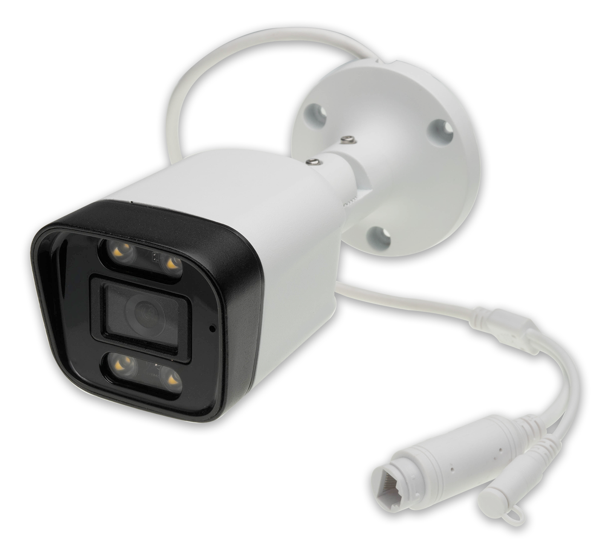

# Introduction
The smart camera developed using the **RV1106G2** chip is based on ARM Cortex-A7, clocked at 1.2GHz, equipped with 0.5Tops NPU computing power, and supports mainstream deep learning frameworks. High-performance 5-megapixel ISP supports HDR, WDR multi-level noise reduction and other image enhancement and correction algorithms. Equipped with sc3336 3-megapixel HD camera, supporting 100M Ethernet and POE power supply.

 