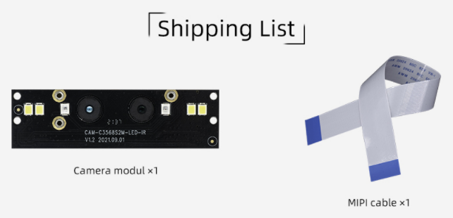

# 一、Introduction
## Product introduction
CAM-2MS2MF is a dual-MIPI dual-lens WDR+NIR module. It is mainly used in scenarios such as face recognition access control, face recognition attendance, gate machines and identification machines.

## Shipping list

## Detailed parameters

| Mode | Parameters |
| ---- | ---- |
| brand| SV |
| Sensor | gc2053(IR)/gc2093(RGB) |
| interface | MIPI |
| pixel | 200W |
| measurement | 20mm x 68mm |
| LED | IR , White fill light|
| Camera center distance | 17mm |
| Power Supply | 2.8V-2.8V-1.8V-1.2V-1.2V Five-way power supply |
| Connection Way | 30pin 0.5mm FPC |
| Operating Temperature | -10℃ ~ +55℃(Humidity:10%RH ~ 75%RH) |
| Storage Temperature | -20℃ ~ +65℃(Humidity:10%RH ~ 75%RH) | 

 

| camera| GC2093 | GC2053 |
| ---- | ---- | ---- |
| Sensor | 1/2.9 sensor/RGB | 1/2.9 sensor/IR |
| Max Resolution | 1920(H)x1080(V) (16:9 mode) | 1920(H)x1080(V) (16:9 mode) |
| Pixel Size | 2.8umx2.8um | 2.8umx2.8um |
| Low illuminance | 0.15Lux/F2.0 | 0.15Lux/F2.0 |
| Maximum transmission rate | 1920x1080P/60fps | 1920x1080P/30fps |
| Signal-to-noise ratio | 38dB | TBD |
| dynamic range | 105DB | TBD |
| lens | M8x0.25 lens/650NM filter | M8x0.25 lens/850NM spike filter |
| FOV  | H:61°；V:35° | H:61°；V:35° |
| aperture | F2.0 | F2.0 |
| Focal length | 4.3mm | 4.3mm |
| Focusing type | Fixed focus, focus distance is 70cm | Fixed focus, focus distance is 70cm |
| distortion | TV Distortion<0.5% | TV Distortion<0.5% |
| CRA| <18° | <18° |
| Temperature range | -20°/+65° | -20°/+65° |
| Lens structure | 4P | 4P |
| Video output format | RAW | RAW |
| power consumption | 2.8V/16mA;1.8V/3mA;1.2V/40mA/±5% | 2.8V/18mA;1.8V/3mA;1.2V/34mA/±5% |

<!--
## 接口定义
## 产品选型
-->

# 二、Usage

<!--
## 使用说明
-->

## Hardware connection

The Firefly development board has two MIPI CSI interfaces, one is a 30pin interface and the other is a 24pin interface. When connecting, please pay attention to the direction and connect only to the corresponding pin number interface. The `CAM-2MS2MF` supports the 30pin interface. ***Here is a unified interface diagram***:

### 30pin MIPI CSI Interface Connection

Note: Do not connect to an interface with the words `MIPI DSI` as this may cause damage to the module or development board.

<!--
| 主控 | 板卡型号 | 
| ---- | ---- | 
| RK3128 | [Firefly-RK3128](_images/), [AIO-3128C](_images/) | 
| RK3288 | [Firefly-RK3288](_images/), [AIO-3288C](_images/), [AIO-3288J](_images/) | 
| RK3308 | [ROC-RK3308B-CC-PLUS](_images/) |
| RK3328 | [ROC-RK3328-CC](_images/) | 
| RK3399 | [AIO-3399C](_images/), [AIO-3399J](_images/), [AIO-3399JD4](_images/), [ROC-RK3399-PC-PLUS](_images/), [ROC-RK3399-PC](_images/), [ROC-RK3399-PC-Pro](_images/), [Firefly-RK3399](_images/) | 
| RK3399Pro | [AIO-3399ProC](_images/), [AIO-3399Pro-JD4](_images/) | 
| RK3566 | [AIO-3566JD4](_images/cam-2ms2mf_AIO-3566JD4.png), [ROC-RK3566-PC](_images/cam-2ms2mf_ROC-RK3566-PC.png) | 
| RK3568 | [AIO-3568J](_images/cam-2ms2mf_AIO-3568J.png), [ROC-RK3568-PC](_images/cam-2ms2mf_ROC-RK3568-PC.png) | 
-->

| CPU  | Board | 
| ---- | ---- | 
| RK3566 | [AIO-3566JD4](../../../modules_img/CAM-2MS2MF/cam-2ms2mf_AIO-3566JD4.png), [ROC-RK3566-PC](../../../modules_img/CAM-2MS2MF/cam-2ms2mf_ROC-RK3566-PC.png) | 
| RK3568 | [AIO-3568J](../../../modules_img/CAM-2MS2MF/cam-2ms2mf_AIO-3568J.png), [ROC-RK3568-PC](../../../modules_img/CAM-2MS2MF/cam-2ms2mf_ROC-RK3568-PC.png), [ROC-RK3568-PC SE](../../../modules_img/CAM-2MS2MF/cam-2ms2mf_ROC-RK3568-PC-SE.png) | 
| RK3588 | [ITX-3588J](../../../modules_img/CAM-2MS2MF/cam-2ms2mf_ITX-3588J.png), [AIO-3588Q](../../../modules_img/CAM-2MS2MF/cam-2ms2mf_AIO-3588Q.png), [AIO-3588JQ](../../../modules_img/CAM-2MS2MF/cam-2ms2mf_AIO-3588Q.png), [AIO-3588MQ](../../../modules_img/CAM-2MS2MF/cam-2ms2mf_AIO-3588Q.png) |
| RK3588S | [AIO-3588SJD4](../../../modules_img/CAM-2MS2MF/cam-2ms2mf_AIO-3588SJD4.png), [ROC-RK3588S-PC](../../../modules_img/CAM-2MS2MF/cam-2ms2mf_ROC-RK3588S-PC.png) |

# 三、Firmware and Resource download
Related documents and firmware download, see the official website [Resource Download](https://community.t-firefly.com/en/doc/download/115)。

<!--
## 文档下载
## 配件图纸
## 软件工具
## 固件下载
-->

# 四、Tutorial
## Flash firmware

<!--
| 主控 | USB 线刷 | SD 卡升级 |
| ---- | ---- | ---- |
| RK3128 | [Firefly-RK3128](../../Mainboards/Firefly-RK3128/upgrade_firmware.md), [AIO-3128C](../../Mainboards/AIO-3128C/upgrade_firmware.md)  |  |
| RK3288 | [Firefly-RK3288](../../Mainboards/Firefly-RK3288/upgrade_firmware.md), [AIO-3288J](../../Mainboards/AIO-3288J/upgrade_firmware.md),  [AIO-3288C](../../Mainboards/AIO-3288C/upgrade_firmware.md) | [Firefly-RK3288](../../Mainboards/Firefly-RK3288/upgrade_firmware_sd.md), [AIO-3288J](../../Mainboards/AIO-3288J/upgrade_firmware_sd.md), [AIO-3288C](../../Mainboards/AIO-3288C/upgrade_firmware_sd.md) |
|RK3308| [ROC-RK3308-CC](../../Mainboards/ROC-RK3308-CC/burning_firmware.md), [ROC-RK3308B-CC-PLUS](../../Mainboards/ROC-RK3308B-CC-PLUS/burning_firmware.md) ||
| RK3328 | [ROC-RK3328-CC](../../Mainboards/ROC-RK3328-CC/flash_emmc.md), [ROC-RK3328-PC](../../Mainboards/ROC-RK3328-PC/upgrade_firmware.md)  | [ROC-RK3328-CC](../../Mainboards/ROC-RK3328-CC/flash_sd.md) |
|RK3399|[Firefly-RK3399](../../Mainboards/Firefly-RK3399/02-upgrade_table.md), [ROC-RK3399-PC](../../Mainboards/ROC-RK3399-PC/03-upgrade_firmware.md)   [ROC-RK3399-PC-PLUS](../../Mainboards/ROC-RK3399-PC-PLUS/03-upgrade_firmware.md), [AIO-3399JD4](../../Mainboards/AIO-3399JD4/03-upgrade_firmware.md)  [AIO-3399J](../../Mainboards/AIO-3399J/03-upgrade_firmware.md), [AIO-3399C](../../Mainboards/AIO-3399C/03-upgrade_firmware.md)  [ROC-RK3399-PC-Pro](../../Mainboards/ROC-RK3399-PC-Pro/03-upgrade_firmware.md)| [Firefly-RK3399](../../Mainboards/Firefly-RK3399/05-upgrade_firmware_sd.md), [ROC-RK3399-PC](../../Mainboards/ROC-RK3399-PC/05-upgrade_firmware_sd.md)   [ROC-RK3399-PC-PLUS](../../Mainboards/ROC-RK3399-PC-PLUS/05-upgrade_firmware_sd.md), [AIO-3399JD4](../../Mainboards/AIO-3399JD4/05-upgrade_firmware_sd.md)  [AIO-3399J](../../Mainboards/AIO-3399J/05-upgrade_firmware_sd.md), [AIO-3399C](../../Mainboards/AIO-3399C/05-upgrade_firmware_sd.md)  [ROC-RK3399-PC-Pro](../../Mainboards/ROC-RK3399-PC-Pro/05-upgrade_firmware_sd.md) | 
|RK3399Pro|[AIO-3399Pro-JD4](../../Mainboards/AIO-3399Pro-JD4/03-upgrade_firmware.md), [AIO-3399ProC](../../Mainboards/AIO-3399ProC/03-upgrade_firmware.md)| [AIO-3399Pro-JD4](../../Mainboards/AIO-3399Pro-JD4/05-upgrade_firmware_sd.md), [AIO-3399ProC](../../Mainboards/AIO-3399ProC/05-upgrade_firmware_sd.md) |
|RK3566|[AIO-3566JD4](../../Mainboards/AIO-3566JD4/03-upgrade_firmware.md), [ROC-RK3566-PC](../../Mainboards/ROC-RK3566-PC/03-upgrade_firmware.md)| [AIO-3566JD4](../../Mainboards/AIO-3566JD4/05-upgrade_firmware_sd.md), [ROC-RK3566-PC](../../Mainboards/ROC-RK3566-PC/05-upgrade_firmware_sd.md) | 
|RK3568|[AIO-3568J](../../Mainboards/AIO-3568J/03-upgrade_firmware.md), [ROC-RK3568-PC](../../Mainboards/ROC-RK3568-PC/03-upgrade_firmware.md) | [AIO-3568J](../../Mainboards/AIO-3568J/05-upgrade_firmware_sd.md), [ROC-RK3568-PC](../../Mainboards/ROC-RK3568-PC/05-upgrade_firmware_sd.md)| 
-->

| CPU | USB upgrade | SD upgrade |
| ---- | ---- | ---- |
|RK3566|[AIO-3566JD4](../../Mainboards/AIO-3566JD4/03-upgrade_firmware.md), [ROC-RK3566-PC](../../Mainboards/ROC-RK3566-PC/03-upgrade_firmware.md)| [AIO-3566JD4](../../Mainboards/AIO-3566JD4/05-upgrade_firmware_sd.md), [ROC-RK3566-PC](../../Mainboards/ROC-RK3566-PC/05-upgrade_firmware_sd.md) | 
|RK3568|[AIO-3568J](../../Mainboards/AIO-3568J/03-upgrade_firmware.md), [ROC-RK3568-PC](../../Mainboards/ROC-RK3568-PC/03-upgrade_firmware.md), [ROC-RK3568-PC SE](../../Mainboards/ROC-RK3568-PC-SE/03-upgrade_firmware.md) | [AIO-3568J](../../Mainboards/AIO-3568J/05-upgrade_firmware_sd.md), [ROC-RK3568-PC](../../Mainboards/ROC-RK3568-PC/05-upgrade_firmware_sd.md), [ROC-RK3568-PC SE](../../Mainboards/ROC-RK3568-PC-SE/05-upgrade_firmware_sd.md)| 
|RK3588|[ITX-3588J](../../Mainboards/ITX-3588J/upgrade_firmware.md), [AIO-3588Q](../../Mainboards/AIO-3588Q/upgrade_firmware.md), [AIO-3588JQ](../../Mainboards/AIO-3588JQ/upgrade_firmware.md), [AIO-3588MQ](../../Mainboards/AIO-3588MQ/upgrade_firmware.md)|[ITX-3588J](../../Mainboards/ITX-3588J/upgrade_firmware_sd.md), [AIO-3588Q](../../Mainboards/AIO-3588Q/upgrade_firmware_sd.md), [AIO-3588JQ](../../Mainboards/AIO-3588JQ/upgrade_firmware_sd.md), [AIO-3588MQ](../../Mainboards/AIO-3588MQ/upgrade_firmware_sd.md) |
|RK3588S|[AIO-3588SJD4](../../Mainboards/AIO-3588SJD4/upgrade_firmware.md), [ROC-RK3588S-PC](../../Mainboards/ROC-RK3588S-PC/upgrade_firmware.md)| [AIO-3588SJD4](../../Mainboards/AIO-3588SJD4/upgrade_firmware_sd.md), [ROC-RK3588S-PC](../../Mainboards/ROC-RK3588S-PC/upgrade_firmware_sd.md) |

## Compile the firmware

<!--

### RK3128 系列

| 系统  | 板卡型号 | 
| ---- | ---- | 
| Android5.1 | [Firefly-RK3128](), [AIO-3128C]() | 
| Ubuntu | [Firefly-RK3128]() | 

### RK3288 系列

| 系统 | 板卡型号 | 
| ---- | ---- | 
| Android5.1  | [Firefly-RK3288](), [AIO-3288J](), [AIO-3288C]() | 
| Ubuntu | [Firefly-RK3288](), [AIO-3288J](), [AIO-3288C]() | 
| Buildroot | [Firefly-RK3288](), [AIO-3288J](), [AIO-3288C]() |

### RK3308 系列

| 系统 | 板卡型号 | 
| ---- | ---- | 
| Buildroot | [ROC-RK3308-CC](), [ROC-RK3308B-CC-PLUS]() |

### RK3328 系列

| 系统 | 板卡型号 | 
| ---- | ---- | 
| Android7.1 Industry | [ROC-RK3328-CC]()|
| Android8.1 | [ROC-RK3328-CC]() |
| Android10.0  | [ROC-RK3328-PC]() | 
| Ubuntu | [ROC-RK3328-CC](), [ROC-RK3328-PC]() | 

### RK3399 系列

| 系统 | 板卡型号 | 
| ---- | ---- | 
| Android7.1 Industry | [Firefly-RK3399](), [ROC-RK3399-PC](), [ROC-RK3399-PC-PLUS](), [ROC-RK3399-PC-Pro](), [AIO-3399JD4](), [AIO-3399J](), [AIO-3399C]() | 
| Android10.0 | [ROC-RK3399-PC-PLUS](), [ROC-RK3399-PC-Pro](),[AIO-3399J](), [AIO-3399C]() | 
| Ubuntu | [Firefly-RK3399](), [ROC-RK3399-PC](), [ROC-RK3399-PC-PLUS](), [ROC-RK3399-PC-Pro](), [AIO-3399JD4](), [AIO-3399J](), [AIO-3399C]() | 
| Buildroot | [Firefly-RK3399](), [ROC-RK3399-PC](), [ROC-RK3399-PC-PLUS](), [ROC-RK3399-PC-Pro](), [AIO-3399JD4](), [AIO-3399J](), [AIO-3399C]() | 

### RK3399Pro 系列

| 系统 | 板卡型号 | 
| ---- | ---- | 
| Android9.0 | [AIO-3399Pro-JD4](), [AIO-3399ProC]() | 
| Ubuntu | [AIO-3399Pro-JD4](), [AIO-3399ProC]() | 

-->

### RK3566 platform

| CPU | board | 
| ---- | ---- | 
| Android11.0 | [AIO-3566JD4](../../Mainboards/AIO-3566JD4/compile_android11.0_firmware.md#dual-camera-cam-2ms2mf-compile), [ROC-RK3566-PC](../../Mainboards/ROC-RK3566-PC/compile_android11.0_firmware.md#dual-camera-cam-2ms2mf-compile) | 
| Ubuntu | [AIO-3566JD4](../../Mainboards/AIO-3566JD4/linux_compile_linux5.10.md#compile-ubuntu-firmware), [ROC-RK3566-PC](../../Mainboards/ROC-RK3566-PC/linux_compile_linux5.10.md#compile-ubuntu-firmware) |
| Buildroot | [AIO-3566JD4](../../Mainboards/AIO-3566JD4/linux_compile_linux5.10.md#compile-buildroot-firmware), [ROC-RK3566-PC](../../Mainboards/ROC-RK3566-PC/linux_compile_linux5.10.md#compile-buildroot-firmware) |

### RK3568 platform

| CPU | board | 
| ---- | ---- | 
| Android11.0 | [AIO-3568J](../../Mainboards/AIO-3568J/compile_android11.0_firmware.md#dual-camera-cam-2ms2mf-compile), [ROC-RK3568-PC](../../Mainboards/ROC-RK3568-PC/compile_android11.0_firmware.md#dual-camera-cam-2ms2mf-compile), [ROC-RK3568-PC-SE](../../Mainboards/ROC-RK3568-PC-SE/compile_android11.0_firmware.md#dual-camera-cam-2ms2mf-compile) | 
| Ubuntu | [AIO-3568J](../../Mainboards/AIO-3568J/linux_compile_linux5.10.md#compile-ubuntu-firmware), [ROC-RK3568-PC](../../Mainboards/ROC-RK3568-PC/linux_compile_linux5.10.md#compile-ubuntu-firmware) |
| Buildroot | [AIO-3568J](../../Mainboards/AIO-3568J/linux_compile_linux5.10.md#compile-buildroot-firmware), [ROC-RK3568-PC](../../Mainboards/ROC-RK3568-PC/linux_compile_linux5.10.md#compile-buildroot-firmware) |

### RK3588 platform

| CPU | board |
| ---- | ---- |
| Android12.0 | [ITX-3588J](../../Mainboards/ITX-3588J/android_compile_android12.0_firmware.md#dual-camera-cam-2ms2mf-compile), [AIO-3588Q](../../Mainboards/AIO-3588Q/android_compile_android12.0_firmware.md#dual-camera-cam-2ms2mf-compile), [AIO-3588JQ](../../Mainboards/AIO-3588JQ/android_compile_android12.0_firmware.md#dual-camera-cam-2ms2mf-compile), [AIO-3588MQ](../../Mainboards/AIO-3588MQ/android_compile_android12.0_firmware.md#dual-camera-cam-2ms2mf-compile) |

### RK3588S platform

| CPU | board |
| ---- | ---- |
| Android12.0 | [AIO-3588SJD4](../../Mainboards/AIO-3588SJD4/android_compile_android12.0_firmware.md#dual-camera-cam-2ms2mf-compile), [ROC-RK3588S-PC](../../Mainboards/ROC-RK3588S-PC/android_compile_android12.0_firmware.md#dual-camera-cam-2ms2mf-compile) |