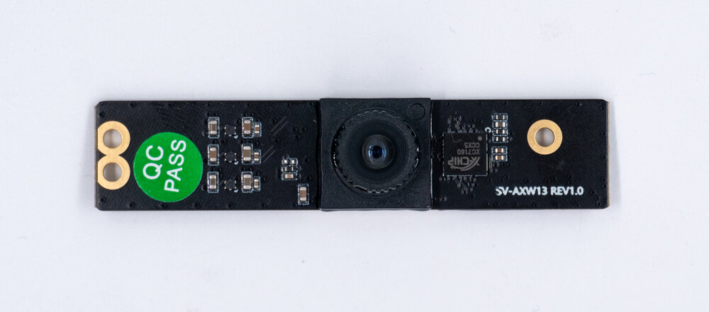
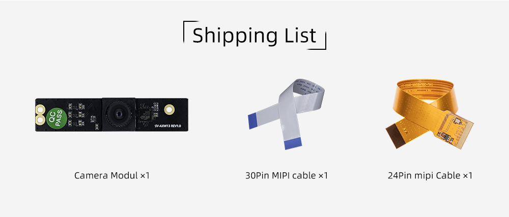
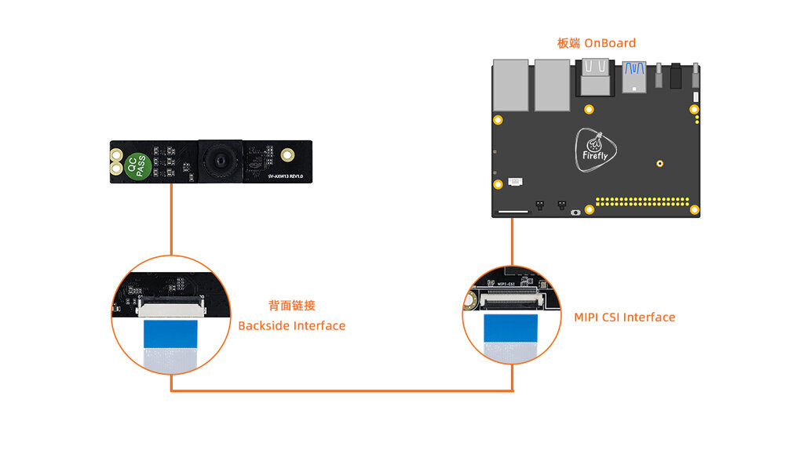
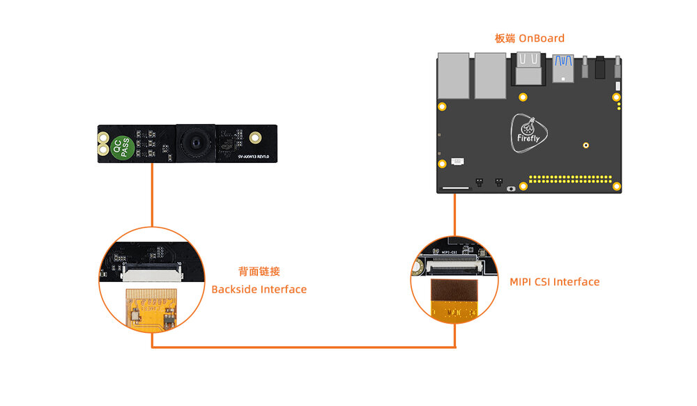

# 1. Introduction
## Product introduction
CAM-8MS1M CAM-8MS1M 1/2.7”industrial-grade HD WDR sensor 100dB WDR, suitable for various complex light environments.MIPI standard interface, supports 7x24h operating.

## Shipping list

## Detailed parameters

|| Parameters |
| ---- | ---- |
|Sensor|SC8238|
|CMOS Sensor|1/2.7 sensor/RGB|
|ISP|built in XC7160|
|Max Resolution|3840(H) x 2160(V) (16:9 mode)|
|Sensor Pixel Size|1.5um x 1.5um|
|Low Lux|≤0.3Lux/F2.4|
|Image Transmission Rate|4K/25fps|
|SNR|36dB|
|WDR|>100DB|
|Distortionless Lens|M8 x 0.25 lens/650NM filter|
|FOV|H: 84°V: 50°|
|Aperture|F2.0|
|Focal Length|4.3mm|
|Distortion|TV Distortion<1%|
|Lens CRA|. <19.4°|
|Lens Temperature Range|-20° /+65°|
|Video Output Format|YUV/MJPG|
|IR|NC|
|Power Supply|5V,Ripple not higher than 80mv.|
|Connection Way|0.5mm FPC (**CAM-8MS1M** is 30pins, **Board** needs to be based on the hardware interface)|
|Power Consumption|5V/ 270MA+10%|
|Operating Temperature|-10° C ~ +55° C (Humidity : 10%RH ~ 75%RH)|
|Storage Temperature|-20° C~ +65° C (Humidity : 10%RH ~75%RH)|

# 2. Usage

## Hardware connection

The Firefly development board has two MIPI CSI interfaces, one is a 30pin interface and the other is a 24pin interface. When connecting, please pay attention to the direction and connect only to the corresponding pin number interface.***Here is a unified interface diagram***:

### 30pin MIPI CSI Interface Connection

### 324pin MIPI CSI Interface Connection

Note: Do not connect to an interface with the words `MIPI DSI` as this may cause damage to the module or development board.

| CPU | Board | 
| ---- | ---- | 
| RK3399 | [AIO-3399J](../../../modules_img/CAM-8MS1M/cam-8ms1m_AIO-3399J.png), [AIO-3399JD4](../../../modules_img/CAM-8MS1M/cam-8ms1m_AIO-3399JD4.png), [ROC-RK3399-PC-PLUS](../../../modules_img/CAM-8MS1M/cam-8ms1m_ROC-RK3399-PC-PLUS.png), [ROC-RK3399-PC-Pro](../../../modules_img/CAM-8MS1M/cam-8ms1m_ROC-RK3399-PC-Pro.png)| 
| RK3399Pro | [AIO-3399ProC](../../../modules_img/CAM-8MS1M/cam-8ms1m_AIO-3399ProC.png), [AIO-3399Pro-JD4](../../../modules_img/CAM-8MS1M/cam-8ms1m_AIO-3399Pro-JD4.png) | 
| RK3566 | [AIO-3566JD4](../../../modules_img/CAM-8MS1M/cam-8ms1m_AIO-3566JD4.png), [ROC-RK3566-PC](../../../modules_img/CAM-8MS1M/cam-8ms1m_ROC-RK3566-PC.png) | 
| RK3568 | [AIO-3568J](../../../modules_img/CAM-8MS1M/cam-8ms1m_AIO-3568J.png), [ROC-RK3568-PC](../../../modules_img/CAM-8MS1M/cam-8ms1m_ROC-RK3568-PC.png), [ROC-RK3568-PC SE](../../../modules_img/CAM-8MS1M/cam-8ms1m_ROC-RK3568-PC-SE.jpg) | 
| RK3588 | [ITX-3588J](../../../modules_img/CAM-8MS1M/cam-8ms1m_ITX-3588J.png),[ROC-RK3588S-PC](../../../modules_img/CAM-8MS1M/cam-8ms1m_ROC-RK3588S-PC.png), AIO-3588SJD4: [DPHY](../../../modules_img/CAM-8MS1M/cam-8ms1m_AIO-3588SJD4.jpg) / [DCPHY](../../../modules_img/CAM-8MS1M/cam-8ms1m_dcphy_AIO-3588SJD4.jpg) ,[AIO-3588Q](../../../modules_img/CAM-8MS1M/cam-8ms1m_AIO-3588Q.jpg)|
| RK3576 | [ROC-RK3576-PC](../../Mainboards/ROC-RK3576-PC/usage_camera.md), [AIO-3576-JD4](../../Mainboards/AIO-3576-JD4/usage_camera.md)，[AIO-3576Q](../../Mainboards/AIO-3576Q/usage_camera.md), [AIO-3576C](../../Mainboards/AIO-3576C/usage_camera.md)|

# 3. Firmware and Resource download
Related documents and firmware download, see the official website [Resource Download](https://en.t-firefly.com/doc/download/114.html)

# 4. Tutorial
## Flash firmware

| CPU | USB upgrade | SD upgrade |
| ---- | ---- | ---- |
|RK3399|[ROC-RK3399-PC-PLUS](../../Mainboards/ROC-RK3399-PC-PLUS/02-upgrade_table.md), [AIO-3399JD4](../../Mainboards/AIO-3399JD4/02-upgrade_table.md)  [AIO-3399J](../../Mainboards/AIO-3399J/02-upgrade_table.md), [ROC-RK3399-PC-Pro](../../Mainboards/ROC-RK3399-PC-Pro/02-upgrade_table.md)| [ROC-RK3399-PC-PLUS](../../Mainboards/ROC-RK3399-PC-PLUS/06-boot_firmware_sd.md), [AIO-3399JD4](../../Mainboards/AIO-3399JD4/05-upgrade_firmware_sd.md)  [AIO-3399J](../../Mainboards/AIO-3399J/05-upgrade_firmware_sd.md), [ROC-RK3399-PC-Pro](../../Mainboards/ROC-RK3399-PC-Pro/05-upgrade_firmware_sd.md) | 
|RK3399Pro|[AIO-3399Pro-JD4](../../Mainboards/AIO-3399Pro-JD4/03-upgrade_firmware.md), [AIO-3399ProC](../../Mainboards/AIO-3399ProC/03-upgrade_firmware.md)| [AIO-3399Pro-JD4](../../Mainboards/AIO-3399Pro-JD4/05-upgrade_firmware_sd.md), [AIO-3399ProC](../../Mainboards/AIO-3399ProC/05-upgrade_firmware_sd.md) |
|RK3566|[AIO-3566JD4](../../Mainboards/AIO-3566JD4/03-upgrade_firmware.md), [ROC-RK3566-PC](../../Mainboards/ROC-RK3566-PC/03-upgrade_firmware.md)| [AIO-3566JD4](../../Mainboards/AIO-3566JD4/05-upgrade_firmware_sd.md), [ROC-RK3566-PC](../../Mainboards/ROC-RK3566-PC/05-upgrade_firmware_sd.md) | 
|RK3568|[AIO-3568J](../../Mainboards/AIO-3568J/03-upgrade_firmware.md), [ROC-RK3568-PC](../../Mainboards/ROC-RK3568-PC/03-upgrade_firmware.md), [ROC-RK3568-PC SE](../../Mainboards/ROC-RK3568-PC-SE/03-upgrade_firmware.md) | [AIO-3568J](../../Mainboards/AIO-3568J/05-upgrade_firmware_sd.md), [ROC-RK3568-PC](../../Mainboards/ROC-RK3568-PC/05-upgrade_firmware_sd.md), [ROC-RK3568-PC SE](../../Mainboards/ROC-RK3568-PC-SE/05-upgrade_firmware_sd.md)| 
|RK3588|[ITX-3588J](../../Mainboards/ITX-3588J/upgrade_firmware.md), [ROC-RK3588S-PC](../../Mainboards/ROC-RK3588S-PC/upgrade_firmware.md), [AIO-3588SJD4](../../Mainboards/AIO-3588SJD4/upgrade_firmware.md),[AIO-3588Q](../../Mainboards/AIO-3588Q/upgrade_firmware.md)|[ITX-3588J](../../Mainboards/ITX-3588J/upgrade_firmware_sd.md), [ROC-RK3588S-PC](../../Mainboards/ROC-RK3588S-PC/upgrade_firmware_sd.md), [AIO-3588SJD4](../../Mainboards/AIO-3588SJD4/upgrade_firmware_sd.md) ,[AIO-3588Q](../../Mainboards/AIO-3588Q/upgrade_firmware_sd.md)|
|RK3576|[ROC-RK3576-PC](../../Mainboards/ROC-RK3576-PC/upgrade_firmware.md), [AIO-3576-JD4](../../Mainboards/AIO-3576-JD4/upgrade_firmware.md), [AIO-3576Q](../../Mainboards/AIO-3576Q/upgrade_firmware.md)|[ROC-RK3576-PC](../../Mainboards/ROC-RK3576-PC/upgrade_firmware_sd.md), [AIO-3576-JD4](../../Mainboards/AIO-3576-JD4/upgrade_firmware_sd.md), [AIO-3576Q](../../Mainboards/AIO-3576Q/upgrade_firmware_sd.md), [AIO-3576C](../../Mainboards/AIO-3576C/upgrade_firmware_sd.md)|

## Compile the firmware

### RK3399 platform

| System | Board | 
| ---- | ---- | 
| Android7.1 Industry | [ROC-RK3399-PC-PLUS](../../Mainboards/ROC-RK3399-PC-PLUS/compile_android7.1_industry_firmware.md#gong-ban-bian-yi), [ROC-RK3399-PC-Pro](../../Mainboards/ROC-RK3399-PC-Pro/compile_android7.1_industry_firmware.md#gong-ban-bian-yi), [AIO-3399JD4](../../Mainboards/AIO-3399JD4/compile_android7.1_industry_firmware.md#gong-ban-bian-yi), [AIO-3399J](../../Mainboards/AIO-3399J/compile_android7.1_industry_firmware.md#gong-ban-bian-yi) | 
| Android10.0 | [ROC-RK3399-PC-PLUS](../../Mainboards/ROC-RK3399-PC-PLUS/compile_android10.0_firmware.md#gong-ban-bian-yi), [ROC-RK3399-PC-Pro](../../Mainboards/ROC-RK3399-PC-Pro/compile_android10.0_firmware.md#gong-ban-bian-yi),[AIO-3399J](../../Mainboards/AIO-3399J/compile_android10.0_firmware.md#gong-ban-bian-yi) | 
| Ubuntu | [ROC-RK3399-PC-PLUS](../../Mainboards/ROC-RK3399-PC-PLUS/linux_compile_gpt.md), [ROC-RK3399-PC-Pro](../../Mainboards/ROC-RK3399-PC-Pro/linux_compile_gpt.md), [AIO-3399JD4](../../Mainboards/AIO-3399JD4/linux_compile_gpt.md), [AIO-3399J](../../Mainboards/AIO-3399J/linux_compile_gpt.md) | 

### RK3399Pro platform

| System | Board | 
| ---- | ---- | 
| Android9.0 | [AIO-3399Pro-JD4](../../Mainboards/AIO-3399Pro-JD4/compile_android9.0_firmware.md#shuang-mu-she-xiang-tou-sv-taysh-tq-bian-yi), [AIO-3399ProC](../../Mainboards/AIO-3399ProC/compile_android9.0_firmware.md#shuang-mu-she-xiang-tou-sv-taysh-tq-bian-yi) | 
| Ubuntu | [AIO-3399Pro-JD4](../../Mainboards/AIO-3399Pro-JD4/linux_compile_gpt.md), [AIO-3399ProC](../../Mainboards/AIO-3399ProC/linux_compile_gpt.md) | 

### RK3566 platform

| System | Board | 
| ---- | ---- | 
| Android11.0 | [AIO-3566JD4](../../Mainboards/AIO-3566JD4/compile_android11.0_firmware.md#public-compile), [ROC-RK3566-PC](../../Mainboards/ROC-RK3566-PC/compile_android11.0_firmware.md#public-compile) | 
| Ubuntu | [AIO-3566JD4](../../Mainboards/AIO-3566JD4/linux_compile_linux5.10.md#compile-ubuntu-firmware), [ROC-RK3566-PC](../../Mainboards/ROC-RK3566-PC/linux_compile_linux5.10.md#compile-ubuntu-firmware) |
| Buildroot | [AIO-3566JD4](../../Mainboards/AIO-3566JD4/linux_compile_linux5.10.md#compile-buildroot-firmware), [ROC-RK3566-PC](../../Mainboards/ROC-RK3566-PC/linux_compile_linux5.10.md#compile-buildroot-firmware) |

### RK3568 platform

| System | Board | 
| ---- | ---- | 
| Android11.0 | [AIO-3568J](../../Mainboards/AIO-3568J/compile_android11.0_firmware.md#public-compile), [ROC-RK3568-PC](../../Mainboards/ROC-RK3568-PC/compile_android11.0_firmware.md#public-compile), [ROC-RK3568-PC SE](../../Mainboards/ROC-RK3568-PC-SE/compile_android11.0_firmware.md#public-compile) | 
| Ubuntu | [AIO-3568J](../../Mainboards/AIO-3568J/linux_compile_linux5.10.md#compile-ubuntu-firmware), [ROC-RK3568-PC](../../Mainboards/ROC-RK3568-PC/linux_compile_linux5.10.md#compile-ubuntu-firmware) |
| Buildroot | [AIO-3568J](../../Mainboards/AIO-3568J/linux_compile_linux5.10.md#compile-buildroot-firmware), [ROC-RK3568-PC](../../Mainboards/ROC-RK3568-PC/linux_compile_linux5.10.md#compile-buildroot-firmware) |

### RK3588 platform

| System | Board | 
| ---- | ---- | 
| Android12.0 | [ITX-3588J](../../Mainboards/ITX-3588J/android_compile_android12.0_firmware.md),[ROC-RK3588S-PC](../../Mainboards/ROC-RK3588S-PC/android_compile_android12.0_firmware.md),[AIO-3588SJD4](../../Mainboards/AIO-3588SJD4/android_compile_android12.0_firmware.md),[AIO-3588Q](../../Mainboards/AIO-3588Q/android_compile_android12.0_firmware.md)|
| Buildroot | [ITX-3588J](../../Mainboards/ITX-3588J/linux_compile.md#compile-buildroot-firmware),[ROC-RK3588S-PC](../../Mainboards/ROC-RK3588S-PC/linux_compile.md#compile-buildroot-firmware),[AIO-3588SJD4](../../Mainboards/AIO-3588SJD4/linux_compile.md#compile-buildroot-firmware),[AIO-3588Q](../../Mainboards/AIO-3588Q/linux_compile.md#compile-buildroot-firmware),[AIO-3588MQ](../../Mainboards/AIO-3588MQ/linux_compile.md#compile-buildroot-firmware),[AIO-3588JQ](../../Mainboards/AIO-3588JQ/linux_compile.md#compile-buildroot-firmware)|
| Ubuntu20.04 | [ITX-3588J](../../Mainboards/ITX-3588J/linux_compile.md#compile-ubuntu-firmware),[ROC-RK3588S-PC](../../Mainboards/ROC-RK3588S-PC/linux_compile.md#compile-ubuntu-firmware),[AIO-3588SJD4](../../Mainboards/AIO-3588SJD4/linux_compile.md#compile-ubuntu-firmware),[AIO-3588Q](../../Mainboards/AIO-3588Q/linux_compile.md#compile-ubuntu-firmware),[AIO-3588MQ](../../Mainboards/AIO-3588MQ/linux_compile.md#compile-ubuntu-firmware),[AIO-3588JQ](../../Mainboards/AIO-3588JQ/linux_compile.md#compile-ubuntu-firmware)|
| Debian11 | [ITX-3588J](../../Mainboards/ITX-3588J/linux_compile.md#compile-debian-firmware),[ROC-RK3588S-PC](../../Mainboards/ROC-RK3588S-PC/linux_compile.md#compile-debian-firmware),[AIO-3588SJD4](../../Mainboards/AIO-3588SJD4/linux_compile.md#compile-debian-firmware),[AIO-3588Q](../../Mainboards/AIO-3588Q/linux_compile.md#compile-debian-firmware),[AIO-3588MQ](../../Mainboards/AIO-3588MQ/linux_compile.md#compile-debian-firmware),[AIO-3588JQ](../../Mainboards/AIO-3588JQ/linux_compile.md#compile-debian-firmware)|

### RK3576 platform

| System | Board |
| ---- | ---- |
| Android14.0 | [ROC-RK3576-PC](../../Mainboards/ROC-RK3576-PC/android_compile_android14.0_firmware.md), [AIO-3576-JD4](../../Mainboards/AIO-3576-JD4/android_compile_android14.0_firmware.md), [AIO-3576Q](../../Mainboards/AIO-3576Q/android_compile_android14.0_firmware.md), [AIO-3576C](../../Mainboards/AIO-3576C/android_compile_android14.0_firmware.md)|
| Linux | [ROC-RK3576-PC](../../Mainboards/ROC-RK3576-PC/linux_compile.md), [AIO-3576-JD4](../../Mainboards/AIO-3576-JD4/linux_compile.md), [AIO-3576Q](../../Mainboards/AIO-3576Q/linux_compile.md), [AIO-3576C](../../Mainboards/AIO-3576C/linux_compile.md)|