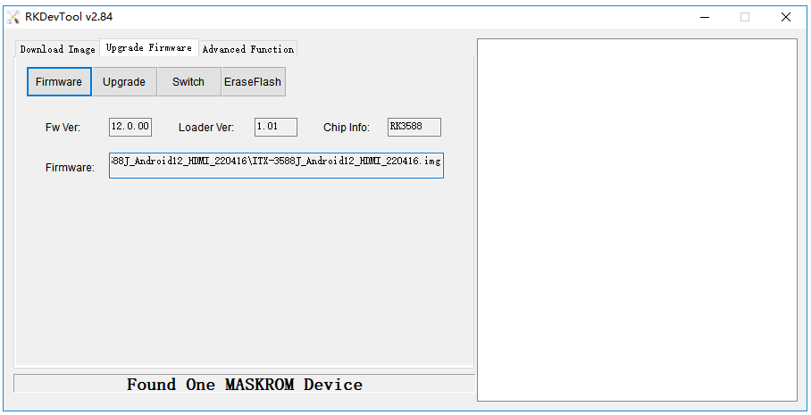
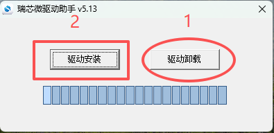

# MaskRom mode

***See startup mode for an introduction [startup mode](upgrade_bootmode.md)***

`MaskRom` pattern is the last line of defense equipment burn out. Forced entry `MaskRom` involved hardware operation, have certain risk, so only in the equipment into the `Loader` mode, can try `MaskRom` mode.

**Please read carefully and operate carefully!**

The operation steps are as follows:

At this point, the device should go into `MaskRom mode`.

Note: If the Windows PC programming tool still doesn't detect the MASKROM device after following the above steps, check if the Windows PC software driver is installed to the latest version.

Click: [Driver Download](https://community.t-firefly.com/en/doc/download/377.html#other_11)

First, click 1 to uninstall the driver, then click 2 to install the driver. After installing the driver, follow the steps above in sequence. The Windows PC programming tool should then be able to recognize the MASKROM device.

