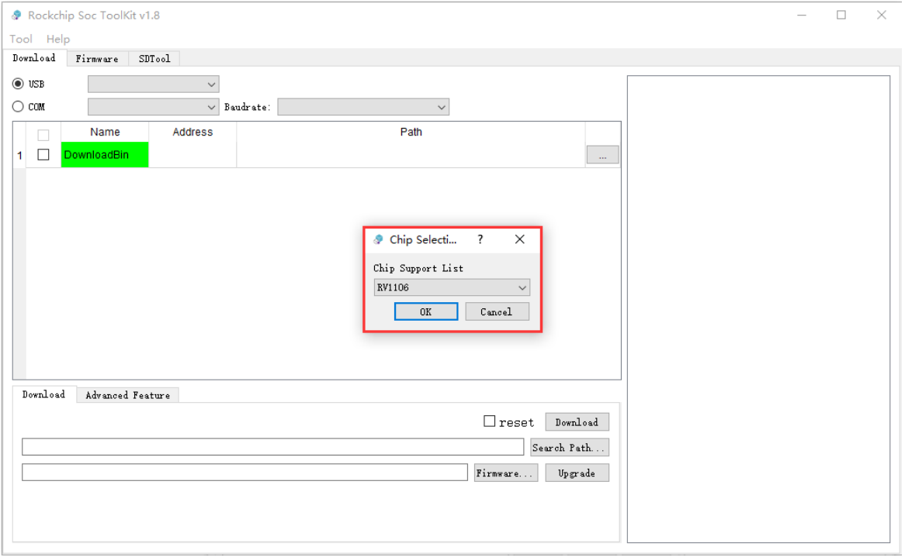
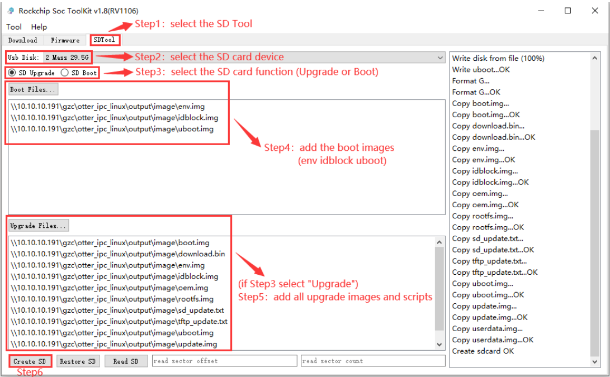

# Use SD card to upgrade firmware

## introduce

This article mainly introduces how to upgrade the firmware on the motherboard through a MicroSD card.

To upgrade firmware using MicroSD, you need to use a card creation tool to write the unified firmware to the MicroSD card on your computer. Currently, this operation can only be completed on the Windows operating system.

## Preparation tools

* Motherboard
* computer
* SD card
* USB card reader
* [**SocToolKit**](https://community.t-firefly.com/en/doc/download/238)

## Steps

1. Download the firmware that needs to be upgraded to the motherboard.
2. Open SocToolKit, click SDTool and select MicroSD Card Tool.
3. Select the MicroSD card device you want to operate.
4. Select the role of the MicroSD card. Supports MicroSD card firmware upgrade and MicroSD card system startup. Select MicroSD card here to upgrade firmware.
6. The current MicroSD card is used as an upgrade card, so all upgrade firmware needs to be added.
7. Click the Create SD button to create a MicroSD upgrade card.
8. Insert the successfully created MicroSD card into the device and then restart. The device will enter the U-Boot terminal in the MicroSD card first.
9. If the MicroSD card has an upgrade function, the device will be automatically upgraded.
10. After the upgrade is completed, you need to remove the MicroSD card and restart the device to enter the device system.

* Note 1: SocToolKit tool version 1.7 or higher is required to support the SD card upgrade boot function.
* Note 2: This function requires the user to run SocToolKit.exe as an administrator (it will ask by default when opening the tool).

