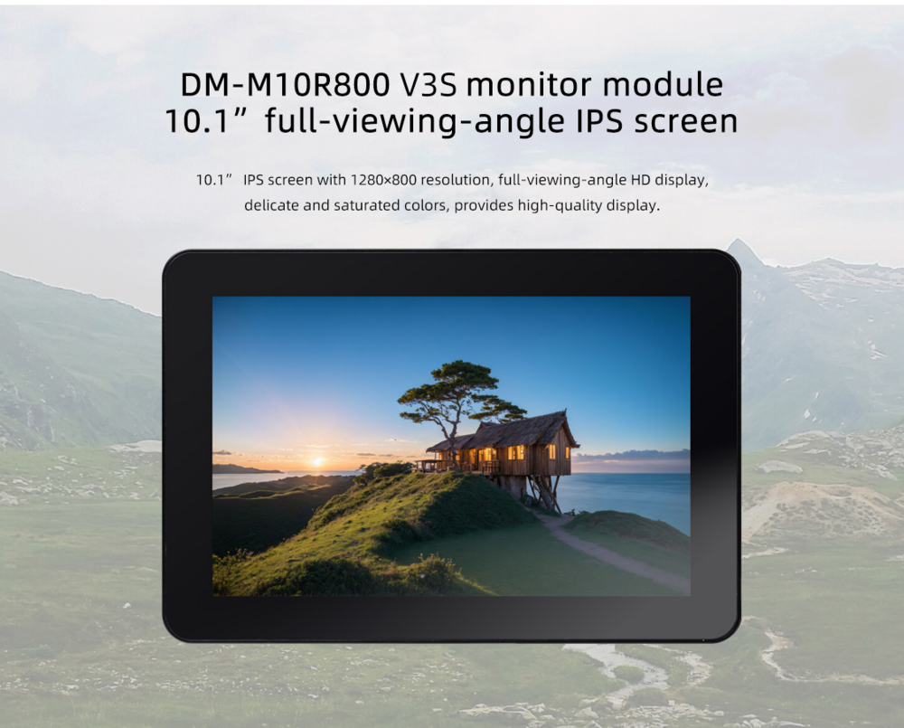

# 1. Introduction
## 1.1 Product introduction

## 1.2 Detailed parameters

||parameters|
|----|----|
|Model|BSD1218-A101KL68|
|Size | 10.1 inch|
|Resolution | 800x1280 (10:16)|
|Display interface| MIPI|
|Visual Angle| 160°|
|Touch screen| multi-point capacitive touch|

# 2. Usage

## 2.1 Hardware connection

### 2.1.1 30pin MIPI DSI Interface Connection

### 2.1.2 40pin MIPI DSI Interface Connection

Connection instructions:
* Due to variations in the silkscreen labels of different development boards, such as `MIPI_DSI`, `MIPI-DSI`, or `DSI_MIPI`, the default connection should be to the interface labeled with `MIPI DSI`.
* If the development board has multiple MIPI DSI interfaces, such as `MIPI_DSI0`, `MIPI_DSI1`, `DSI0_MIPI`, or `DSI1_MIPI`, the default connection should be to the interface labeled `MIPI DSI0`.
* Use the 30-pin same-side FPC cable , while in a **powered-off state**, connect it as shown in the diagram to the corresponding MIPI DSI interface on the board.

Note: Do not connect to the `MIPI CSI` interface, as this may burn out the module or development board.

Detailed Interface Definition Reference:

| CPU |  Board |
| ---- | ---- |
|RK3566|[AIO-3566JD4](../../Mainboards/AIO-3566JD4/interface_definition.md), [ROC-RK3566-PC](../../Mainboards/ROC-RK3566-PC/interface_definition.md)| 
|RK3568|[AIO-3568J](../../Mainboards/AIO-3568J/interface_definition.md), [ROC-RK3568-PC](../../Mainboards/ROC-RK3568-PC/interface_definition.md), [ROC-RK3568-PC SE](../../Mainboards/ROC-RK3568-PC-SE/interface_definition.md), [ITX-3568JQ](../../Mainboards/ITX-3568JQ/interface_definition.md) |
|RK3588|[ITX-3588J](../../Mainboards/ITX-3588J/interface_definition.md), [AIO-3588Q](../../Mainboards/AIO-3588Q/interface_definition.md), [AIO-3588L](../../Mainboards/AIO-3588L/interface_definition.md) |
|RK3588S|[ROC-RK3588S-PC](../../Mainboards/ROC-RK3588S-PC/interface_definition.md),[AIO-3588SJD4](../../Mainboards/AIO-3588SJD4/interface_definition.md),[AIO-3588SG](../../Mainboards/AIO-3588SG/interface_definition.md) |
| RK3576|[ROC-RK3576-PC](../../Mainboards/ROC-RK3576-PC/interface_definition.md), [AIO-3576Q](../../Mainboards/AIO-3576Q/interface_definition.md), [AIO-3576C](../../Mainboards/AIO-3576C/interface_definition.md)|
| RK3399|[AIO-3399C](../../Mainboards/AIO-3399C/interface_definition.md), [ROC-RK3399-PC-PLUS](../../Mainboards/ROC-RK3399-PC-PLUS/started.md)| 

# 3. Firmware and Resource download
Related documents and firmware download, see the official website [Resource Download](https://community.t-firefly.com/en/doc/download/303.html)

# 4. Tutorial

## 4.1 Flash firmware

| CPU | USB upgrade | SD upgrade|
| ---- | ---- | ---- |
|RK3566|[AIO-3566JD4](../../Mainboards/AIO-3566JD4/03-upgrade_firmware.md), [ROC-RK3566-PC](../../Mainboards/ROC-RK3566-PC/03-upgrade_firmware.md)| [AIO-3566JD4](../../Mainboards/AIO-3566JD4/05-upgrade_firmware_sd.md), [ROC-RK3566-PC](../../Mainboards/ROC-RK3566-PC/05-upgrade_firmware_sd.md) | 
|RK3568|[AIO-3568J](../../Mainboards/AIO-3568J/03-upgrade_firmware.md), [ROC-RK3568-PC](../../Mainboards/ROC-RK3568-PC/03-upgrade_firmware.md), [ROC-RK3568-PC SE](../../Mainboards/ROC-RK3568-PC-SE/03-upgrade_firmware.md), [ITX-3568JQ](../../Mainboards/ITX-3568JQ/03-upgrade_firmware.md) | [AIO-3568J](../../Mainboards/AIO-3568J/05-upgrade_firmware_sd.md), [ROC-RK3568-PC](../../Mainboards/ROC-RK3568-PC/05-upgrade_firmware_sd.md), [ROC-RK3568-PC SE](../../Mainboards/ROC-RK3568-PC-SE/05-upgrade_firmware_sd.md), [ITX-3568JQ](../../Mainboards/ITX-3568JQ/05-upgrade_firmware_sd.md)| 
|RK3588|[ITX-3588J](../../Mainboards/ITX-3588J/upgrade_firmware.md), [AIO-3588Q](../../Mainboards/AIO-3588Q/upgrade_firmware.md), [AIO-3588L](../../Mainboards/AIO-3588L/upgrade_firmware.md) | [ITX-3588J](../../Mainboards/ITX-3588J/upgrade_firmware_sd.md), [AIO-3588Q](../../Mainboards/AIO-3588Q/upgrade_firmware_sd.md), [AIO-3588L](../../Mainboards/AIO-3588L/upgrade_firmware_sd.md) |
|RK3588S|[ROC-RK3588S-PC](../../Mainboards/ROC-RK3588S-PC/upgrade_firmware.md),[AIO-3588SJD4](../../Mainboards/AIO-3588SJD4/upgrade_firmware.md),[AIO-3588SG](../../Mainboards/AIO-3588SG/upgrade_firmware.md) | [ROC-RK3588S-PC](../../Mainboards/ROC-RK3588S-PC/upgrade_firmware_sd.md), [AIO-3588SJD4](../../Mainboards/AIO-3588SJD4/upgrade_firmware_sd.md), [AIO-3588SG](../../Mainboards/AIO-3588SG/upgrade_firmware_sd.md) |
| RK3576|[ROC-RK3576-PC](../../Mainboards/ROC-RK3576-PC/upgrade_firmware.md), [AIO-3576Q](../../Mainboards/AIO-3576Q/upgrade_firmware.md), [AIO-3576C](../../Mainboards/AIO-3576C/upgrade_firmware.md)|[ROC-RK3576-PC](../../Mainboards/ROC-RK3576-PC/upgrade_firmware_sd.md), [AIO-3576Q](../../Mainboards/AIO-3576Q/upgrade_firmware_sd.md), [AIO-3576C](../../Mainboards/AIO-3576C/upgrade_firmware_sd.md)|
|RK3399|[ROC-RK3399-PC-PLUS](../../Mainboards/ROC-RK3399-PC-PLUS/03-upgrade_firmware.md),[AIO-3399C(AI)](../../Mainboards/AIO-3399C/03-upgrade_firmware.md)| [ROC-RK3399-PC-PLUS](../../Mainboards/ROC-RK3399-PC-PLUS/05-upgrade_firmware_sd.md),[AIO-3399C(AI)](../../Mainboards/AIO-3399C/05-upgrade_firmware_sd.md)|

<!-- |RK3399Pro|[AIO-3399Pro-JD4](../../Mainboards/AIO-3399Pro-JD4/03-upgrade_firmware.md), [AIO-3399ProC](../../Mainboards/AIO-3399ProC/03-upgrade_firmware.md)| [AIO-3399Pro-JD4](../../Mainboards/AIO-3399Pro-JD4/05-upgrade_firmware_sd.md), [AIO-3399ProC](../../Mainboards/AIO-3399ProC/05-upgrade_firmware_sd.md) |
| RV1126_RV1109|[AIO-1126-JD4](../../Mainboards/AIO-1126-JD4/upgrade.md), [AIO-1109-JD4](../../Mainboards/AIO-1109-JD4/upgrade.md), [CAM-C1126S2U](../../AI Camera/CAM-C1126S2U/upgrade.md), [CAM-C1109S2U](../../AI Camera/CAM-C1109S2U/upgrade.md) | [AIO-1126-JD4](../../Mainboards/AIO-1126-JD4/upgrade.md#shi-yong-sd-ka-sheng-ji-gu-jian), [AIO-1109-JD4](../../Mainboards/AIO-1109-JD4/upgrade.md#shi-yong-sd-ka-sheng-ji-gu-jian)
| RK3588|[ITX-3588J](../../Mainboards/ITX-3588J/upgrade_firmware.md), [ROC-RK3588S-PC](../../Mainboards/ROC-RK3588S-PC/upgrade_firmware.md), [AIO-3588SJD4](../../Mainboards/AIO-3588SJD4/upgrade_firmware.md),[AIO-3588Q](../../Mainboards/AIO-3588Q/upgrade_firmware.md),[AIO-3588L](../../Mainboards/AIO-3588L/upgrade_firmware.md),[AIO-3588SG](../../Mainboards/AIO-3588SG/upgrade_firmware.md)|[ITX-3588J](../../Mainboards/ITX-3588J/upgrade_firmware_sd.md), [ROC-RK3588S-PC](../../Mainboards/ROC-RK3588S-PC/upgrade_firmware_sd.md), [AIO-3588SJD4](../../Mainboards/AIO-3588SJD4/upgrade_firmware_sd.md),[AIO-3588Q](../../Mainboards/AIO-3588Q/upgrade_firmware_sd.md),[AIO-3588L](../../Mainboards/AIO-3588L/upgrade_firmware_sd.md),[AIO-3588SG](../../Mainboards/AIO-3588SG/upgrade_firmware_sd.md)| -->

## 4.2 Compile the firmware

### RK3566 platform

|  System  |  Board | 
|  ----  | ----  | 
| Android11.0  | [AIO-3566JD4](../../Mainboards/AIO-3566JD4/compile_android11.0_firmware.md#display-dm-m10r800-v3s-compile), [ROC-RK3566-PC](../../Mainboards/ROC-RK3566-PC/compile_android11.0_firmware.md#display-dm-m10r800-v3s-compile) | 
| Ubuntu | [AIO-3566JD4](../../Mainboards/AIO-3566JD4/linux_compile_linux5.10.md#compile-ubuntu-firmware), [ROC-RK3566-PC](../../Mainboards/ROC-RK3566-PC/linux_compile_linux5.10.md#compile-ubuntu-firmware) |
| Buildroot | [AIO-3566JD4](../../Mainboards/AIO-3566JD4/linux_compile_linux5.10.md#compile-buildroot-firmware), [ROC-RK3566-PC](../../Mainboards/ROC-RK3566-PC/linux_compile_linux5.10.md#compile-buildroot-firmware) |

### RK3568 platform

|  System  |  Board | 
|  ----  | ----  | 
| Android11.0  | [AIO-3568J](../../Mainboards/AIO-3568J/compile_android11.0_firmware.md#display-dm-m10r800-v3s-compile), [ROC-RK3568-PC](../../Mainboards/ROC-RK3568-PC/compile_android11.0_firmware.md#display-dm-m10r800-v3s-compile), [ROC-RK3568-PC SE](../../Mainboards/ROC-RK3568-PC-SE/compile_android11.0_firmware.md#display-dm-m10r800-v3s-compile), [ITX-3568JQ](../../Mainboards/ITX-3568JQ/compile_android11.0_firmware.md#display-dm-m10r800-v3s-compile)  | 
| Ubuntu | [AIO-3568J](../../Mainboards/AIO-3568J/linux_compile_linux5.10.md#compile-ubuntu-firmware), [ROC-RK3568-PC](../../Mainboards/ROC-RK3568-PC/linux_compile_linux5.10.md#compile-ubuntu-firmware), [ROC-RK3568-PC SE](../../Mainboards/ROC-RK3568-PC-SE/linux_compile_linux5.10.md#compile-ubuntu-firmware), [ITX-3568JQ](../../Mainboards/ITX-3568JQ/linux_compile_linux5.10.md#compile-ubuntu-firmware) |
| Buildroot | [AIO-3568J](../../Mainboards/AIO-3568J/linux_compile_linux5.10.md#compile-buildroot-firmware), [ROC-RK3568-PC](../../Mainboards/ROC-RK3568-PC/linux_compile_linux5.10.md#compile-buildroot-firmware), [ROC-RK3568-PC SE](../../Mainboards/ROC-RK3568-PC-SE/linux_compile_linux5.10.md#compile-buildroot-firmware), [ITX-3568JQ](../../Mainboards/ITX-3568JQ/linux_compile_linux5.10.md#compile-buildroot-firmware) |

### RK3588 系列

|  系统   |  板卡型号 |
|  ----  | ----  |
| Android14.0  | [ITX-3588J](../../Mainboards/ITX-3588J/android_compile_android14.0_firmware.md#xian-shi-ping-dm-m10r800-v3s-gu-jian-bian-yi), [AIO-3588Q](../../Mainboards/AIO-3588Q/android_compile_android14.0_firmware.md#xian-shi-ping-dm-m10r800-v3s-gu-jian-bian-yi), [AIO-3588L](../../Mainboards/AIO-3588L/android_compile_android14.0_firmware.md#xian-shi-ping-dm-m10r800-v3s-gu-jian-bian-yi) |
| Ubuntu | [ITX-3588J](../../Mainboards/ITX-3588J/linux_compile.md#bian-yi-ubuntu-gu-jian), [AIO-3588Q](../../Mainboards/AIO-3588Q/linux_compile.md#bian-yi-ubuntu-gu-jian), [AIO-3588L](../../Mainboards/AIO-3588L/linux_compile.md#bian-yi-ubuntu-gu-jian)|
| Buildroot | [ITX-3588J](../../Mainboards/ITX-3588J/linux_compile.md#bian-yi-buildroot-gu-jian), [AIO-3588Q](../../Mainboards/AIO-3588Q/linux_compile.md#bian-yi-buildroot-gu-jian), [AIO-3588L](../../Mainboards/AIO-3588L/linux_compile.md#bian-yi-buildroot-gu-jian) |

### RK3588S 系列

|  系统   |  板卡型号 |
|  ----  | ----  |
| Android14.0  | [ROC-RK3588S-PC](../../Mainboards/ROC-RK3588S-PC/android_compile_android14.0_firmware.md#xian-shi-ping-dm-m10r800-v3s-gu-jian-bian-yi), [AIO-3588SJD4](../../Mainboards/AIO-3588SJD4/android_compile_android14.0_firmware.md#xian-shi-ping-dm-m10r800-v3s-gu-jian-bian-yi), [AIO-3588SG](../../Mainboards/AIO-3588SG/android_compile_android14.0_firmware.md#xian-shi-ping-dm-m10r800-v3s-gu-jian-bian-yi)|
| Ubuntu | [ROC-RK3588S-PC](../../Mainboards/ROC-RK3588S-PC/linux_compile.md#bian-yi-ubuntu-gu-jian), [AIO-3588Q](../../Mainboards/AIO-3588Q/linux_compile.md#bian-yi-ubuntu-gu-jian), [AIO-3588SG](../../Mainboards/AIO-3588SG/linux_compile.md#bian-yi-ubuntu-gu-jian) |
| Buildroot | [ROC-RK3588S-PC](../../Mainboards/ROC-RK3588S-PC/linux_compile.md#bian-yi-buildroot-gu-jian), [AIO-3588Q](../../Mainboards/AIO-3588Q/linux_compile.md#bian-yi-buildroot-gu-jian), [AIO-3588SG](../../Mainboards/AIO-3588SG/linux_compile.md#bian-yi-buildroot-gu-jian) |

### RK3576 系列

|  System   |  Board | 
|  ----  | ----  | 
| Android14.0 | [ROC-RK3576-PC](../../Mainboards/ROC-RK3576-PC/android_compile_android14.0_firmware.md#mipi-v3s-firmware-compilation), [AIO-3576Q](../../Mainboards/AIO-3576Q/android_compile_android14.0_firmware.md#mipi-v3s-firmware-compilation), [AIO-3576C](../../Mainboards/AIO-3576C/android_compile_android14.0_firmware.md#mipi-v3s-firmware-compilation)|

### RK3399 platform

| System   |  Board | 
|  ----  | ----  | 
| Android7.1  | [ROC-RK3399-PC-PLUS](../../Mainboards/ROC-RK3399-PC-PLUS/compile_android7.1_industry_firmware.md#display-dm-m10r800-v2-compile), [ROC-RK3399-PC-Pro](../../Mainboards/ROC-RK3399-PC-Pro/compile_android7.1_industry_firmware.md#display-dm-m10r800-v2-compile), [AIO-3399C(AI)](../../Mainboards/AIO-3399C/compile_android7.1_industry_firmware.md#display-dm-m10r800-v2-compile) | 
| Android10.0  | [ROC-RK3399-PC-PLUS](../../Mainboards/ROC-RK3399-PC-PLUS/compile_android10.0_firmware.md#xian-shi-ping-dm-m10r800-v2-bian-yi), [ROC-RK3399-PC-Pro](../../Mainboards/ROC-RK3399-PC-Pro/compile_android10.0_firmware.md#xian-shi-ping-dm-m10r800-v2-bian-yi), [AIO-3399C(AI)](../../Mainboards/AIO-3399C/compile_android10.0_firmware.md#display-dm-m10r800-v2-compile) | 
| Ubuntu  | [ROC-RK3399-PC-PLUS](../../Mainboards/ROC-RK3399-PC-PLUS/linux_compile_gpt.md), [ROC-RK3399-PC-Pro](../../Mainboards/ROC-RK3399-PC-Pro/linux_compile_gpt.md), [AIO-3399C(AI)](../../Mainboards/AIO-3399C/linux_compile_gpt.md) |

<!-- ### RK3399Pro platform

|  System   |  Board | 
|  ----  | ----  | 
| Android9.0  | [AIO-3399Pro-JD4](../../Mainboards/AIO-3399Pro-JD4/compile_android9.0_firmware.md#xian-shi-ping-dm-m10r800-v2-mipi-ping-mo-zu-bian-yi), [AIO-3399ProC](../../Mainboards/AIO-3399ProC/compile_android9.0_firmware.md#xian-shi-ping-dm-m10r800-v2-mipi-ping-mo-zu-bian-yi) | 
| Ubuntu  | [AIO-3399Pro-JD4](../../Mainboards/AIO-3399Pro-JD4/linux_compile_gpt.md), [AIO-3399ProC](../../Mainboards/AIO-3399ProC/linux_compile_gpt.md) |  -->

<!-- ### RV1126_RV1109 platform

|  System   |  Board | 
|  ----  | ----  | 
| Buildroot | [AIO-1126-JD4](../../Mainboards/AIO-1126-JD4/Source_code.md#bian-yi-pei-zhi), [AIO-1109-JD4](../../Mainboards/AIO-1109-JD4/Source_code.md#bian-yi-pei-zhi), [CAM-C1126S2U](../../AI Camera/CAM-C1126S2U/Source_code.md#bian-yi-pei-zhi), [CAM-C1109S2U](../../AI Camera/CAM-C1109S2U/Source_code.md#bian-yi-pei-zhi) |

### RK3588 platform

|  System   |  Board | 
|  ----  | ----  | 
| Android12.0  | [ITX-3588J](../../Mainboards/ITX-3588J/android_compile_android12.0_firmware.md#mipi-dsi0-firmware-compilation), [ROC-RK3588S-PC](../../Mainboards/ROC-RK3588S-PC/android_compile_android12.0_firmware.md#mipi-dsi0-firmware-compilation), [AIO-3588SJD4](../../Mainboards/AIO-3588SJD4/android_compile_android12.0_firmware.md#mipi-dsi0-firmware-compilation),[AIO-3588Q](../../Mainboards/AIO-3588Q/android_compile_android12.0_firmware.md#xian-shi-ping-dm-m10r800-v2-gu-jian-bian-yi),[AIO-3588L](../../Mainboards/AIO-3588L/android_compile_android12.0_firmware.md#xian-shi-ping-dm-m10r800-v2-gu-jian-bian-yi),[AIO-3588SG](../../Mainboards/AIO-3588SG/android_compile_android12.0_firmware.md#core-3588sg-product-compilation-method)|
| Buildroot | [ITX-3588J](../../Mainboards/ITX-3588J/linux_compile.md#compile-buildroot-firmware),[ROC-RK3588S-PC](../../Mainboards/ROC-RK3588S-PC/linux_compile.md#compile-buildroot-firmware),[AIO-3588SJD4](../../Mainboards/AIO-3588SJD4/linux_compile.md#compile-buildroot-firmware),[AIO-3588Q](../../Mainboards/AIO-3588Q/linux_compile.md#compile-buildroot-firmware),[AIO-3588MQ](../../Mainboards/AIO-3588MQ/linux_compile.md#compile-buildroot-firmware),[AIO-3588JQ](../../Mainboards/AIO-3588JQ/linux_compile.md#compile-buildroot-firmware),[AIO-3588L](../../Mainboards/AIO-3588L/linux_compile.md#bian-yi-buildroot-gu-jian),[AIO-3588SG](../../Mainboards/AIO-3588SG/linux_compile.md#compile-buildroot-firmware)|
| Ubuntu20.04 | [ITX-3588J](../../Mainboards/ITX-3588J/linux_compile.md#compile-ubuntu-firmware),[ROC-RK3588S-PC](../../Mainboards/ROC-RK3588S-PC/linux_compile.md#compile-ubuntu-firmware),[AIO-3588SJD4](../../Mainboards/AIO-3588SJD4/linux_compile.md#compile-ubuntu-firmware),[AIO-3588Q](../../Mainboards/AIO-3588Q/linux_compile.md#compile-ubuntu-firmware),[AIO-3588MQ](../../Mainboards/AIO-3588MQ/linux_compile.md#compile-ubuntu-firmware),[AIO-3588JQ](../../Mainboards/AIO-3588JQ/linux_compile.md#compile-ubuntu-firmware),[AIO-3588L](../../Mainboards/AIO-3588L/linux_compile.md#bian-yi-ubuntu-gu-jian),[AIO-3588SG](../../Mainboards/AIO-3588SG/linux_compile.md#compile-ubuntu-firmware)|
| Debian11 | [ITX-3588J](../../Mainboards/ITX-3588J/linux_compile.md#compile-debian-firmware),[ROC-RK3588S-PC](../../Mainboards/ROC-RK3588S-PC/linux_compile.md#compile-debian-firmware),[AIO-3588SJD4](../../Mainboards/AIO-3588SJD4/linux_compile.md#compile-debian-firmware),[AIO-3588Q](../../Mainboards/AIO-3588Q/linux_compile.md#compile-debian-firmware),[AIO-3588MQ](../../Mainboards/AIO-3588MQ/linux_compile.md#compile-debian-firmware),[AIO-3588JQ](../../Mainboards/AIO-3588JQ/linux_compile.md#compile-debian-firmware),[AIO-3588L](../../Mainboards/AIO-3588L/linux_compile.md#bian-yi-debian-gu-jian),[AIO-3588SG](../../Mainboards/AIO-3588SG/linux_compile.md#compile-debian-firmware)| -->