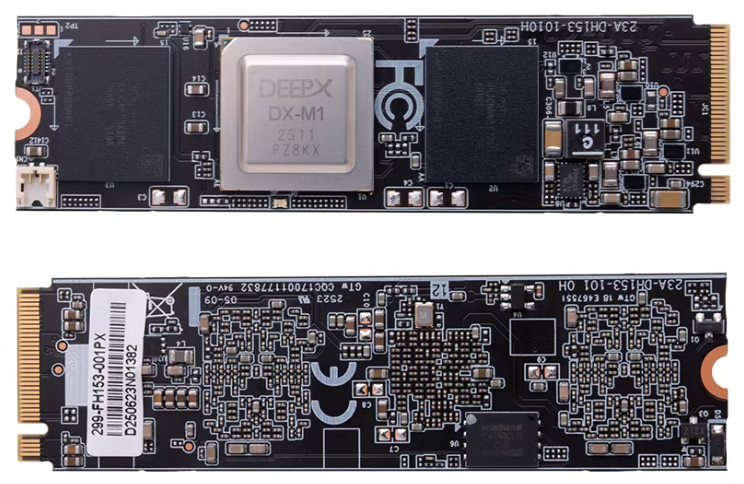
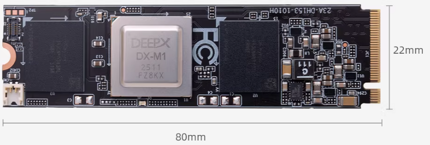

# DX-M1 AI Accelerator Card

## 1. Product Introduction

### Overview

The DEEPX DX-M1 M.2 module brings server-class AI inference directly to edge devices. With only 2 W to 5 W of power consumption, DX-M1 provides 25 TOPS of performance, delivers 20 times higher performance efficiency (FPS/W) than a GPGPU, and maintains GPU-level AI accuracy.



### Specifications



| Item | Specification |
| --- | --- |
| AI computing power | 25 TOPS |
| Form factor | M.2 M key |
| Size | 22 x 80 mm |
| Interface | PCIe Gen 3 x4 |
| Memory | 4GB LPDDR5 + 1Gbit QSPI NAND Flash |
| Debug interface | UART0, JTAG1 |

## 2. Usage

### Installation

Install the card into an RK3588 device with an M.2 connector, power on the device, and confirm that the DX-M1 PCIe accelerator card can be detected.

```shell
root@firefly:/home/firefly# lspci
0004:40:00.0 PCI bridge: Rockchip Electronics Co., Ltd Device 3588 (rev 01)
0004:41:00.0 Processing accelerators: Device 1ff4:0000 (rev 01)
```

### Environment Setup

Download the source code:

```shell
git clone -b v2.1.0 --recurse-submodules https://github.com/DEEPX-AI/dx-all-suite.git
```

Build and install the driver:

```shell
# Linux Headers must be installed on the device before building.
# See:
# https://wiki.t-firefly.com/zh_CN/Firefly-Linux-Guide/first_use.html#linux-headers
cd /dx-all-suite/dx-runtime/dx_rt_npu_linux_driver/modules/
./build.sh -d m1
./build.sh -d m1 -c install

# After installation, dxrt_driver can be shown by lsmod.
lsmod
```

Install dx_rt:

```shell
cd ./dx-all-suite/dx-runtime/dx_rt
./install.sh --all
./build.sh --install /usr/local
sudo cp ./service/dxrt.service /etc/systemd/system
sudo systemctl start dxrt.service
sudo systemctl enable dxrt.service
cd python_package
pip3 install .
reboot

# After installation, use this command to check the accelerator card status.
dxrt-cli -s
```

Update the firmware:

```shell
# The firmware on the accelerator card may not match the current SDK.
# Update it to the firmware version provided by the SDK first.
cd ~/dx-all-suite/dx-runtime/dx_fw
dxrt-cli -u ./m1/latest/mdot2/fw.bin
```

Test:

```shell
# Download a prebuilt model from https://developer.deepx.ai/article/modelzoo/.
# This example uses YoloV5S.

# run_model is the model benchmark tool.
run_model -m ./YoloV5S.dxnn -b -l 100 -v
```

## 3. More Resources

* GitHub: https://github.com/DEEPX-AI/