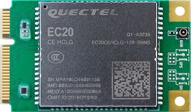
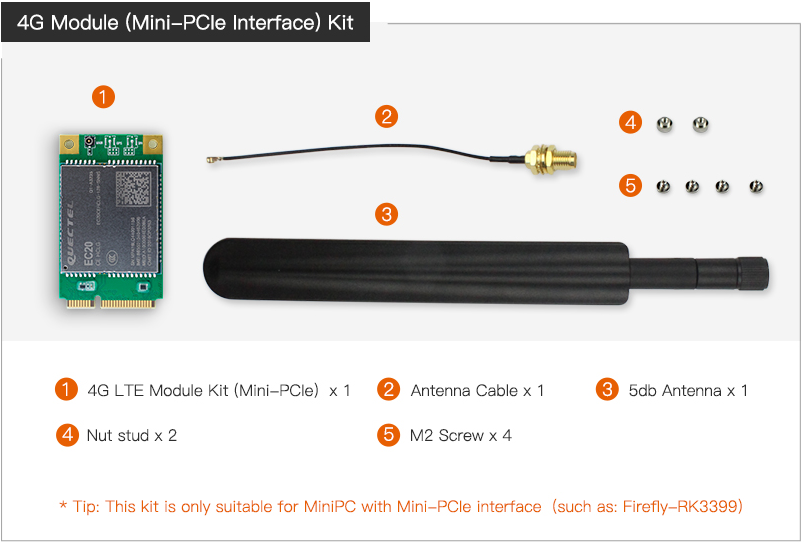
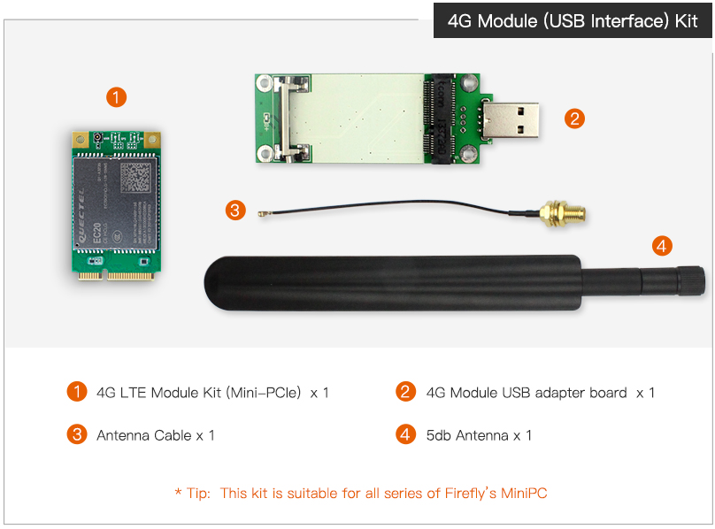
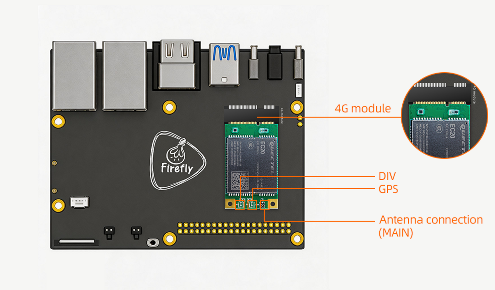
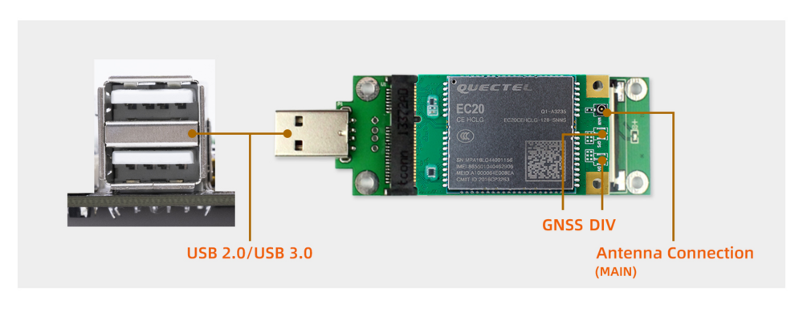

# 一、Introduction
## Product introduction
### EC20


<br>
<br>
This module does not support voice calls and SMS, if you need support, please contact business <sales@t-firefly.com>。

<!-- ## Shipping list
### PCIE interface

### USB interface
 -->

## Detailed parameters

|Model| EC20 R2.1 Mini PCIe|
|----|----|
|Working frequency band| TDD-LTE: B38/B39/B40/B41<br> FDD-LTE: B1/B3/B8 <br> WCDMA: B1/B8<br> TD-SCDMA: B34/B39<br> GSM: 900/1800 MHz|
|Data transmission|TDD-LTE： Max 130Mbps (DL) Max 35Mbps (UL)<br>FDD-LTE： Max 150Mbps (DL) Max 50Mbps (UL)<br>DC-HSPA+： Max 42Mbps (DL) Max 5.76Mbps (UL)<br>UMTS： Max 384Kbps (DL) Max 384Kbps (UL)<br>TD-SCDMA： Max 4.2Mbps (DL) Max 2.2Mbps (UL)<br>CDMA： Max 3.1Mbps (DL) Max 1.8Mbps (UL)<br>EDGE： Max 236.8Kbps (DL) Max 236.8Kbps (UL)<br>GPRS： Max 85.6Kbps (DL) Max 85.6Kbps (UL)|
|Structure size|51.0mm x 30.0mm x 4.9mm<br>Weight about 10.5 g |
|Authentication|NAL/SRRC/CCC |
|Antenna Connectors|x3 main antenna, diversity antenna and GNSS antenna|

<!-- |Interface connector|USB: USB 2.0 high-speed interface, 480Mbps<br>digital voice: 1 digital voice interface (optional)）<br>USIM: 1.8/3.3V<br>network indicator: ×2, NET_STATUS and NET_MODE<br>UART: x1 UART<br>reset: low level<br>PWRKEY: low level<br>antenna interface: 3 (main antenna, diversity antenna and GNSS antenna interface)<br>ADC: x2| -->

# 二、Usage

## Hardware connection
### Module connection
#### PCIE connection

<!-- | CPU | Board | 
| ---- | ---- | 
| PX30 | [AIO-PX30-JD4](../../../modules_img/EC20/ec20_AIO-PX30-JD4.png) |
| RK3128 | [AIO-3128C]() | 
| RK3288 | [AIO-3288C](../../../modules_img/EC20/ec20_AIO-3288C.png), [AIO-3288J](../../../modules_img/EC20/ec20_AIO-3288J.png) | 
| RK3399 | [AIO-3399C](../../../modules_img/EC20/ec20_AIO-3399C.png), [AIO-3399JD4](../../../modules_img/EC20/ec20_AIO-3399JD4.png), [AIO-3399J](_images/ec20_AIO-3399J.png), [Firefly-RK3399](../../../modules_img/EC20/ec20_Firefly-RK3399.png) | 
| RK3399Pro | [AIO-3399Pro-JD4](), [AIO-3399ProC](../../../modules_img/EC20/ec20_AIO-3399ProC.png) | 
| RK3566 | [AIO-3566JD4](../../../modules_img/EC20/ec20_AIO-3566JD4.png)|
| RK3568 | [AIO-3568J](../../../modules_img/EC20/ec20_AIO-3568J.png), [ROC-RK3568-PC SE](../../../modules_img/EC20/ec20_ROC-RK3568-PC-SE.png)| 
| RV1126_RV1109 | [AIO-1126-JD4](../../../modules_img/EC20/ec20_AIO-1126-JD4_AIO-1109-JD4.png), [AIO-1109-JD4](../../../modules_img/EC20/ec20_AIO-1126-JD4_AIO-1109-JD4.png) | 
| RK3588 | [ITX-3588J](../../../modules_img/EC20/ec20_ITX-3588J.png), [AIO-3588SJD4](../../../modules_img/EC20/ec20_AIO-3588SJD4.jpg), [AIO-3588Q](../../../modules_img/EC20/ec20_AIO-3588Q.jpg)|
| RK3576 | [AIO-3576C](_images/ec20_AIO-3576C.jpg)| -->


#### USB connection


### SIM insertion


# 三、Firmware and Resource download
Related documents and firmware download, see the official website [Resource Download](https://en.t-firefly.com/doc/download/119.html)


# 四、Tutorial
## Flash firmware

| CPU | USB upgrade | SD upgrade |
| ---- | ---- | ---- |
| PX30 | [AIO-PX30-JD4](../../System%20on%20Module/Core-PX30-JD4/programming_firmware.md) | |
| RK3128 | [Firefly-RK3128](../../Mainboards/Firefly-RK3128/Flash_Image.md), [AIO-3128C](../../Mainboards/AIO-3128C/upgrade_firmware.md)  |  |
| RK3288 | [Firefly-RK3288](../../Mainboards/Firefly-RK3288/upgrade_firmware.md), [AIO-3288J](../../Mainboards/AIO-3288J/upgrade_firmware.md),  [AIO-3288C](../../Mainboards/AIO-3288C/upgrade_firmware.md) | [Firefly-RK3288](../../Mainboards/Firefly-RK3288/upgrade_firmware_sd.md), [AIO-3288J](../../Mainboards/AIO-3288J/upgrade_firmware_sd.md), [AIO-3288C](../../Mainboards/AIO-3288C/upgrade_firmware_sd.md) |
|RK3308| [ROC-RK3308-CC](../../Mainboards/ROC-RK3308-CC/burning_firmware.md), [ROC-RK3308B-CC-PLUS](../../Mainboards/ROC-RK3308B-CC-PLUS/03-upgrade_firmware.md) ||
| RK3328 | [ROC-RK3328-CC](../../Mainboards/ROC-RK3328-CC/flash_emmc.md), [ROC-RK3328-PC](../../Mainboards/ROC-RK3328-PC/03-upgrade_firmware.md)  | [ROC-RK3328-CC](../../Mainboards/ROC-RK3328-CC/flash_sd.md) |
|RK3399|[Firefly-RK3399](../../Mainboards/Firefly-RK3399/02-upgrade_table.md), [ROC-RK3399-PC](../../Mainboards/ROC-RK3399-PC/03-upgrade_firmware.md) <br> [ROC-RK3399-PC-PLUS](../../Mainboards/ROC-RK3399-PC-PLUS/03-upgrade_firmware.md), [AIO-3399JD4](../../Mainboards/AIO-3399JD4/03-upgrade_firmware.md), [AIO-3399J](../../Mainboards/AIO-3399J/03-upgrade_firmware.md) <br> [AIO-3399C](../../Mainboards/AIO-3399C/03-upgrade_firmware.md) | [Firefly-RK3399](../../Mainboards/Firefly-RK3399/05-upgrade_firmware_sd.md), [ROC-RK3399-PC](../../Mainboards/ROC-RK3399-PC/05-upgrade_firmware_sd.md) <br> [ROC-RK3399-PC-PLUS](../../Mainboards/ROC-RK3399-PC-PLUS/05-upgrade_firmware_sd.md), [AIO-3399JD4](../../Mainboards/AIO-3399JD4/05-upgrade_firmware_sd.md), [AIO-3399J](../../Mainboards/AIO-3399J/05-upgrade_firmware_sd.md) <br> [AIO-3399C](../../Mainboards/AIO-3399C/05-upgrade_firmware_sd.md) | 
|RK3399Pro|[AIO-3399Pro-JD4](../../Mainboards/AIO-3399Pro-JD4/03-upgrade_firmware.md), [AIO-3399ProC](../../Mainboards/AIO-3399ProC/03-upgrade_firmware.md)| [AIO-3399Pro-JD4](../../Mainboards/AIO-3399Pro-JD4/05-upgrade_firmware_sd.md), [AIO-3399ProC](../../Mainboards/AIO-3399ProC/05-upgrade_firmware_sd.md) |
|RK3566|[AIO-3566JD4](../../Mainboards/AIO-3566JD4/03-upgrade_firmware.md), [ROC-RK3566-PC](../../Mainboards/ROC-RK3566-PC/03-upgrade_firmware.md)| [AIO-3566JD4](../../Mainboards/AIO-3566JD4/05-upgrade_firmware_sd.md), [ROC-RK3566-PC](../../Mainboards/ROC-RK3566-PC/05-upgrade_firmware_sd.md) | 
|RK3568|[AIO-3568J](../../Mainboards/AIO-3568J/03-upgrade_firmware.md), [ROC-RK3568-PC](../../Mainboards/ROC-RK3568-PC/03-upgrade_firmware.md), [ROC-RK3568-PC SE](../../Mainboards/ROC-RK3568-PC-SE/03-upgrade_firmware.md)  | [AIO-3568J](../../Mainboards/AIO-3568J/05-upgrade_firmware_sd.md), [ROC-RK3568-PC](../../Mainboards/ROC-RK3568-PC/05-upgrade_firmware_sd.md), [ROC-RK3568-PC SE](../../Mainboards/ROC-RK3568-PC-SE/05-upgrade_firmware_sd.md)| 
| RV1126_RV1109|[AIO-1126-JD4](../../System%20on%20Module/Core-1126-JD4/upgrade_firmware.md), [AIO-1109-JD4](../../System%20on%20Module/Core-1109-JD4/upgrade_firmware.md), [CAM-C1126S2U](../../AI Camera/CAM-C1126S2U/upgrade_firmware.md), [CAM-C1109S2U](../../AI Camera/CAM-C1109S2U/upgrade_firmware.md) | [AIO-1126-JD4](../../System%20on%20Module/Core-1126-JD4/upgrade_firmware_sd.md), [AIO-1109-JD4](../../System%20on%20Module/Core-1109-JD4/upgrade_firmware_sd.md)
|RK3588|[ITX-3588J](../../Mainboards/ITX-3588J/upgrade_firmware.md), [ROC-RK3588S-PC](../../Mainboards/ROC-RK3588S-PC/upgrade_firmware.md), [AIO-3588SJD4](../../Mainboards/AIO-3588SJD4/upgrade_firmware.md),[AIO-3588Q](../../Mainboards/AIO-3588Q/upgrade_firmware.md)|[ITX-3588J](../../Mainboards/ITX-3588J/upgrade_firmware_sd.md), [ROC-RK3588S-PC](../../Mainboards/ROC-RK3588S-PC/upgrade_firmware_sd.md),[AIO-3588SJD4](../../Mainboards/AIO-3588SJD4/upgrade_firmware_sd.md) ,[AIO-3588Q](../../Mainboards/AIO-3588Q/upgrade_firmware_sd.md)|
|RK3576|[ROC-RK3576-PC](../../Mainboards/ROC-RK3576-PC/upgrade_firmware.md), [AIO-3576Q](../../Mainboards/AIO-3576Q/upgrade_firmware.md), [AIO-3576C](../../Mainboards/AIO-3576C/upgrade_firmware.md)|[ROC-RK3576-PC](../../Mainboards/ROC-RK3576-PC/upgrade_firmware_sd.md) ,[AIO-3576Q](../../Mainboards/AIO-3576Q/upgrade_firmware_sd.md), [AIO-3576C](../../Mainboards/AIO-3576C/upgrade_firmware_sd.md)|

<!-- ## Compile the firmware
### PX30 platform

|  System  |  Board |
|  ----  | ----  |
| Android8.1 | [AIO-PX30-JD4](../../Mainboards/AIO-PX30-JD4/Android_development.md#aio-px30-jd4-compiling-method) |
| Ubuntu | [AIO-PX30-JD4](../../Mainboards/AIO-PX30-JD4/linux_compile.md) |
| Buildroot | [AIO-PX30-JD4](../../Mainboards/AIO-PX30-JD4/buildroot_compile.md) |

### RK3128 platform

|  System  |  Board | 
|  ----  | ----  | 
| Android5.1  | [Firefly-RK3128](../../Mainboards/Firefly-RK3128/Build_Android.md#hdmi), [AIO-3128C](../../Mainboards/AIO-3128C/Build_Android.md#hdmi) | 

### RK3288 platform

|  System  |  Board | 
|  ----  | ----  | 
| Android5.1  | [Firefly-RK3288](../../Mainboards/Firefly-RK3288/compile_android_firmware.md#hdmi), [AIO-3288J](../../Mainboards/AIO-3288J/compile_android_firmware.md#hdmi), [AIO-3288C](../../Mainboards/AIO-3288C/compile_android_firmware.md#hdmi) | 
| Ubuntu | [Firefly-RK3288](../../Mainboards/Firefly-RK3288/linux_compile_gpt.md), [AIO-3288J](../../Mainboards/AIO-3288J/linux_compile_gpt.md), [AIO-3288C](../../Mainboards/AIO-3288C/linux_compile_gpt.md) | 
| Buildroot | [Firefly-RK3288](../../Mainboards/Firefly-RK3288/buildroot_compile.md), [AIO-3288J](../../Mainboards/AIO-3288J/buildroot_compile.md), [AIO-3288C](../../Mainboards/AIO-3288C/buildroot_compile.md) |

### RK3308 platform

|  System   |  Board | 
|  ----  | ----  | 
| Buildroot | [ROC-RK3308-CC](../../Mainboards/ROC-RK3308-CC/buildroot_development.md), [ROC-RK3308B-CC-PLUS](../../Mainboards/ROC-RK3308B-CC-PLUS/sdkbuilding.md) |

### RK3328 platform

|  System   |  Board | 
|  ----  | ----  | 
| Android7.1 | [ROC-RK3328-CC](../../Mainboards/ROC-RK3328-CC/android_compile_android7.md)|
|Android8.1 | [ROC-RK3328-CC](../../Mainboards/ROC-RK3328-CC/android_compile_android8.md) |
| Android10.0  | [ROC-RK3328-PC](../../Mainboards/ROC-RK3328-PC/android_compile_android10.md) | 
| Ubuntu | [ROC-RK3328-CC](../../Mainboards/ROC-RK3328-CC/linux_compile.md), [ROC-RK3328-PC](../../Mainboards/ROC-RK3328-PC/linux_compile.md) |

### RK3399 platform

|  System   |  Board | 
|  ----  | ----  | 
| Android7.1 Industry | [Firefly-RK3399](../../Mainboards/Firefly-RK3399/compile_android7.1_industry_firmware.md#public-compile), [ROC-RK3399-PC](../../Mainboards/ROC-RK3399-PC/compile_android7.1_industry_firmware.md#public-compile), [ROC-RK3399-PC-PLUS](../../Mainboards/ROC-RK3399-PC-PLUS/compile_android7.1_industry_firmware.md#public-compile), [ROC-RK3399-PC-Pro](../../Mainboards/ROC-RK3399-PC-Pro/compile_android7.1_industry_firmware.md#public-compile), [AIO-3399JD4](../../Mainboards/AIO-3399JD4/compile_android7.1_industry_firmware.md#public-compile), [AIO-3399J](../../Mainboards/AIO-3399J/compile_android7.1_industry_firmware.md#public-compile), [AIO-3399C](../../Mainboards/AIO-3399C/compile_android7.1_industry_firmware.md#public-compile), [Face-RK3399](../../Mainboards/Face-RK3399/compile_android_firmware.md#wan-zheng-bian-yi-face-rk3399) | 
| Android10.0 | [ROC-RK3399-PC-PLUS](../../Mainboards/ROC-RK3399-PC-PLUS/compile_android10.0_firmware.md#public-compile), [ROC-RK3399-PC-Pro](../../Mainboards/ROC-RK3399-PC-Pro/compile_android10.0_firmware.md#public-compile),[AIO-3399J](../../Mainboards/AIO-3399J/compile_android10.0_firmware.md#public-compile), [AIO-3399C](../../Mainboards/AIO-3399C/compile_android10.0_firmware.md#public-compile) | 
| Ubuntu | [Firefly-RK3399](../../Mainboards/Firefly-RK3399/linux_compile_gpt.md), [ROC-RK3399-PC](../../Mainboards/ROC-RK3399-PC/linux_compile_gpt.md), [ROC-RK3399-PC-PLUS](../../Mainboards/ROC-RK3399-PC-PLUS/linux_compile_gpt.md), [AIO-3399JD4](../../Mainboards/AIO-3399JD4/linux_compile_gpt.md), [AIO-3399J](../../Mainboards/AIO-3399J/linux_compile_gpt.md), [AIO-3399C](../../Mainboards/AIO-3399C/linux_compile_gpt.md) | 
| Buildroot | [Firefly-RK3399](../../Mainboards/Firefly-RK3399/buildroot_compile.md), [ROC-RK3399-PC](../../Mainboards/ROC-RK3399-PC/buildroot_compile.md), [ROC-RK3399-PC-PLUS](../../Mainboards/ROC-RK3399-PC-PLUS/buildroot_compile.md), [AIO-3399JD4](../../Mainboards/AIO-3399JD4/buildroot_compile.md), [AIO-3399J](../../Mainboards/AIO-3399J/buildroot_compile.md), [AIO-3399C](../../Mainboards/AIO-3399C/buildroot_compile.md) | 

### RK3399Pro platform

|  System  |  Board | 
|  ----  | ----  | 
| Android9.0 | [AIO-3399Pro-JD4](../../Mainboards/AIO-3399Pro-JD4/compile_android9.0_firmware.md#public-compile), [AIO-3399ProC](../../Mainboards/AIO-3399ProC/compile_android9.0_firmware.md#public-compile) | 
| Ubuntu | [AIO-3399Pro-JD4](../../Mainboards/AIO-3399Pro-JD4/linux_compile_gpt.md), [AIO-3399ProC](../../Mainboards/AIO-3399ProC/linux_compile_gpt.md) | 

### RK3566 platform

|  System   |  Board | 
|  ----  | ----  | 
| Android11.0 | [AIO-3566JD4](../../Mainboards/AIO-3566JD4/compile_android11.0_firmware.md#public-compile), [ROC-RK3566-PC](../../Mainboards/ROC-RK3566-PC/compile_android11.0_firmware.md#public-compile) | 
| Ubuntu | [AIO-3566JD4](../../Mainboards/AIO-3566JD4/linux_compile_gpt.md), [ROC-RK3566-PC](../../Mainboards/ROC-RK3566-PC/linux_compile_gpt.md) | 
| Buildroot | [AIO-3566JD4](../../Mainboards/AIO-3566JD4/buildroot_compile.md), [ROC-RK3566-PC](../../Mainboards/ROC-RK3566-PC/buildroot_compile.md) |

### RK3568 platform

|  System  |  Board | 
|  ----  | ----  | 
| Android11.0 | [AIO-3568J](../../Mainboards/AIO-3568J/compile_android11.0_firmware.md#public-compile), [ROC-RK3568-PC](../../Mainboards/ROC-RK3568-PC/compile_android11.0_firmware.md#public-compile), [ROC-RK3568-PC SE](../../Mainboards/ROC-RK3568-PC-SE/compile_android11.0_firmware.md#public-compile) | 
| Ubuntu | [AIO-3568J](../../Mainboards/AIO-3568J/linux_compile_gpt.md), [ROC-RK3568-PC](../../Mainboards/ROC-RK3568-PC/linux_compile_gpt.md) | 
| Buildroot | [AIO-3568J](../../Mainboards/AIO-3568J/buildroot_compile.md), [ROC-RK3568-PC](../../Mainboards/ROC-RK3568-PC/buildroot_compile.md) |

### RV1126_RV1109 platform

|  System   |  Board | 
|  ----  | ----  | 
| Buildroot | [AIO-1126-JD4](../../Mainboards/AIO-1126-JD4/Source_code.md#bian-yi-pei-zhi), [AIO-1109-JD4](../../Mainboards/AIO-1109-JD4/Source_code.md#bian-yi-pei-zhi), [CAM-C1126S2U](../../AI Camera/CAM-C1126S2U/Source_code.md#bian-yi-pei-zhi), [CAM-C1109S2U](../../AI Camera/CAM-C1109S2U/Source_code.md#bian-yi-pei-zhi) |

### RK3588 platform

|  System   |  Board | 
|  ----  | ----  | 
| Android12.0 | [ITX-3588J](../../Mainboards/ITX-3588J/android_compile_android12.0_firmware.md),[ROC-RK3588S-PC](../../Mainboards/ROC-RK3588S-PC/android_compile_android12.0_firmware.md),[AIO-3588SJD4](../../Mainboards/AIO-3588SJD4/android_compile_android12.0_firmware.md),[AIO-3588Q](../../Mainboards/AIO-3588Q/android_compile_android12.0_firmware.md)| 
| Buildroot | [ITX-3588J](../../Mainboards/ITX-3588J/linux_compile_buildroot.md),[ROC-RK3588S-PC](../../Mainboards/ROC-RK3588S-PC/linux_compile_buildroot.md),[AIO-3588SJD4](../../Mainboards/AIO-3588SJD4/linux_compile_buildroot.md),[AIO-3588Q](../../Mainboards/AIO-3588Q/linux_compile_buildroot.md),[AIO-3588MQ](../../Mainboards/AIO-3588MQ/linux_compile_buildroot.md),[AIO-3588JQ](../../Mainboards/AIO-3588JQ/linux_compile_buildroot.md)|
| Ubuntu20.04 | [ITX-3588J](../../Mainboards/ITX-3588J/linux_compile_ubuntu.md),[ROC-RK3588S-PC](../../Mainboards/ROC-RK3588S-PC/linux_compile_ubuntu.md),[AIO-3588SJD4](../../Mainboards/AIO-3588SJD4/linux_compile_ubuntu.md),[AIO-3588Q](../../Mainboards/AIO-3588Q/linux_compile_ubuntu.md),[AIO-3588MQ](../../Mainboards/AIO-3588MQ/linux_compile_ubuntu.md),[AIO-3588JQ](../../Mainboards/AIO-3588JQ/linux_compile_ubuntu.md)|
| Debian11 | [ITX-3588J](../../Mainboards/ITX-3588J/linux_compile_debian.md),[ROC-RK3588S-PC](../../Mainboards/ROC-RK3588S-PC/linux_compile_debian.md),[AIO-3588SJD4](../../Mainboards/AIO-3588SJD4/linux_compile_debian.md),[AIO-3588Q](../../Mainboards/AIO-3588Q/linux_compile_debian.md),[AIO-3588MQ](../../Mainboards/AIO-3588MQ/linux_compile_debian.md),[AIO-3588JQ](../../Mainboards/AIO-3588JQ/linux_compile_debian.md)|

### RK3576 platform

|  System   |  Board |
|  ----  | ----  |
| Android14.0 | [ROC-RK3576-PC](../../Mainboards/ROC-RK3576-PC/android_compile_android14.0_firmware.md),[AIO-3588Q](../../Mainboards/AIO-3588Q/android_compile_android14.0_firmware.md),[AIO-3576C](../../Mainboards/AIO-3576C/android_compile_android14.0_firmware.md)| 
| Ubuntu22.04 | [ROC-RK3576-PC](../../Mainboards/ROC-RK3576-PC/linux_compile_ubuntu.md),[AIO-3576Q](../../Mainboards/AIO-3576Q/linux_compile_ubuntu.md),[AIO-3576C](../../Mainboards/AIO-3576C/linux_compile_ubuntu.md)| -->

### EC20 GNSS Function(optional)

EC20 module supports wireless network data communication, including GNSS and without GNSS:
* Suffix `SNNS`: not support GNSS
* Suffix `SGNS`: support GNSS

GNSS is supported by public firmware, but disabled by default

### Parameters
EC20 module supports GPS, GLONASS, GALILEO and BEIDOU, and is compatible with standard NMEA 0183 protocol. It can output NMEA information of 1Hz frequency through USB NMEA interface. The default output serial port is `/dev/ttyUSB1` and baud rate is ` 115200` bit/s.

### Antenna Requirements

||Parameter|
|---|---|
| Frequency range |1559MHz~1609MHz|
| Polarization |RHCP or Linear|
| VSWR |< 2(Typical) |
| Active antenna noise figure|< 1.5dB |
| Active antenna gain |> 0dB |
| LNA gain embedded in active antenna |< 17dB |


### How to enable GPS and modify serial port Configuration

##### Android Temporary modification method

* Enable ADB, and how to enable ADB, please refer to wiki tutorial ADB Use
* Set system readable and writable
    ```
    adb shell setprop persist.sys.root_access 3
    adb root && adb remount
    ```
* Modify Parameters

    * Enabled GPS：Modify the parameter `ro.factory.hasGPS` in `/vendor/build.prop` on the machine to `true` to enable GPS. It will take effect after soft restarting the machine.
    * Modify serial port configuration: change `SERIAL_DEVICE` and `SERIAL_BAUD_RATE` in /system/etc/u-blox.conf to `/dev/ttyusb1` and `115200` respectively. It takes effect after soft restarting the machine.

##### Android Code modification method

* Enabled GPS
    * Modify the `BOARD_HAS_GPS` in the SDK directory `device/rockchip/{CPU}/{PRODUCT}/{PRODUCT}.mk` to `true` to enable GPS function. Then, recompile the SDK and upgrad the firmware to take effect.

* Modify serial port configuration (serial port node or baud rate)
    * Set `SERIAL_DEVICE` in `device/rockchip/{CPU}/{PRODUCT}/GPS/u-blox.conf` to `/dev/ttyUSB1`. `SERIAL_BAUD_RATE` is changed to `115200`. Then, recompile the SDK and upgrad the firmware to take effect.