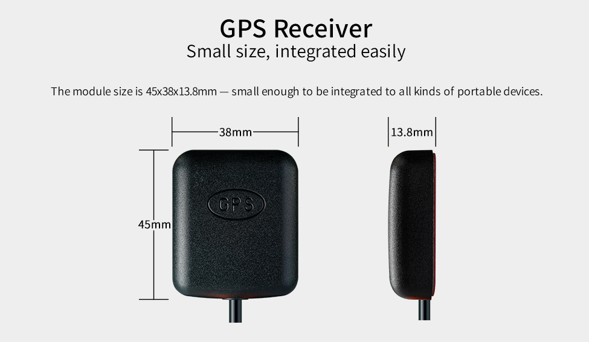
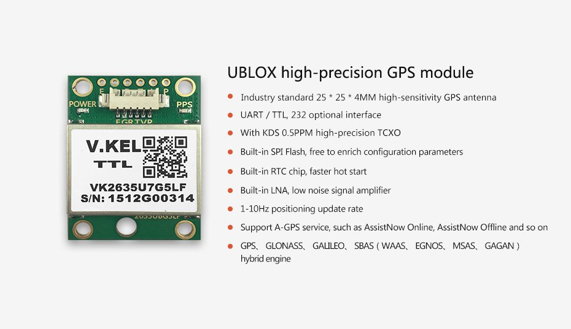

# 一、Introduction
## Product introduction
### DELINCOMM
* Single GPS receiver RG4538
* GPS&GLONASS receiver RU4538-G
* GPS&BeiDou (BeiDou)receiver RM4538-B



### DK2635U7F


<!--
## Shipping list
-->

## Detailed parameters

|      | RG4538 | RM4538-B | RU4538-G | DK2635U7F |
| ---- | ---- |---- |---- |---- |
| Chipset | G9501 | MT3333 | UBX-M8030-KT | UBX-G7020-KT |
| Track sensitivity | -165dBm | -165dBm | -167dBm | -162dBm |
| Power consumption | Max 60mA@3.3V | Max 45mA@3.3V | Max 40mA@3.3V | Max 25mA@3.3V |
| protocol |  NMEA-0183 | NMEA-0183 | NMEA-0183 | NMEA-0183 |
| voltage range | 3.3V~5.0V | 3.3V~5.0V | 3.3V~5.0V | 3.3V~5.0V |
| Operating Temperature | -40℃~85℃ | -40℃~85℃ | -40℃~85℃ | -40℃~85℃ |
| size | 45x38x13.8mm | 45x38x13.8mm | 45x38x13.8mm | 26x35x8.5mm |
| Communicatione | UART/TTL | UART/TTL | UART/TTL | UART/TTL |
| Baud rate | 9600 | 9600 | 9600 | 9600 |
| Interface | XH2.0mm PIN spacing<br>4Pin<br>L=200cm | XH2.0mm PIN spacing<br>4Pin<br>L=200cm | XH2.0mm PIN spacing<br>4Pin<br>L=200cm |  |

## Interface
### DELINCOMM
* VCC: Red wire
* GND: Black wire
* TX : White wire
* RX : Green wire

### DK2635U7F
* VCC: White wire
* GND: Black wire
* TX : Blue wire
* RX : Green wire

<!--
## 产品选型
-->

# 二、Usage

<!--
## Usage
-->

## Hardware connection

Connect the VCC, GND, TX and RX of the module to 3.3V, GND, RX and TX of ****(<font color = "red">the corresponding node is </font>) respectively. Pay attention to avoid<font color="red"> burning the module </font> due to wrong connection of VCC, GND, TX and RX
<br>

For some definitions and descriptions of UART, please refer to the Wiki tutorial "UART Usage" of each board

| CPU | Board | 
| ---- | ---- | 
| RK3399 | [AIO-3399C](https://wiki.t-firefly.com/GNSS/_images/gnss_AIO-3399C.png), [AIO-3399J](https://wiki.t-firefly.com/GNSS/_images/gnss_AIO-3399J.png), [AIO-3399JD4](https://wiki.t-firefly.com/GNSS/_images/gnss_AIO-3399JD4.png)| 
| RK3399Pro | [AIO-3399ProC](https://wiki.t-firefly.com/GNSS/_images/gnss_AIO-3399ProC.png), [AIO-3399Pro-JD4](https://wiki.t-firefly.com/GNSS/_images/gnss_AIO-3399Pro-JD4.png) | 
| RK3566 | [AIO-3566JD4](https://wiki.t-firefly.com/GNSS/_images/gnss_AIO-3566JD4.png) | 
| RK3568 | [AIO-3568J](https://wiki.t-firefly.com/GNSS/_images/gnss_AIO-3568J.png) | 
| RK3588 | [ITX-3588J](https://wiki.t-firefly.com/GNSS/_images/gnss_ITX-3588J.jpg) , [ROC-RK3588S-PC](https://wiki.t-firefly.com/GNSS/_images/gnss_ROC-RK3588S-PC.jpg) , [AIO-3588SJD4](https://wiki.t-firefly.com/GNSS/_images/gnss_AIO-3588SJD4.jpg),[AIO-3588Q](https://wiki.t-firefly.com/GNSS/_images/gnss_AIO-3588Q.jpg)| 

## How to enable GPS and modify serial port configuration ?
### Android temporary modification
* Enable ADB: How to enable ADB, refer to the chapter "Using ADB" in the Wiki tutorial of each product.
* Set the system to be readable and writable

    ```
    adb shell setprop persist.sys.root_access 3
    adb root && adb remount
    ````
* Change parameters
    * Enable GPS: Modify `ro.factory.hasGPS` in `/vendor/build.prop` to `true`
    * Modify the serial port configuration: modify the `SERIAL_DEVICE` in the board `/system/etc/u-blox.conf` to the serial port path where the corresponding module is connected, and `SERIAL_BAUD_RATE` to the baud rate of the corresponding module
* Reboot the board

### Android code modification
* Enable GPS
    * Modify `BOARD_HAS_GPS` in `device/rockchip/{CPU}/{PRODUCT}/{PRODUCT}.mk` in SDK directory to `true`
* Modify serial port configuration
    * Modify `SERIAL_DEVICE` in `device/rockchip/{CPU}/{PRODUCT}/gps/u-blox.conf` in the SDK directory to the serial port path where the corresponding module is connected, and `SERIAL_BAUD_RATE` to the baud rate of the corresponding module Rate
* Recompile the SDK and flash the firmware

## FAQ
<font color='red'>Note:</font>The following content is based on the GPS module's serial port path `/dev/ttysWK2` and baud rate `9600` as an example.
### How to judge whether the GPS module hardware connection is correct ?
When the GPS module operates according to the [Hardware Connection](gnss.html#ying-jian-lian-jie)" chapter, through debugging the serial port or adb shell, after executing `cat /dev/ttysWK2`, the correct hardware connection will appear The following LOG information.

```
cat /dev/ttysWK2
$GPRMC,,V,,,,,,,,,,N*53
$GPVTG,,,,,,,,,N*30
$GPGGA,,,,,,0,00,99.99,,,,,,*48
$GPGSA,A,1,,,,,,,,,,,,,99.99,99.99,99.99*30
$GPGLL,,,,,,V,N*64
$GPRMC,,V,,,,,,,,,,N*53
$GPVTG,,,,,,,,,N*30
$GPGGA,,,,,,0,00,99.99,,,,,,*48
$GPGSA,A,1,,,,,,,,,,,,,99.99,99.99,99.99*30
$GPGLL,,,,,,V,N*64
$GPRMC,,V,,,,,,,,,,N*53
$GPVTG,,,,,,,,,N*30
$GPGGA,,,,,,0,00,99.99,,,,,,*48
$GPGSA,A,1,,,,,,,,,,,,,99.99,99.99,99.99*30
$GPGLL,,,,,,V,N*64
$GPRMC,,V,,,,,,,,,,N*53
$GPVTG,,,,,,,,,N*30
$GPGGA,,,,,,0,00,99.99,,,,,,*48
$GPGSA,A,1,,,,,,,,,,,,,99.99,99.99,99.99*30
$GPGLL,,,,,,V,N*64
$GPRMC,,V,,,,,,,,,,N*53
$GPVTG,,,,,,,,,N*30
$GPGGA,,,,,,0,00,99.99,,,,,,*48
$GPGSA,A,1,,,,,,,,,,,,,99.99,99.99,99.99*30
$GPGLL,,,,,,V,N*64
$GPRMC,,V,,,,,,,,,,N*53
$GPVTG,,,,,,,,,N*30
$GPGGA,,,,,,0,00,99.99,,,,,,*48
$GPGSA,A,1,,,,,,,,,,,,,99.99,99.99,99.99*30
$GPGLL,,,,,,V,N*64
...
```

### How to judge whether gps.default.so is loaded normally?

When according to "[How to enable GPS and modify serial port configuration](gnss.html#how-to-enable-gps-and-modify-serial-port-configuration)" section, power on the motherboard again, and execute `logcat -s TD1030DBG` through serial port debugging or adb shell, *gps.default.so* will appear as follows when loading normally LOG information:

```
logcat -s TD1030DBG
--------- beginning of kernel
--------- beginning of system
--------- beginning of main
06-01 01:38:26.913   254   254 D TD1030DBG: ======ro.factory.hasGPS: true
06-01 01:38:26.913   254   254 D TD1030DBG: Ver:20170626
06-01 01:38:26.913   254   254 D TD1030DBG: Firefly Version: gps_hal-android-arm64-5299e92006fa
06-01 01:38:26.922   254   254 D TD1030DBG: [DebugMask:0x60]
06-01 01:38:26.922   254   254 D TD1030DBG: [PROJECT_NAME : TD1030]
06-01 01:38:26.922   254   254 D TD1030DBG: Uart Path : /dev/ttysWK2
06-01 01:38:26.922   254   254 D TD1030DBG: Uart Baudrate : 9600
06-01 01:38:26.922   254   254 D TD1030DBG: AGPS_PORT:7275
06-01 01:38:26.922   254   254 D TD1030DBG: [AGPS_SERVER : supl.google.com]
06-01 01:38:26.922   254   254 D TD1030DBG: GNSS_MODE:3
06-01 01:38:26.922   254   254 D TD1030DBG: Succeed : Load configfile ok!
06-01 01:38:26.923   254   254 D TD1030DBG: Succeed : open uart /dev/ttysWK2 boadrate = 9600
06-01 01:38:26.924   254   254 V TD1030DBG: UartTxData, do not send data to gps_soc by uart
06-01 01:38:27.074   254   254 V TD1030DBG: UartTxData, do not send data to gps_soc by uart
06-01 01:38:27.224   254   254 V TD1030DBG: UartTxData, do not send data to gps_soc by uart
06-01 01:38:37.447   254   254 D TD1030DBG: Enter : td_bdgps_get_extension(gps-xtra)
06-01 01:38:37.447   254   254 D TD1030DBG: Enter : td_bdgps_get_extension(agps_ril)
06-01 01:38:37.448   254   254 D TD1030DBG: Enter : td_bdgps_get_extension(agps)
06-01 01:38:37.448   254   254 D TD1030DBG: Enter : td_bdgps_get_extension(gps_navigation_message)
06-01 01:38:37.448   254   254 D TD1030DBG: Enter : td_bdgps_get_extension(gps_measurement)
06-01 01:38:37.448   254   254 D TD1030DBG: Enter : td_bdgps_get_extension(gps-debug)
06-01 01:38:37.448   254   254 D TD1030DBG: Enter : td_bdgps_get_extension(gps-ni)
06-01 01:38:37.449   254   254 D TD1030DBG: Enter : td_bdgps_get_extension(gnss_configuration)
06-01 01:38:37.449   254   254 D TD1030DBG: Enter : td_bdgps_get_extension(gps_geofencing)
06-01 01:38:37.450   254   254 D TD1030DBG: Enter : td_bdgps_init
06-01 01:38:37.450   254   254 D TD1030DBG: Enter : gps_state_init
06-01 01:38:37.452   254   254 D TD1030DBG: Enter : td_bd_agps_init
06-01 01:38:37.452   254   254 D TD1030DBG: Succeed : agps init
06-01 01:38:37.453   254   254 D TD1030DBG: Enter : bd_xtra_init
06-01 01:38:37.453   254   254 D TD1030DBG: Enter : td_agps_init
06-01 01:38:37.453   254   254 D TD1030DBG: Enter : td_gps_ni_init
06-01 01:38:37.454   254   254 D TD1030DBG: Enter : td_agps_ril_init
06-01 01:38:37.454   254   254 D TD1030DBG: Enter : td_bdgps_cleanup
06-01 01:38:37.463   254   719 D TD1030DBG: Enter : tdchip_ack_timer_thread(0)
06-01 01:38:37.465   254   254 D TD1030DBG: Enter : td_bdgps_init
06-01 01:38:37.465   254   254 D TD1030DBG: Enter : bd_xtra_init
06-01 01:38:37.466   254   715 D TD1030DBG: Enter : gps_state_thread
06-01 01:38:37.466   254   715 D TD1030DBG: Event : gps control fd event 10
06-01 01:38:37.466   254   717 D TD1030DBG: Enter : supl_client_assist_thread
06-01 01:38:37.467   254   254 D TD1030DBG: Enter : td_agps_init
06-01 01:38:37.467   254   254 D TD1030DBG: Enter : td_gps_ni_init
06-01 01:38:37.468   254   254 D TD1030DBG: Enter : td_agps_ril_init
```


Among them, you can check whether the serial port path and baud rate set by the software are consistent with the GPS module through the LOG information, such as:

```
06-01 01:38:26.923   254   254 D TD1030DBG: Succeed : open uart /dev/ttysWK2 boadrate = 9600
```


If the serial port path does not have 0666 permission, *gps.default.so* will fail to load, and the following error LOG information will appear:
```
06-01 01:38:26.923   254   254 D TD1030DBG: ERROR : Uart Open Permission denied
```

Solution: Give 0666 permission to the serial port path.

### The GPS test APK has a small number of stars or fails to locate
When the GPS module is connected correctly and *gps.default.so* is loaded normally, the GPS test APK may find that the number of satellites is small or the positioning fails. It is necessary to check whether the **GPS antenna** is placed in an **open outdoor**.

# 三、Firmware and Resource Download
For related documents and firmware download, see [Data Download](https://en.t-firefly.com/doc/download/120.html) on the official website .

<!--
## 文档下载
## 配件图纸
## 软件工具
## 固件下载
-->

# 四、Getting Started
## Flash firmware

| CPU | USB flash | SD upgrade |
| ---- | ---- | ---- |
|RK3399|[AIO-3399JD4](https://wiki.t-firefly.com/en/Core-3399-JD4/03-upgrade_firmware.html),[AIO-3399J](https://wiki.t-firefly.com/en/AIO-3399J/03-upgrade_firmware.html)<br> [AIO-3399C](https://wiki.t-firefly.com/en/AIO-3399C/03-upgrade_firmware.html) | [AIO-3399JD4](https://wiki.t-firefly.com/en/Core-3399-JD4/05-upgrade_firmware_sd.html), [AIO-3399J](https://wiki.t-firefly.com/en/AIO-3399J/05-upgrade_firmware_sd.html)<br> [AIO-3399C](https://wiki.t-firefly.com/AIO-3399C/05-upgrade_firmware_sd.html) | 
|RK3399Pro|[AIO-3399Pro-JD4](https://wiki.t-firefly.com/enAIO-3399PRO-JD4/03-upgrade_firmware.html), [AIO-3399ProC](https://wiki.t-firefly.com/en/AIO-3399ProC/03-upgrade_firmware.html)| [AIO-3399Pro-JD4](https://wiki.t-firefly.com/en/AIO-3399PRO-JD4/05-upgrade_firmware_sd.html), [AIO-3399ProC](https://wiki.t-firefly.com/en/AIO-3399ProC/05-upgrade_firmware_sd.html) |
|RK3566|[AIO-3566JD4](https://wiki.t-firefly.com/en/Core-3566JD4/03-upgrade_firmware.html)| [AIO-3566JD4](https://wiki.t-firefly.com/en/Core-3566JD4/05-upgrade_firmware_sd.html) | 
|RK3568|[AIO-3568J](https://wiki.t-firefly.com/en/Core-3568J/03-upgrade_firmware.html) | [AIO-3568J](https://wiki.t-firefly.com/en/Core-3568J/05-upgrade_firmware_sd.html)| 
|RK3588|[ITX-3588J](https://wiki.t-firefly.com/en/Core-3588J/upgrade_firmware.html), [ROC-RK3588S-PC](https://wiki.t-firefly.com/en/ROC-RK3588S-PC/upgrade_firmware.html), [AIO-3588SJD4](https://wiki.t-firefly.com/en/Core-3588SJD4/upgrade_firmware.html),[AIO-3588Q](https://wiki.t-firefly.com/en/iCore-3588Q/upgrade_firmware.html)|[ITX-3588J](https://wiki.t-firefly.com/en/Core-3588J/upgrade_firmware_sd.html), [ROC-RK3588S-PC](https://wiki.t-firefly.com/en/ROC-RK3588S-PC/upgrade_firmware_sd.html), [AIO-3588SJD4](https://wiki.t-firefly.com/en/Core-3588SJD4/upgrade_firmware_sd.html),[AIO-3588Q](https://wiki.t-firefly.com/en/iCore-3588Q/upgrade_firmware_sd.html)| 

## Compile the firmware

### RK3399 platform

| System | Board | 
| ---- | ---- | 
| Android7.1 Industry | [AIO-3399JD4](https://wiki.t-firefly.com/en/Core-3399-JD4/compile_android7.1_industry_firmware.html#gong-ban-bian-yi), [AIO-3399J](https://wiki.t-firefly.com/en/AIO-3399J/compile_android7.1_industry_firmware.html#gong-ban-bian-yi), [AIO-3399C](https://wiki.t-firefly.com/AIO-3399C/compile_android7.1_industry_firmware.html#gong-ban-bian-yi) | 
| Ubuntu | [AIO-3399JD4](), [AIO-3399J](), [AIO-3399C]() | 
| Buildroot | [AIO-3399JD4](), [AIO-3399J](), [AIO-3399C]() | 

### RK3399Pro platform

| System | Board | 
| ---- | ---- | 
| Android9.0 | [AIO-3399Pro-JD4](https://wiki.t-firefly.com/en/AIO-3399Pro-JD4/compile_android9.0_firmware.html#gong-ban-bian-yi), [AIO-3399ProC](https://wiki.t-firefly.com/en/AIO-3399ProC/compile_android9.0_firmware.html#gong-ban-bian-yi) | 
| Ubuntu | [AIO-3399Pro-JD4](), [AIO-3399ProC]() | 

### RK3566 platform

| System | Board | 
| ---- | ---- | 
| Android11.0 | [AIO-3566JD4](https://wiki.t-firefly.com/en/Core-3566JD4/compile_android11.0_firmware.html#gong-ban-bian-yi) | 
| Ubuntu | [AIO-3566JD4]() | 
| Buildroot | [AIO-3566JD4]() | 

### RK3568 platform

| System | Board | 
| ---- | ---- | 
| Android11.0 | [AIO-3568J](https://wiki.t-firefly.com/en/Core-3568J/compile_android11.0_firmware.html#gong-ban-bian-yi) | 
| Ubuntu | [AIO-3568J]() | 
| Buildroot | [AIO-3568J]() | 

### RK3588 platform

| System | Board |
| ---- | ---- |
| Android12.0 | [ITX-3588J](https://wiki.t-firefly.com/en/Core-3588J/android_compile_android12.0_firmware.html#core-3588j-product-compilation-method), [ROC-RK3588S-PC](https://wiki.t-firefly.com/en/ROC-RK3588S-PC/android_compile_android12.0_firmware.html#roc-rk3588s-pc-product-compilation-method), [AIO-3588SJD4](https://wiki.t-firefly.com/en/Core-3588SJD4/android_compile_android12.0_firmware.html#core-3588sjd4-product-compilation-method),[AIO-3588Q](https://wiki.t-firefly.com/en/iCore-3588Q/android_compile_android12.0_firmware.html)
| Buildroot | [ITX-3588J](https://wiki.t-firefly.com/en/Core-3588J/linux_compile_buildroot.html),[ROC-RK3588S-PC](https://wiki.t-firefly.com/en/ROC-RK3588S-PC/linux_compile_buildroot.html),[AIO-3588SJD4](https://wiki.t-firefly.com/en/Core-3588SJD4/linux_compile_buildroot.html),[AIO-3588Q](https://wiki.t-firefly.com/en/iCore-3588Q/linux_compile_buildroot.html),[AIO-3588MQ](https://wiki.t-firefly.com/en/iCore-3588MQ/linux_compile_buildroot.html),[AIO-3588JQ](https://wiki.t-firefly.com/en/iCore-3588MQ/linux_compile_buildroot.html)|
| Ubuntu20.04 | [ITX-3588J](https://wiki.t-firefly.com/en/Core-3588J/linux_compile_ubuntu.html),[ROC-RK3588S-PC](https://wiki.t-firefly.com/en/ROC-RK3588S-PC/linux_compile_ubuntu.html),[AIO-3588SJD4](https://wiki.t-firefly.com/en/Core-3588SJD4/linux_compile_ubuntu.html),[AIO-3588Q](https://wiki.t-firefly.com/en/iCore-3588Q/linux_compile_ubuntu.html),[AIO-3588MQ](https://wiki.t-firefly.com/en/iCore-3588MQ/linux_compile_ubuntu.html),[AIO-3588JQ](https://wiki.t-firefly.com/en/iCore-3588MQ/linux_compile_buildroot.html)|
| Debian11 | [ITX-3588J](https://wiki.t-firefly.com/en/Core-3588J/linux_compile_debian.html),[ROC-RK3588S-PC](https://wiki.t-firefly.com/en/ROC-RK3588S-PC/linux_compile_debian.html),[AIO-3588SJD4](https://wiki.t-firefly.com/en/Core-3588SJD4/linux_compile_debian.html),[AIO-3588Q](https://wiki.t-firefly.com/en/iCore-3588Q/linux_compile_debian.html),[AIO-3588MQ](https://wiki.t-firefly.com/en/iCore-3588MQ/linux_compile_debian.html),[AIO-3588JQ](https://wiki.t-firefly.com/en/iCore-3588MQ/linux_compile_debian.html)|
|
| Ubuntu | [ITX-3588J](), [ROC-RK3588S-PC]()|
| Buildroot | [ITX-3588J](), [ROC-RK3588S-PC]()|