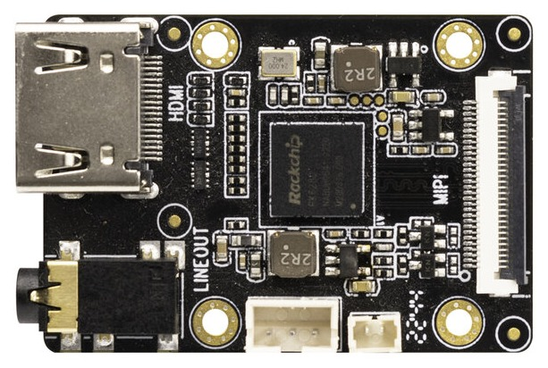
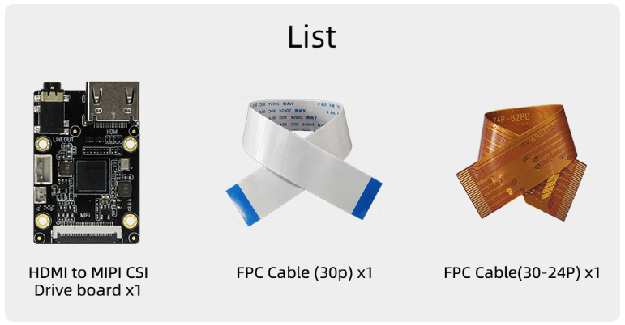
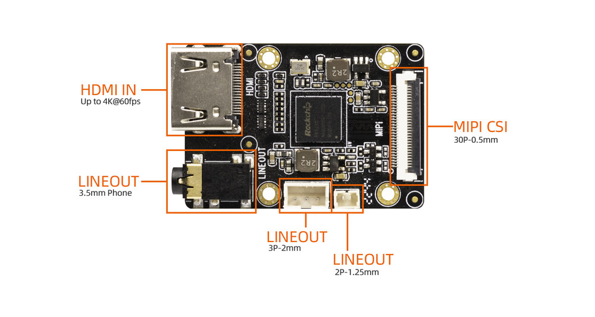
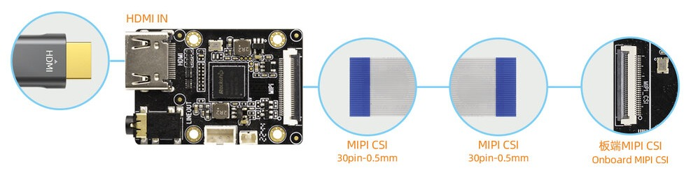
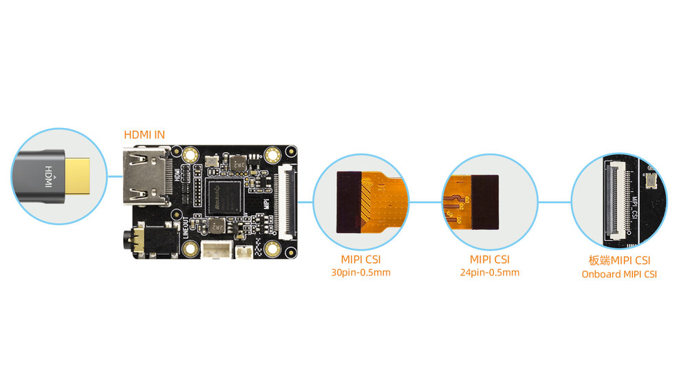
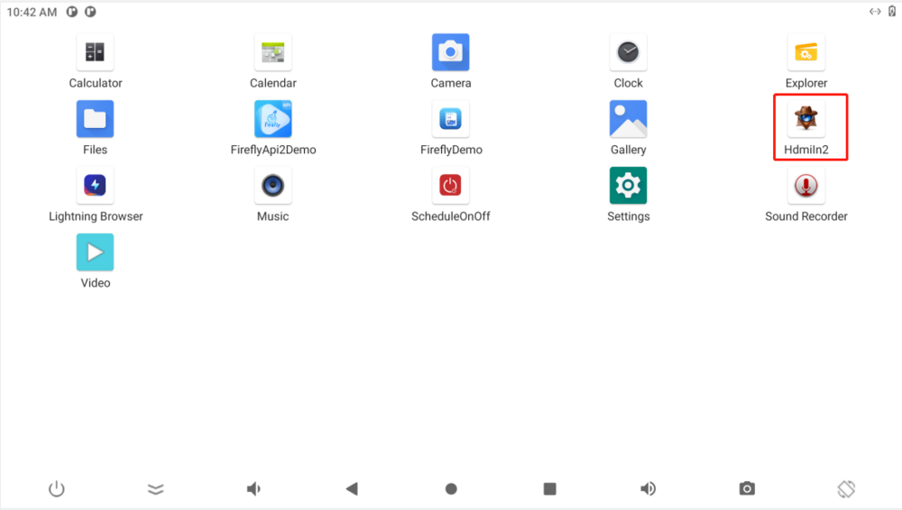

# HDMI-TO-MIPI-CSI-RK628D Drive Board

## 1. Introduction
### Product Introduction
#### HDMI-TO-MIPI-CSI Drive Board

The HDMI-TO-MIPI-CSI drive board uses the video bridge chip RK628D, which can realize the conversion requirements of HDMI video signal to MIPI CSI signal, greatly simplify the hardware design, improve the hardware design efficiency, and save the overall cost. It can be applied to intelligent micro projector, intelligent display screen, video acquisition and conversion products.



### Shipping list(Only for references)



### Specifications

* Size: 43.5mm * 30 mm
* HDMI RX Interface:  
  * Compliant with HDMI 1.4/HDMI 2.0
  * Supports 8/10bit per component video format
  * Supports rgb888/yuv420
  * Supports Max resolution 4K@60fps (yuv420)
* MIPI CSI Interface:
  * Compliant with MIPI DPHY V1.2
  * Support Format: YUV422
  * Main Support Resolution:3840x2160@30fps,1920x1080@60fps,1280x720@60fps,720x480@60fps	
* LINEOUT Interface:
  * Same audio output: 3.5mm headphone interface  * 1, 3P-2mm * 1, 2P-1.25mm * 1

### Interface Definition


Line Out:  Output the analog signal processed by the sound card to the audio device through this interface.

## 2. Usage

<font color='red'>See the [Compile the firmware](#compile-the-firmware) section for the embedded board support list.</font>

### Hardware connection

#### RK3566/RK3568/RK3588/RK3588S/RK3576 Series Embedded Board


#### RK3399 Series Embedded Board


<font color='red'>Note:<br />1. Operate this step when the drive board and development board are in power off state to avoid burning them.<br /> 2.If the RK3399 series embedded board has two MIPI CSI interfaces, it is connected to MIPI CSI0 by default.</font>

### Android uses HDMI-IN

HdmiIn2 application is built in the system by default, as shown in the figure:



Click to enter the application, the interface will display HDMI-IN video, and the audio will be output from LineOut on the driver board. The application supports the maximum output resolution 3840x2160@30fps .

### Linux uses HDMI-IN

Run the following script on the device:

```bash
#!/bin/bash

export DISPLAY=:0
export XAUTHORITY=/home/firefly/.Xauthority
export LD_LIBRARY_PATH=$LD_LIBRARY_PATH:/usr/lib/aarch64-linux-gnu/gstreamer-1.0
WIDTH=1920
HEIGHT=1080
SINK=xvimagesink

gst-launch-1.0 v4l2src device=/dev/video0 ! video/x-raw,format=NV12,width=${WIDTH},height=${HEIGHT} ! videoconvert ! $SINK &

wait
```

## 3. Firmware and Resource Download
Related documents and firmware download, see the official website [Resource Download](https://community.t-firefly.com/en/doc/download/page/id/178.html)

## 4. Tutorial
### Flash firmware

| CPU | USB upgrade | SD upgrade |
| ---- | ---- | ---- |
|RK3566|[AIO-3566JD4](../../System%20on%20Module/Core-3566JD4/03-upgrade_firmware.md), [ROC-RK3566-PC](../../Mainboards/ROC-RK3566-PC/03-upgrade_firmware.md)| [AIO-3566JD4](../../System%20on%20Module/Core-3566JD4/05-upgrade_firmware_sd.md), [ROC-RK3566-PC](../../Mainboards/ROC-RK3566-PC/05-upgrade_firmware_sd.md) | 
|RK3568|[AIO-3568J](../../System%20on%20Module/Core-3568J/03-upgrade_firmware.md), [ROC-RK3568-PC](../../Mainboards/ROC-RK3568-PC/03-upgrade_firmware.md), [ROC-RK3568-PC SE](../../Mainboards/ROC-RK3568-PC-SE/03-upgrade_firmware.md)  | [AIO-3568J](../../System%20on%20Module/Core-3568J/05-upgrade_firmware_sd.md), [ROC-RK3568-PC](../../Mainboards/ROC-RK3568-PC/05-upgrade_firmware_sd.md), [ROC-RK3568-PC SE](../../Mainboards/ROC-RK3568-PC-SE/05-upgrade_firmware_sd.md)| 
|RK3588|[ITX-3588J](../../System%20on%20Module/Core-3588J/upgrade_firmware.md), [AIO-3588Q](../../System%20on%20Module/iCore-3588Q/upgrade_firmware.md)| [ITX-3588J](../../System%20on%20Module/Core-3588J/upgrade_firmware_sd.md), [AIO-3588Q](../../System%20on%20Module/iCore-3588Q/upgrade_firmware_sd.md),[AIO-3588SG](../../System%20on%20Module/Core-3588SG/upgrade_firmware.md) |
|RK3588S| [AIO-3588SJD4](../../System%20on%20Module/Core-3588SJD4/upgrade_firmware.md), [ROC-RK3588S-PC](../../Mainboards/ROC-RK3588S-PC/upgrade_firmware.md)| [AIO-3588SJD4](../../System%20on%20Module/Core-3588SJD4/upgrade_firmware_sd.md), [ROC-RK3588S-PC](../../Mainboards/ROC-RK3588S-PC/upgrade_firmware_sd.md), [AIO-3588SG](../../System%20on%20Module/Core-3588SG/upgrade_firmware_sd.md) |
|RK3576|[ROC-RK3576-PC](../../Mainboards/ROC-RK3576-PC/upgrade_firmware.md),[AIO-3576Q](../../System%20on%20Module/iCore-3576Q/upgrade_firmware.md) | [ROC-RK3576-PC](../../Mainboards/ROC-RK3576-PC/upgrade_firmware_sd.md),[AIO-3576Q](../../System%20on%20Module/iCore-3576Q/upgrade_firmware_sd.md) |


### Compile the firmware

#### RK3566 platform

|  System   |  Board | 
|  ----  | ----  | 
| Android11.0 | [AIO-3566JD4](../../System%20on%20Module/Core-3566JD4/compile_android11.0_firmware.md#hdmi-to-mipi-csi-rk628d-compile), [ROC-RK3566-PC](../../Mainboards/ROC-RK3566-PC/compile_android11.0_firmware.md#hdmi-to-mipi-csi-rk628d-compile) |
| Ubuntu20.04 | [AIO-3566JD4](../../System%20on%20Module/Core-3566JD4/linux_compile_linux5.10.md#compile-ubuntu-firmware), [ROC-RK3566-PC](../../Mainboards/ROC-RK3566-PC/linux_compile_linux5.10.md#compile-ubuntu-firmware) |

#### RK3568 platform

|  System  |  Board | 
|  ----  | ----  | 
| Android11.0 | [AIO-3568J](../../System%20on%20Module/Core-3568J/compile_android11.0_firmware.md#hdmi-to-mipi-csi-rk628d-compile), [ROC-RK3568-PC](../../Mainboards/ROC-RK3568-PC/compile_android11.0_firmware.md#hdmi-to-mipi-csi-rk628d-compile), [ROC-RK3568-PC SE](../../Mainboards/ROC-RK3568-PC-SE/compile_android11.0_firmware.md#hdmi-to-mipi-csi-rk628d-compile) |
| Ubuntu20.04 | [AIO-3568J](../../System%20on%20Module/Core-3568J/linux_compile_linux5.10.md#compile-ubuntu-firmware), [ROC-RK3568-PC](../../Mainboards/ROC-RK3568-PC/linux_compile_linux5.10.md#compile-ubuntu-firmware), [ROC-RK3568-PC SE](../../Mainboards/ROC-RK3568-PC-SE/linux_compile_linux5.10.md#compile-ubuntu-firmware) |

#### RK3588 platform

|  System   |  Board |
|  ----  | ----  |
| Android12.0 | [ITX-3588J](../../System%20on%20Module/Core-3588J/android_compile_android12.0_firmware.md#hdmi-to-mipi-csi-rk628d-compile), [AIO-3588Q](../../System%20on%20Module/iCore-3588Q/android_compile_android12.0_firmware.md#hdmi-to-mipi-csi-rk628d-compile) |
| Android14.0 | [ITX-3588J](../../System%20on%20Module/Core-3588J/android_compile_android14.0_firmware.md#core-3588j-chan-pin-bian-yi-fang-fa), [AIO-3588Q](../../System%20on%20Module/iCore-3588Q/android_compile_android14.0_firmware.md#icore-3588q-chan-pin-bian-yi-fang-fa)|
| Linux-kernel6.1 | [ITX-3588J](../../System%20on%20Module/Core-3588J/linux6.1_compile.md), [AIO-3588Q](../../System%20on%20Module/iCore-3588Q/linux6.1_compile.md)|

#### RK3588S platform

|  System   |  Board |
|  ----  | ----  |
| Android12.0 | [AIO-3588SJD4](../../System%20on%20Module/Core-3588SJD4/android_compile_android12.0_firmware.md#hdmi-to-mipi-csi-rk628d-compile), [ROC-RK3588S-PC](../../Mainboards/ROC-RK3588S-PC/android_compile_android12.0_firmware.md#hdmi-to-mipi-csi-rk628d-compile) |
| Android14.0 | [AIO-3588SJD4](../../System%20on%20Module/Core-3588SJD4/android_compile_android14.0_firmware.md#core-3588sjd4-chan-pin-bian-yi-fang-fa), [ROC-RK3588S-PC](../../Mainboards/ROC-RK3588S-PC/android_compile_android14.0_firmware.md#roc-rk3588s-pc-chan-pin-bian-yi-fang-fa), [AIO-3588SG](../../System%20on%20Module/Core-3588SG/android_compile_android14.0_firmware.md#core-3588sg-chan-pin-bian-yi-fang-fa) |
| Linux-kernel6.1 | [AIO-3588SJD4](../../System%20on%20Module/Core-3588SJD4/linux6.1_compile.md), [ROC-RK3588S-PC](../../Mainboards/ROC-RK3588S-PC/linux6.1_compile.md), [AIO-3588SG](../../System%20on%20Module/Core-3588SG/linux6.1_compile.md) |

#### RK3576 platform

|  System   |  Board |
|  ----  | ----  |
| Android14.0 | [ROC-RK3576-PC](../../Mainboards/ROC-RK3576-PC/android_compile_android14.0_firmware.md#roc-rk3576-pc-chan-pin-bian-yi-fang-fa), [AIO-3576Q](../../System%20on%20Module/iCore-3576Q/android_compile_android14.0_firmware.md#icore-3576q-chan-pin-bian-yi-fang-fa) |