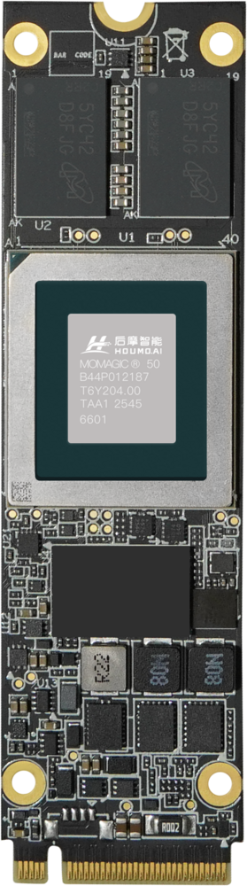
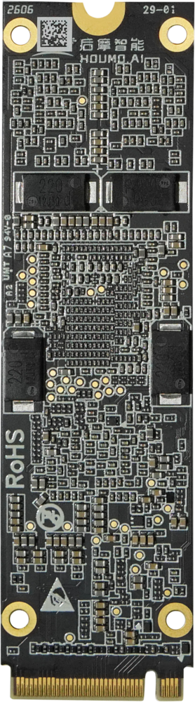

# Houmo LQ50 M.2 AI Computing Module

## Product Introduction

### Overview


| Front | Back |
| :---: | :---: |
|  |  |

### Specifications

Please contact sales (sales@t-firefly.com) to obtain the datasheet of the corresponding module.


## Usage

Considering that the Houmo module resources are mainly tested with Docker containers and are large in size, and the driver is automatically compiled and installed via DKMS, which requires network access and a complete development environment on the board for the first installation, Firefly releases resources in two forms. One is the Firefly installation package: based on our own firmware, with the prebuilt driver and test tools packaged together, so that customers using Firefly firmware can test directly (not maintained long-term, mainly used to check whether the module works properly). The other is the official Houmo resource package. After completing the preliminary test of the Houmo module, customers can download the corresponding resources according to their needs. After the driver is installed, usage of the official resource package splits into two paths: **Docker image based** and **bare metal (without Docker)**; see the path summary at the end of the [Driver Installation](#driver-installation-common-to-both-paths) section.


### Firefly Houmo Installation Package

The package includes:

1. Prebuilt driver of the Houmo LQ50 module for the aarch64 platform (the GUI tools are trimmed out to reduce the package size)
2. Test package
3. Runtime archive
4. Installation script

Run `install.sh` and it will automatically install the driver and install the runtime into the system Python via pip (the sdist is compiled on the board, which requires network access; the script automatically installs any missing build dependencies). Decompress the test package and run `run_all.sh` to start the test. By default only the check test runs, which is used to verify that the module and the environment work properly. You can run `run_all.sh --aging` for a 2-hour stress test. It tests the DDR read/write speed, computing power, and inference performance of the module respectively (the inference performance verification uses a CNN model, mainly to verify the functional integrity of the module). When doing model development inside a venv, you need to pip install the runtime archive from the package again inside that venv (see the "Install the Runtime" subsection of [Path 2: Bare Metal (without Docker)](#path-2-bare-metal-without-docker)); the houmo_test binary test tools automatically locate the pip-installed library, no /opt needed.

After the installation, run `hm_smi -a`. If the module can be detected, you can jump directly to the "Module Test" subsection of [Path 1: Docker Image Based](#path-1-docker-image-based). There is no need to configure the driver and the runtime environment again.

> Note that the Firefly Houmo installation package only supports the firmware provided by Firefly, mainly due to kernel version restrictions, so please pay attention to this when using it.


### Official Resource Package Download

Please contact sales (sales@t-firefly.com) to get the **Houmo cloud drive resources** download link, and select the corresponding Houmo version to download according to your needs. The Houmo resources uploaded on the cloud drive have all been verified on the firmware we provide (e.g. Debian 12).

**Download resources**

```bash
houmo-drv-<target_hw>_<release>_${distro}_$arch.run			# Driver package
houmo_tcim_runtime_xh2_linux_aarch64-<version>.tar.gz		# Python runtime sdist (for bare-metal pip installation)
Dadao-deploy-docker-xh2-vx.y.z-<rootfs>-aarch64.tar			# Test environment image
houmo-examples-xh2_<version>.zip		# Test program package
```

For a detailed introduction to the package naming, refer to [3.1. Linux Host Installation and Deployment — M50 Software Platform Quick Start 1.4.0](https://developer.houmoai.com/hmdoc/m50/software-manual/latest/quickstart/getting-started/quickstart_guide/setup/linux.html) and [3.2. Ubuntu/Kylin V11/UOS Driver Installation and Uninstallation — M50 Software Platform Driver Installation Guide 1.4.0](https://developer.houmoai.com/hmdoc/m50/software-manual/latest/system-installation-device-management/environment-deployment/system_software_installation_guide/linux/ubuntu.html).


### Driver Installation (Common to Both Paths)

The following tutorial uses version V1.2.0 as an example. Replace it according to your needs.

```bash
# Install the PCIe driver of the accelerator card
apt  update
sudo apt-get install python3 python3-dev python3-pip -y
apt install /boot/linux-headers-6.1-arm64_arm64.deb
# Switch pip to domestic mirrors (Huawei Cloud/Aliyun are fast in practice; the Tsinghua mirror returns 403 on some networks)
pip3 config set global.index-url https://repo.huaweicloud.com/repository/pypi/simple
pip3 config set global.extra-index-url https://mirrors.aliyun.com/pypi/simple/
chmod a+x houmo-drv-xh2_v1.2.0_linux_aarch64.run
sudo bash ./houmo-drv-xh2_v1.2.0_linux_aarch64.run --build-host false install all
```

> **Error: linux-headers-6.1 not found**
>
> ```
> cd /boot
> ls
> ```
>
> Check the version corresponding to the board
>
> Run the following command
>
> ```bash
> dpkg -i /boot/linux-headers-<version>-arm64_arm64.deb # Replace it with the deb name of the corresponding version
> ```
>
> Run again
>
> ```bash
> sudo bash ./houmo-drv-xh2_v1.2.0_linux_aarch64.run --build-host false install all
> ```

After the installation is complete, run:

```bash
hm_smi -a
```

You should see output similar to the following:

```
--------------------------------------------------------------------------------
  sdk build infos
--------------------------------------------------------------------------------
  Build_Time     : 2026-08-20 19:40:00
  HMSW_Version   : V1.2.0
  HM_SMI_Version : V1.0.0
--------------------------------------------------------------------------------
  Wed Sep 16 05:35:51 CST 2026
--------------------------------------------------------------------------------
  device0 detail infos
--------------------------------------------------------------------------------
  Driver_Version         : V1.2.0
  Vendor                 : Houmo
  BDF                    : 0004:41:00.0
  Dev                    : 0
  Cur_BandWidth          : 5.0 GT/s x 1lane
  Power_Management       :
    DVFS_Mode            : performance
    Cur_Ipu_Freq         : 1400.0 Mhz
    Lock_Ipu_Max_Clock   : 1400.0 Mhz
    Lock_Ipu_Min_Clock   : 700.0 Mhz
    IPU_Load             : 0.0 %
  Firmware_Version       : V1.1.1
  IPU_Infos              :
    Core_Num             : 2
    Core_Freq            : 1400.0 Mhz
    Voltage              : 750.0 mV
    Core0_Util           : 0.0 %
    Core1_Util           : 0.0 %
    Average_Util         : 0.0 %
  Group_Id               : 0
  Chip_Id                : 0
  SN                     : 0104020100002026001000000522
  PN                     : 100O2010
  Model                  : LQ50-24GB
  DDR_Memory_Infos       :
    DDR_Memory_Free      : 24448.0MB
    DDR_Memory_Total     : 24448.0MB
  Temperature            :
    DDR0                 : 31.9 C
    DDR2                 : 30.5 C
    DDR4                 : 28.6 C
    DDR5                 : 29.2 C
    Core0                : 28.9 C
    Core1                : 28.9 C
  Board_Power            : 6.42 W
--------------------------------------------------------------------------------
```

When every installed Houmo module can be detected, it indicates that the driver is installed and started properly.

After the driver is installed, usage splits into two paths:

| Path | Description |
| --- | --- |
| [Path 1: Docker Image Based](#path-1-docker-image-based) | Uses the official Houmo Docker image, with the complete toolchain and environment variables pre-configured, ready to use out of the box |
| [Path 2: Bare Metal (without Docker)](#path-2-bare-metal-without-docker) | No Docker; pip installs the runtime and hmatc into the on-board Python environment (a venv is recommended), for inference verification only |

### Path 1: Docker Image Based

The Docker image is Houmo's official complete toolchain environment (Ubuntu 24.04 + Python 3.12), with hmatc, tcim_lite, modelscope, etc. pre-installed inside (/opt/venv/dadao), and environment variables such as HOUMO_TARGET / HOUMO_VERSION / TCIM_* pre-configured. There is no need to pip install any dependency or to export anything.

#### Install the Docker Image

Run the following commands:

```bash
sudo apt update
sudo apt install docker.io
sudo docker load -i Dadao-docker-xh2-v1.2.0-ubuntu20.04-aarch64.tar
```

> A regular user is not in the docker group, so running the `docker` command directly fails with a `/var/run/docker.sock` permission error. `sudo` is used consistently in this document. To go sudo-free, run `sudo usermod -aG docker <username>` and log in again for it to take effect.

> **Docker installation error**
>
> ```
> Loaded image: harbor.houmo.ai/toolchain/release:Dadao-xh2-v1.2.0-ubuntu20.04-aarch64
> Error unpacking image harbor.houmo.ai/toolchain/release:Dadao-xh2-v1.2.0-ubuntu20.04-aarch64: apply layer error for "harbor.houmo.ai/toolchain/release:Dadao-xh2-v1.2.0-ubuntu20.04-aarch64": failed to extract layer sha256:b4c711080c6c7c55fedf111aa657a7799dd3bd28aed19b017a12266c6fcb4dcc: failed to convert whiteout file "root/.pip/.wh..wh..opq": operation not supported
> ```
>
> When installing the image, docker reports the error above. The error is caused by a conflict with our Overlay rootfs. The solution is to use a real ext4 instead of overlay; a soft link in the firmware is not enough.
>
> ```bash
> systemctl stop docker
> rm -rf /userdata/docker/
> mkdir -p /userdata/docker_real
> chmod 711 /userdata/docker_real
> mkdir -p /etc/docker
> cat > /etc/docker/daemon.json <<'EOF'
> {
>   "data-root": "/userdata/docker_real",
>   "storage-driver": "overlay2"
> }
> EOF
> systemctl start docker
> ```


#### Module Test

After downloading `houmo-examples-xh2_v1.2.0.zip`, run the following commands.

```
unzip houmo-examples-xh2_v1.2.0.zip
cd houmo-examples-xh2/
sudo docker run -it --name Dadao-xh2-1.2.0 --pid=host --privileged --shm-size 64g -v "$PWD:/workspace" -w /workspace harbor.houmo.ai/toolchain/release:Dadao-xh2-v1.2.0-ubuntu20.04-aarch64 /bin/bash
source env.sh

# Test DDR bandwidth
/workspace/tools/bandwidth_perf# ./run.sh

# Test PCIe bandwidth
/usr/local/houmo-sdk/hal/utility/pcie_test 0

# Test computing performance
/workspace/tools/computing_perf# ./run.sh
```

#### Model Test (Inside the Image)

```bash
cd houmo-examples-xh2/
sudo docker run -it --name Dadao-deploy-xh2 --pid=host --privileged --shm-size 64g \
  -v "$PWD:/workspace" -w /workspace \
  harbor.houmo.ai/toolchain/release:Dadao-deploy-xh2-v1.4.0-ubuntu24.04-aarch64 /bin/bash

source env.sh
cd models/llm/qwen3.5

# modelscope is pre-installed in the container, so the tokenizer downloads automatically and hf_config does not need to be copied manually
python3 get_model.py --type hmm --model_name qwen3.5 --model_size 0.8b

# The demo's default image is not included in the examples package, so put one at the default path first (see the note in the Model Test subsection of Path 2)
mkdir -p /workspace/data/pic && cp /workspace/hmodel/xh2/examples/llm/qwen3omni/data/cars.jpg /workspace/data/pic/beach.jpeg
python3 demo.py --model_name qwen3.5 --model_size 0.8b
```

The image tag depends on the tar you actually downloaded (check with `sudo docker images`); large models such as 9b require adding swap on the host first (see the "Add Swap When Memory Is Insufficient" subsection of [Path 2: Bare Metal (without Docker)](#path-2-bare-metal-without-docker); swap also applies to containers).

### Path 2: Bare Metal (without Docker)

The following uses the v1.4.0 resources as an example; replace the version numbers in the file names according to the actual version. Bare metal is for inference verification only: AArch64 does not support model quantization and compilation (which require an x86 + CUDA environment), so use pre-compiled .hmm models.

#### Basic Environment

```bash
sudo apt update
sudo apt install -y python3-venv python3-pip build-essential python3-dev

# Switch pip to domestic mirrors (Huawei Cloud/Aliyun are fast in practice; the Tsinghua mirror returns 403 on some networks)
pip3 config set global.index-url https://repo.huaweicloud.com/repository/pypi/simple
pip3 config set global.extra-index-url https://mirrors.aliyun.com/pypi/simple/
```

#### Install the Runtime (pip install, do not unpack to /opt)

The runtime archive is a standard Python source package (sdist). Install it directly with pip and tcim_lite will be compiled on the spot for the current Python version:

```bash
cd houmo-examples-xh2
python3 -m venv .venv
source .venv/bin/activate
pip3 install houmo_tcim_runtime_xh2_linux_aarch64-1.4.0.tar.gz
python3 -c "import tcim_lite; print(tcim_lite.__file__)"    # Verify
```


#### Install the hmatc Toolchain

```bash
source /etc/profile.d/houmo-sdk.sh    # Provides HOUMO_SDK_PATH (hmatc looks for the HAL headers there when compiling its extension; non-login shells do not load it automatically)
pip3 install "torch==2.8.0" "torchvision==0.23.0"
pip3 install -r hmatc/requirements.txt
pip3 install requests tqdm loguru onnx-graphsurgeon opencv-python-headless    # Dependencies missing from requirements
export HOUMO_TARGET=xh2        # Mandatory for hmatc's setup.py
cd hmatc && ./install.sh
cd ..
python3 -c "import hmatc; print(hmatc.__file__)"    # Verify
```

#### Set Environment Variables

| Variable | Value | Description |
| ---- | -- | ---- |
| HOUMO_TARGET | xh2 | Required. demo / build / get_model use it to build model paths; they fail directly if it is unset |
| HOUMO_VERSION | v1.4.0 | Required by get_model (written into the model version info), format vX.Y.Z |
| TCIM_FORCE_BACKEND | Xh2HalBackend | Required for inference. Otherwise it reports No available devices |
| HOUMO_SDK_PATH | /usr/local/houmo-sdk | Needed when installing hmatc (compiling the extension). Obtained via `source /etc/profile.d/houmo-sdk.sh`; non-login shells do not load it automatically |
| TCIM_RUNTIME_PATH, PYTHONPATH | — | Only needed by the legacy /opt workflow; not required after pip installing the runtime |

Note: the env.sh at the repository root only supplements PATH / LD_LIBRARY_PATH and similar paths. It does **not** set the variables in the table above (they are pre-configured inside the Docker image), so on bare metal you need to export them yourself first:

```bash
export HOUMO_TARGET=xh2 HOUMO_VERSION=v1.4.0 TCIM_FORCE_BACKEND=Xh2HalBackend
source env.sh    # Optional, only to supplement the paths
```

You can also write them into the system configuration:

```bash
echo 'export HOUMO_TARGET=xh2 HOUMO_VERSION=v1.4.0 TCIM_FORCE_BACKEND=Xh2HalBackend' | sudo tee /etc/profile.d/houmo-env.sh
```

#### Model Test (Bare Metal)

qwen3.5 also comes in 0.8b / 2b / 4b sizes (see the README.MD in that directory). For a quick verification, start with `--model_size 0.8b`: the model is only about 2.1 GB with a low peak memory during loading, so an 8 GB board can run it without adding swap (about 25 tokens/s E2E in our test).

```bash
cd models/llm/qwen3.5
pip3 install transformers==5.5.0 onnx-ir==0.1.13    # demo dependencies; do not use -r requirements.txt (its embedded Tsinghua mirror returns 403 on some networks)

# Pull only the pre-compiled .hmm; always pass --type hmm together with the model arguments. Without them the script goes on to pull the full raw weights (useless on bare metal, and it errors out due to the missing modelscope package)
python3 get_model.py --type hmm --model_name qwen3.5 --model_size 9b
# Once all .hmm files are in place, the script still reports a ModuleNotFoundError: modelscope once at the final tokenizer stage — this is expected, just ignore it

mkdir -p Qwen3.5-9B && cp -a output/xh2/hmquant/hf_config/. Qwen3.5-9B/

# The demo's default image is not included in the examples package, so put an image at the default path first (the --image_path argument can only be appended due to a script flaw; the default value cannot be replaced)
mkdir -p ../../data/pic && cp ../../hmodel/xh2/examples/llm/qwen3omni/data/cars.jpg ../../data/pic/beach.jpeg

python3 demo.py --model_name qwen3.5 --model_size 9b
```

> qwen3.5 is a multimodal model. In non-interactive mode it always asks "describe these images" and the `--question` argument has no effect; the image being described is the one placed above at `$HOUMO_EXAMPLES_PATH/data/pic/beach.jpeg` (run `source env.sh` first so the variable takes effect).
>
> For more models and usage, refer to the README in the other model folders under the models directory.

#### Add Swap When Memory Is Insufficient

Loading a 9b-class model peaks above 8 GB, which triggers a kernel OOM on an 8 GB board (`Killed process ... python3` can be seen in dmesg). Add swap before running:

```bash
sudo fallocate -l 8G /userdata/swapfile
sudo chmod 600 /userdata/swapfile
sudo mkswap /userdata/swapfile
sudo swapon /userdata/swapfile
echo '/userdata/swapfile none swap sw,nofail 0 0' | sudo tee -a /etc/fstab
```

### hm_smi

The hm_smi tool can be used to control the power consumption and frequency of the card. The following is a detailed description of the parameters:

| **Parameter**           | **Description**                                                     | **Notes**                                                     |
| ------------------ | ------------------------------------------------------------ | ------------------------------------------------------------ |
| -g, --gov          | Sets the DVFS governor policy. Three policies are currently supported:<br>performance: maximum performance, no frequency scaling, the IPU runs at the highest frequency, which is 1400 MHz by default; if changed with lc, the value after the lc change applies<br>ondemand: dynamically adjusts the IPU operating frequency according to the IPU load<br>powerlimit: dynamically adjusts the IPU frequency according to the power consumption specified by the user (starting from the lowest supported frequency; the smi tool needs to keep running and monitoring) (in powerlimit mode the smi tool must keep running and monitoring; once it exits, the mode switches to ondemand until the next -g command changes the policy) | |
| -pl, --powerlimit  | Required parameter when using powerlimit mode. Additionally specify the maximum power consumption; the minimum power consumption can also be specified (in W) | When the IPU runs at the lowest frequency and still exceeds the set maximum power, it stays at the lowest frequency. When the IPU runs at the highest frequency and still stays below the set minimum power, it stays at the highest frequency |
| -lc, --lock_clocks | Locks the maximum IPU frequency; the minimum frequency can also be specified (in MHz) | Restricts the operating frequency range of the IPU. Once set, it remains in effect until the next lc change. It works in parallel with the governor policy |

**Usage examples**

| Command                                                         | Explanation                                                         | Notes                                                   |
| ------------------------------------------------------------ | ------------------------------------------------------------ | ------------------------------------------------------ |
| hm_smi -g ondemand                                           | Set the current mode to ondemand                                       |                                                        |
| hm_smi -g performance                                        | Set the current mode to performance                                     |                                                        |
| hm_smi -g powerlimit -pl 10w                                 | Set the current mode to powerlimit, with a maximum power of 10 W                 |                                                        |
| hm_smi -g powerlimit -pl 10w 6.5w                            | Set the current mode to powerlimit, allowing the power to fluctuate between 10 W and 6.5 W        | When the power fluctuates between 10 W and 6.5 W, the IPU frequency is no longer adjusted            |
| hm_smi -a -lc 1000 500 -g powerlimit -pl 5w 3w               | Set the current mode to powerlimit, allowing the power to fluctuate between 5 W and 3 W, with the IPU maximum frequency at 1000 MHz and the minimum frequency at 500 MHz | Available IPU frequency levels: 1400/1200/1000/850/700/500/200         |
| `hm_smi -lc 1000 500` is equivalent to `hm_smi -g performance -lc 1000 500` | Set the current mode to performance, with the IPU frequency range from 500 MHz (minimum) to 1000 MHz (maximum). | The IPU actually runs at 1000 MHz, because performance mode always runs at the highest frequency |


For more hm_smi commands, refer to [M50 SMI Tool User Guide 1.0.0](https://developer.houmoai.com/hmdoc/m50/software-manual/latest/system-installation-device-management/device-monitoring-and-management/smi_tool_user_guide/index.html)


## Model Compilation

Please refer to the [Houmo Dadao® M50 TCIM User Manual 1.4.0](https://developer.houmoai.com/hmdoc/m50/software-manual/latest/model-build-and-inference/tcim_user_guide/index.html)


## FAQ

### Different PCIe lane counts

The PCIe interfaces of different boards may differ. The Houmo module supports up to 4 lanes and automatically switches according to the number of available PCIe lanes at power-on. According to the test results, for inference scenarios with relatively small data transfer such as LLM and VLM, PCIe bandwidth has almost no impact on inference performance, and only affects the speed of the first model loading to a certain extent. PCIe bandwidth mainly affects CV-type applications with frequent data exchange, such as Yolo and image recognition.


### ModuleNotFoundError when using hmatc / tcim_lite on bare metal

The pre-compiled tcim_lite extension inside the runtime archive only targets Python 3.9 (the Docker image environment). Unpacking it to /opt and setting PYTHONPATH does not work on Debian 12 (Python 3.11) or similar environments; hmatc is not distributed with the runtime either. The correct approach is to pip install the runtime source package into the target Python environment (a venv is recommended), so that it is compiled on the spot for the current Python version:

```bash
pip3 install houmo_tcim_runtime_xh2_linux_aarch64-<version>.tar.gz
```

Pure binary test tools (tcim_perf, etc.) do not involve Python; they only need LD_LIBRARY_PATH pointing to the runtime lib directory.

### Download speed is too slow

Switch to a domestic mirror.

pip mirrors (pick one):

```bash
pip3 config set global.index-url https://repo.huaweicloud.com/repository/pypi/simple   # Huawei Cloud
pip3 config set global.index-url https://mirrors.aliyun.com/pypi/simple/               # Aliyun
pip3 config set global.index-url https://mirrors.ustc.edu.cn/pypi/simple               # USTC
pip3 config set global.index-url https://mirrors.cloud.tencent.com/pypi/simple         # Tencent Cloud
```

The same applies to the apt sources (Debian 12; replace the domain with any of the above):

```bash
sudo sed -i 's|deb.debian.org|mirrors.ustc.edu.cn|g; s|security.debian.org|mirrors.ustc.edu.cn|g' /etc/apt/sources.list
sudo apt update
```

Note: the Tsinghua mirror (tuna) returns 403 and is unavailable on some networks; some requirements.txt files inside the examples hard-code tuna as the extra-index. If a download fails, install the packages by name instead.