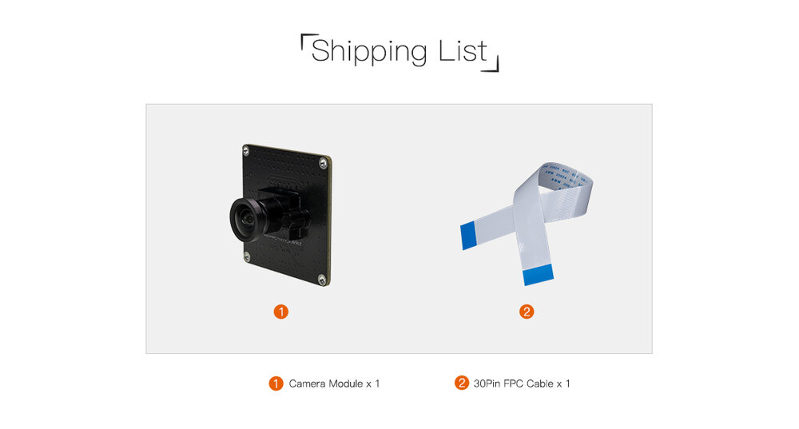

# 一、Introduction
## Product introduction
CAM-8MS1M(IMX415) is a 1/2.8” industrial-grade HD WDR sensor, suitable for various complex light environments.MIPI standard interface, supports 7x24h operating.It is mainly used in scenarios such as face recognition access control, face recognition attendance, gate machines and identification machines.

## Shipping list

## Detailed parameters

|| Parameters |
| ---- | ---- |
|Camera|CAM-8MS1M(IMX415)|
|CMOS Sensor|1/2.8 sensor/RGB|
|Max Resolution|3840(H) x 2160(V) (16:9 mode)|
|Sensor Pixel Size|1.45um x 1.45um|
|Low Lux|≤0.5Lux/F2.0|
|Image Transmission Rate|3840x2160/60fps|
|SNR|TBD|
|WDR|TBD|
|FOV|D:120.3° H: 111° V: 76.4°|
|Aperture|F2.0|
|Focal Length|1.95mm|
|Distortion|TV Distortion<-3.3%|
|Lens CRA|TBD|
|Lens Temperature Range|-20° /+60°|
|Lens structure|1G5P|
|Video Output Format|RAW10/RAW12|
|IR|NC|
|Power Supply|5V,Ripple not higher than 100mv.|
|Connection Way|0.5mm FPC (**SV-AJ38-TQ REV1.0** is 30pins, **Board** needs to be based on the hardware interface)|
|Power Consumption|TBD|
|Operating Temperature|-10° C ~ +55° C (Humidity : 10%RH ~ 75%RH)|
|Storage Temperature|-20° C~ +65° C (Humidity : 10%RH ~75%RH)|

# 二、Usage

## Hardware connection

The Firefly development board has two MIPI CSI interfaces, one is a 30pin interface and the other is a 24pin interface. When connecting, please pay attention to the direction and connect only to the corresponding pin number interface. The `CAM-8MS1M(IMX415)` supports the 30pin interface. ***Here is a unified interface diagram***:

### 30pin MIPI CSI Interface Connection

Note: Do not connect to an interface with the words `MIPI DSI` as this may cause damage to the module or development board.

| CPU | Board |
| ---- | ---- |
| RK3566 | [AIO-3566JD4](../../../modules_img/IMX415/imx415_AIO-3566-JD4.jpg), [ROC-RK3566-PC](../../../modules_img/IMX415/imx415_ROC-RK3566-PC.jpg) |
| RK3568 | [AIO-3568J](../../../modules_img/IMX415/imx415_AIO-3568J.jpg), [ROC-RK3568-PC](../../../modules_img/IMX415/imx415_ROC-3568-PC.jpg), [ROC-RK3568-PC SE](../../../modules_img/IMX415/imx415_ROC-3568-PC%20SE.jpg) |
| RK3588 | [ITX-3588J](../../../modules_img/IMX415/imx415_ITX-3588J.jpg),[ROC-RK3588S-PC](../../../modules_img/IMX415/imx415_ROC-RK3588S-PC.jpg), [AIO-3588SJD4](../../../modules_img/IMX415/imx415_AIO-3588SJD4.jpg) ,[AIO-3588Q](../../../modules_img/IMX415/imx415_AIO-3588Q.jpg), [AIO-3588JD4](../../Mainboards/AIO-3588JD4/usage_camera.md) |
| RK3576 | [ROC-RK3576-PC](../../Mainboards/ROC-RK3576-PC/usage_camera.md), [AIO-3576JD4](../../Mainboards/AIO-3576JD4/usage_camera.md)，[AIO-3576Q](../../Mainboards/AIO-3576Q/usage_camera.md), [AIO-3576C](../../Mainboards/AIO-3576C/usage_camera.md)|

# 三、Firmware and Resource download
Related documents and firmware download, see the official website [Resource Download](https://community.t-firefly.com/en/doc/download/235)

# 四、Tutorial
## Flash firmware

| CPU | USB upgrade | SD upgrade |
| ---- | ---- | ---- |
|RK3566|[AIO-3566JD4](../../Mainboards/AIO-3566JD4/03-upgrade_firmware.md), [ROC-RK3566-PC](../../Mainboards/ROC-RK3566-PC/03-upgrade_firmware.md)| [AIO-3566JD4](../../Mainboards/AIO-3566JD4/05-upgrade_firmware_sd.md), [ROC-RK3566-PC](../../Mainboards/ROC-RK3566-PC/05-upgrade_firmware_sd.md) |
|RK3568|[AIO-3568J](../../Mainboards/AIO-3568J/03-upgrade_firmware.md), [ROC-RK3568-PC](../../Mainboards/ROC-RK3568-PC/03-upgrade_firmware.md), [ROC-RK3568-PC SE](../../Mainboards/ROC-RK3568-PC-SE/03-upgrade_firmware.md) | [AIO-3568J](../../Mainboards/AIO-3568J/05-upgrade_firmware_sd.md), [ROC-RK3568-PC](../../Mainboards/ROC-RK3568-PC/05-upgrade_firmware_sd.md), [ROC-RK3568-PC SE](../../Mainboards/ROC-RK3568-PC-SE/05-upgrade_firmware_sd.md)|
|RK3588|[ITX-3588J](../../Mainboards/ITX-3588J/upgrade_firmware.md), [ROC-RK3588S-PC](../../Mainboards/ROC-RK3588S-PC/upgrade_firmware.md), [AIO-3588SJD4](../../Mainboards/AIO-3588SJD4/upgrade_firmware.md),[AIO-3588Q](../../Mainboards/AIO-3588Q/upgrade_firmware.md), [AIO-3588JD4](../../Mainboards/AIO-3588JD4/upgrade_firmware.md)|[ITX-3588J](../../Mainboards/ITX-3588J/upgrade_firmware_sd.md), [ROC-RK3588S-PC](../../Mainboards/ROC-RK3588S-PC/upgrade_firmware_sd.md), [AIO-3588SJD4](../../Mainboards/AIO-3588SJD4/upgrade_firmware_sd.md) ,[AIO-3588Q](../../Mainboards/AIO-3588Q/upgrade_firmware_sd.md), [AIO-3588JD4](../../Mainboards/AIO-3588JD4/upgrade_firmware_sd.md)|
|RK3576|[ROC-RK3576-PC](../../Mainboards/ROC-RK3576-PC/upgrade_firmware.md), [AIO-3576JD4](../../Mainboards/AIO-3576JD4/upgrade_firmware.md), [AIO-3576Q](../../Mainboards/AIO-3576Q/upgrade_firmware.md)|[ROC-RK3576-PC](../../Mainboards/ROC-RK3576-PC/upgrade_firmware_sd.md), [AIO-3576JD4](../../Mainboards/AIO-3576JD4/upgrade_firmware_sd.md), [AIO-3576Q](../../Mainboards/AIO-3576Q/upgrade_firmware_sd.md), [AIO-3576C](../../Mainboards/AIO-3576C/upgrade_firmware_sd.md)|

## Compile the firmware

### RK3566 platform

| System | Board | 
| ---- | ---- | 
| Android11.0 | [AIO-3566JD4](../../Mainboards/AIO-3566JD4/compile_android11.0_firmware.md#public-compile), [ROC-RK3566-PC](../../Mainboards/ROC-RK3566-PC/compile_android11.0_firmware.md#public-compile) | 
| Ubuntu | [AIO-3566JD4](../../Mainboards/AIO-3566JD4/linux_compile_linux5.10.md#compile-ubuntu-firmware), [ROC-RK3566-PC](../../Mainboards/ROC-RK3566-PC/linux_compile_linux5.10.md#compile-ubuntu-firmware) |
| Buildroot | [AIO-3566JD4](../../Mainboards/AIO-3566JD4/linux_compile_linux5.10.md#compile-buildroot-firmware), [ROC-RK3566-PC](../../Mainboards/ROC-RK3566-PC/linux_compile_linux5.10.md#compile-buildroot-firmware) |

### RK3568 platform

| System | Board | 
| ---- | ---- | 
| Android11.0 | [AIO-3568J](../../Mainboards/AIO-3568J/compile_android11.0_firmware.md#public-compile), [ROC-RK3568-PC](../../Mainboards/ROC-RK3568-PC/compile_android11.0_firmware.md#public-compile), [ROC-RK3568-PC SE](../../Mainboards/ROC-RK3568-PC-SE/compile_android11.0_firmware.md#public-compile) | 
| Ubuntu | [AIO-3568J](../../Mainboards/AIO-3568J/linux_compile_linux5.10.md#compile-ubuntu-firmware), [ROC-RK3568-PC](../../Mainboards/ROC-RK3568-PC/linux_compile_linux5.10.md#compile-ubuntu-firmware) |
| Buildroot | [AIO-3568J](../../Mainboards/AIO-3568J/linux_compile_linux5.10.md#compile-buildroot-firmware), [ROC-RK3568-PC](../../Mainboards/ROC-RK3568-PC/linux_compile_linux5.10.md#compile-buildroot-firmware) |

### RK3588 platform

| System | Board | 
| ---- | ---- | 
| Android12.0 | [ITX-3588J](../../Mainboards/ITX-3588J/android_compile_android12.0_firmware.md),[ROC-RK3588S-PC](../../Mainboards/ROC-RK3588S-PC/android_compile_android12.0_firmware.md),[AIO-3588SJD4](../../Mainboards/AIO-3588SJD4/android_compile_android12.0_firmware.md),[AIO-3588Q](../../Mainboards/AIO-3588Q/android_compile_android12.0_firmware.md)|
| Buildroot | [ITX-3588J](../../Mainboards/ITX-3588J/linux_compile.md#compile-buildroot-firmware),[ROC-RK3588S-PC](../../Mainboards/ROC-RK3588S-PC/linux_compile.md#compile-buildroot-firmware),[AIO-3588SJD4](../../Mainboards/AIO-3588SJD4/linux_compile.md#compile-buildroot-firmware),[AIO-3588Q](../../Mainboards/AIO-3588Q/linux_compile.md#compile-buildroot-firmware),[AIO-3588MQ](../../Mainboards/AIO-3588MQ/linux_compile.md#compile-buildroot-firmware),[AIO-3588JQ](../../Mainboards/AIO-3588JQ/linux_compile.md#compile-buildroot-firmware),[AIO-3588JD4](../../Mainboards/AIO-3588JD4/linux_compile.md#compile-buildroot-firmware)|
| Ubuntu20.04/Ubuntu22.04 | [ITX-3588J](../../Mainboards/ITX-3588J/linux_compile.md#compile-ubuntu-firmware),[ROC-RK3588S-PC](../../Mainboards/ROC-RK3588S-PC/linux_compile.md#compile-ubuntu-firmware),[AIO-3588SJD4](../../Mainboards/AIO-3588SJD4/linux_compile.md#compile-ubuntu-firmware),[AIO-3588Q](../../Mainboards/AIO-3588Q/linux_compile.md#compile-ubuntu-firmware),[AIO-3588MQ](../../Mainboards/AIO-3588MQ/linux_compile.md#compile-ubuntu-firmware),[AIO-3588JQ](../../Mainboards/AIO-3588JQ/linux_compile.md#compile-ubuntu-firmware), [AIO-3588JD4](../../Mainboards/AIO-3588JD4/linux_compile.md#compile-ubuntu-firmware)|
| Debian11/Debian12 | [ITX-3588J](../../Mainboards/ITX-3588J/linux_compile.md#compile-debian-firmware),[ROC-RK3588S-PC](../../Mainboards/ROC-RK3588S-PC/linux_compile.md#compile-debian-firmware),[AIO-3588SJD4](../../Mainboards/AIO-3588SJD4/linux_compile.md#compile-debian-firmware),[AIO-3588Q](../../Mainboards/AIO-3588Q/linux_compile.md#compile-debian-firmware),[AIO-3588MQ](../../Mainboards/AIO-3588MQ/linux_compile.md#compile-debian-firmware),[AIO-3588JQ](../../Mainboards/AIO-3588JQ/linux_compile.md#compile-debian-firmware), [AIO-3588JD4](../../Mainboards/AIO-3588JD4/linux_compile.md#compile-debian-firmware)|

### RK3576 platform

| System | Board |
| ---- | ---- |
| Android14.0 | [ROC-RK3576-PC](../../Mainboards/ROC-RK3576-PC/android_compile_android14.0_firmware.md), [AIO-3576JD4](../../Mainboards/AIO-3576JD4/android_compile_android14.0_firmware.md), [AIO-3576Q](../../Mainboards/AIO-3576Q/android_compile_android14.0_firmware.md), [AIO-3576C](../../Mainboards/AIO-3576C/android_compile_android14.0_firmware.md)|
| Linux | [ROC-RK3576-PC](../../Mainboards/ROC-RK3576-PC/linux_compile.md), [AIO-3576JD4](../../Mainboards/AIO-3576JD4/linux_compile.md), [AIO-3576Q](../../Mainboards/AIO-3576Q/linux_compile.md), [AIO-3576C](../../Mainboards/AIO-3576C/linux_compile.md)|