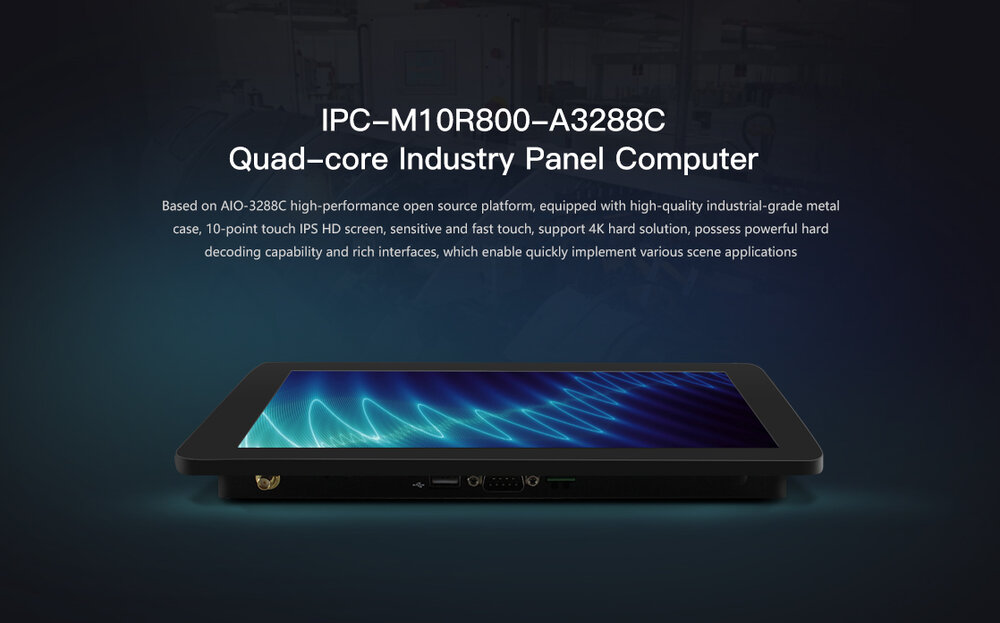
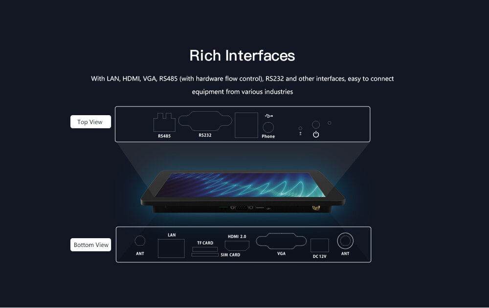
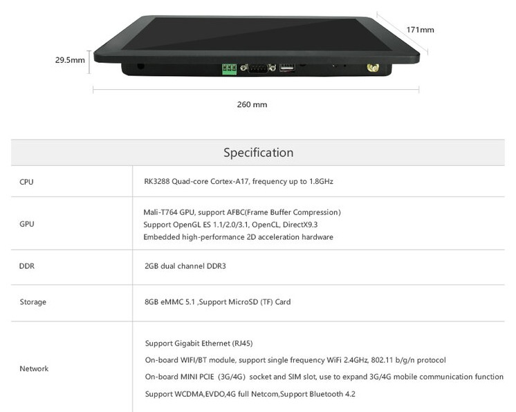
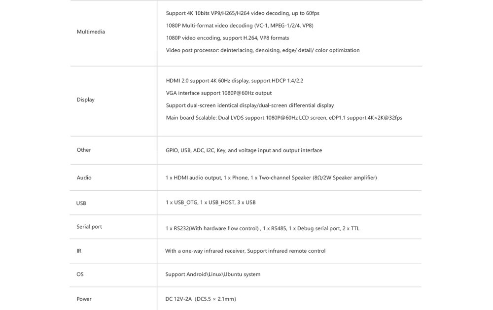
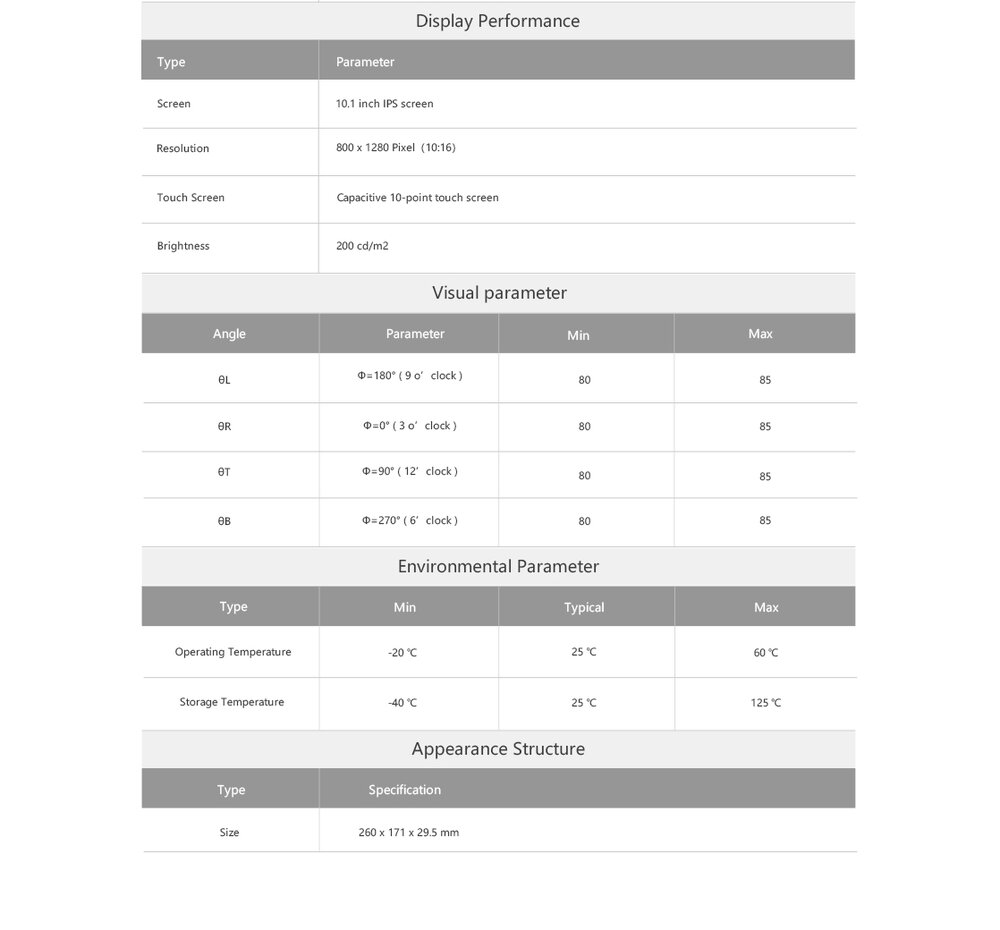

## Product introduction

IPC-M10R800-A3288C Quad-core Industry Panel Computer，Based on AIO-3288C high-performance 
open source platform, equipped with high-quality industrial-grade metal case, 10-point touch IPS HD 
screen, sensitive and fast touch, support 4K hard solution, possess powerful hard decoding capability and 
rich interfaces, which enable quickly implement various scene applications. 
Adapt RK3288 quad-core Cortex-A17 processor, frequency up to 1.8GHz, integrated quad-core 
Mali-T764 GPU, maximum support 4K hardware decoding, and it can achieve 4Kx2K H.264 and H.265 
video hard decoding. 

## Product parameters

## Product resources

* [[Wiki]](../../../en/Motherboard/AIO-3288C/index.md)
Includes information on Android & Ubuntu driver development (see AIO-3288C Wiki)
 
* [[Git link]](https://bitbucket.org/T-Firefly/firenow-lollipop) 
Android SDK source code

* [[Technical forum]](http://bbs.t-firefly.com/forum.php?mod=forumdisplay&fid=100)
More than 100,000 corporate customers and users communication platform

## Product technical support
IPC-M10R800-A3288C can realize the different needs of customers in a variety of scenarios. It has been widely used in game equipment, advertising machines, vending machines, robots, etc. The quality and performance have already had a very good reputation in the industry, professional technical team.Solve a variety of problems in hardware design and software functions for our customers.Please contact us for professional technical support and more detailed information.

### Technical case
* [Multi-channel codec example]
* [Double screen variant example]
* [H.264 hardcoded & hard decoded]
* [Timer Switching Machine Example]
* [Ubuntu dual screen display]
* [Firefly Android API Demo]

### Contact information
* Email: sales@t-firefly.com
* Mobile: (+86) 186 8811 7175
* Landline: 0760-89881218
* National Service Hotline: 4001-511-533
* Address: Room 2101, Hongyu Building, No. 57 Zhongshan 4th Road, East District, Zhongshan City, Guangdong Province
 