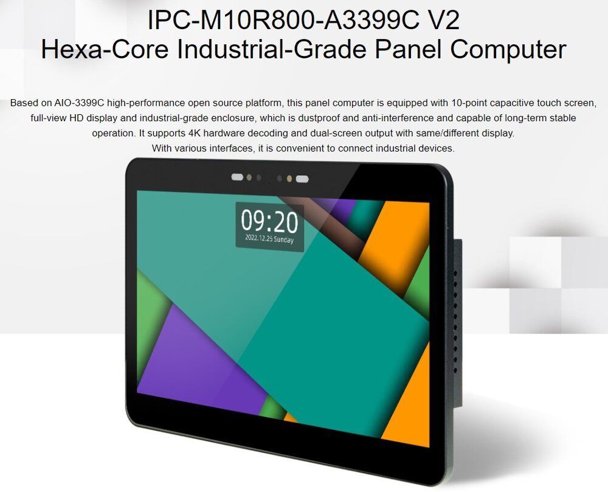
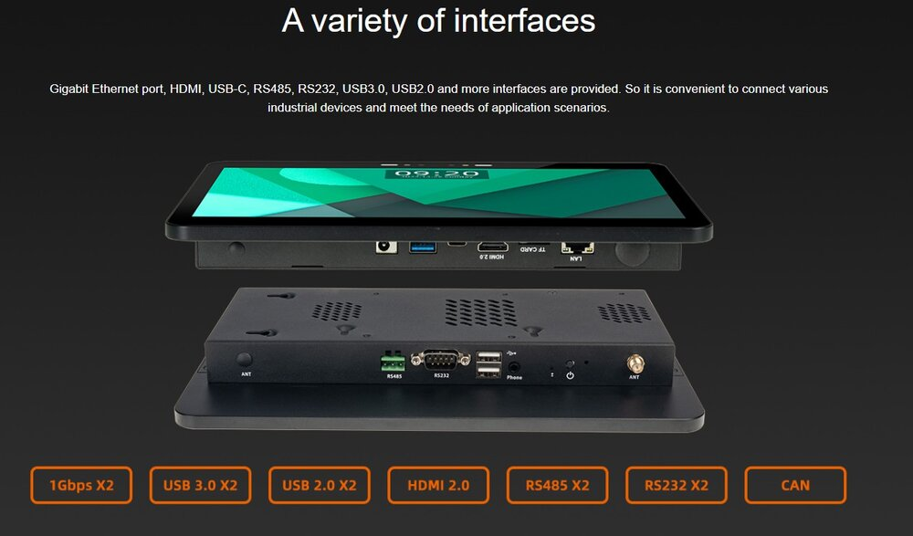
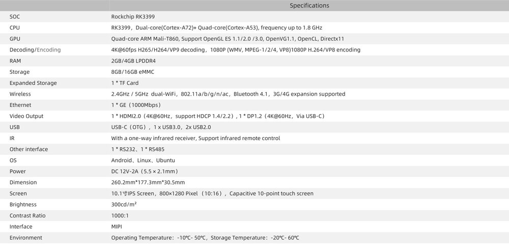
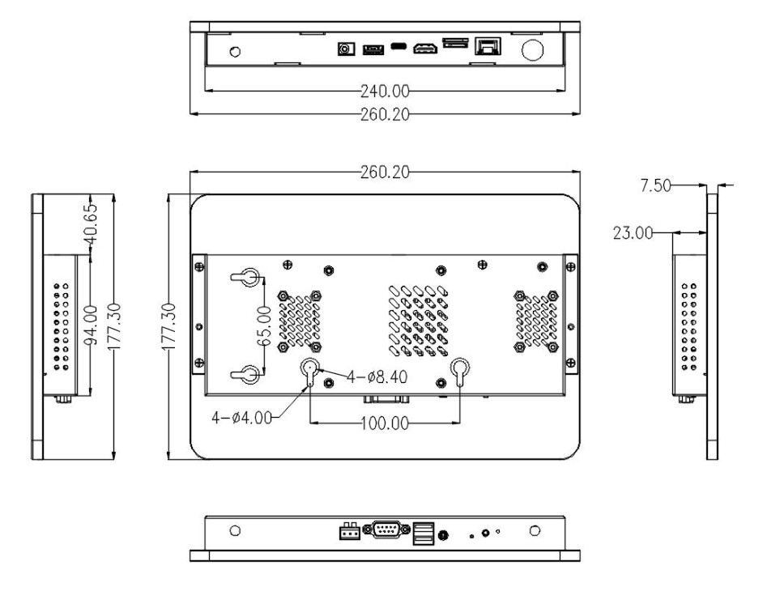

## Product introduction

IPC-M10R800-A3399C V2 Six-core Industry Panel Computer, Based on AIO-3399C high-performance 
open source platform and adopts capacitive 10-point touch screen, full-view HD display and 
industrial-grade enclosure, dustproof, anti-jamming and capable of long-term stable operation. Moreover, 
it supports 4K hardware acceleration, dual-screen identical display/dual-screen differential display and 
has rich interface for easy connection of various industrial equipment. 
It is equipped with ARM Cortex-A72 architecture, six-core 64-bit high-performance processor, 
frequency up to 2.0GHz, integrates quad-core Mali-T860 GPU, supports H.265 HEVC and VP9, H.264 
encoding, 4K HDR, and has the maximum support of 4K hardware decoding. 
It adopts 10.1-inch IPS high-end screen of 800 x 1280 resolution, supports dual-screen identical 
display/dual-screen differential display and full-view HD display with fine color saturation and high-quality 
HD image. 

## Product parameters

## Product resources

* [[Wiki]](../../Mainboards/AIO-3399C/started.md)
Includes information on Android & Ubuntu driver development (see AIO-3399C Wiki)
 
* [[SDK link]](https://community.t-firefly.com/en/doc/download/175.html#other_230) 
Android SDK source code

* [[SDK link]](https://community.t-firefly.com/en/doc/download/175.html#other_144)
Linux SDK source code

* [[Technical forum]](http://bbs.t-firefly.com/forum.php?mod=forumdisplay&fid=100)
More than 100,000 corporate customers and users communication platform

## Compile
[[Android 10.1 MIPI complie]](../../Mainboards/AIO-3399C/compile_android7.1_industry_firmware.md#display-dm-m10r800-v2-compile)

[[Linux   10.1 MIPI complie]](../../Mainboards/AIO-3399C/linux_compile_gpt.md)

## Product technical support
IPC-M10R800-A3399C V2 can realize the different needs of customers in a variety of scenarios. It has been widely used in game equipment, advertising machines, vending machines, robots, etc. The quality and performance have already had a very good reputation in the industry, professional technical team.Solve a variety of problems in hardware design and software functions for our customers.Please contact us for professional technical support and more detailed information.

### Technical case
* [Multi-channel codec example]
* [Double screen variant example]
* [Firefly Baidu AI Face Recognition Demo]
* [Firefly Android API Demo]

### Contact information
* Email: sales@t-firefly.com
* Mobile: (+86) 186 8811 7175
* Landline: 0760-89881218
* National Service Hotline: 4001-511-533
* Address: Room 2101, Hongyu Building, No. 57 Zhongshan 4th Road, East District, Zhongshan City, Guangdong Province
 