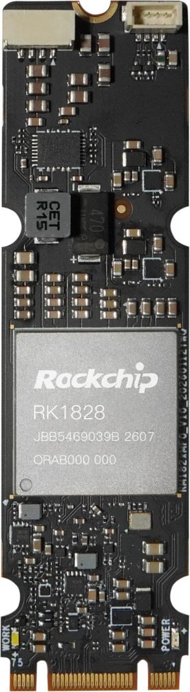
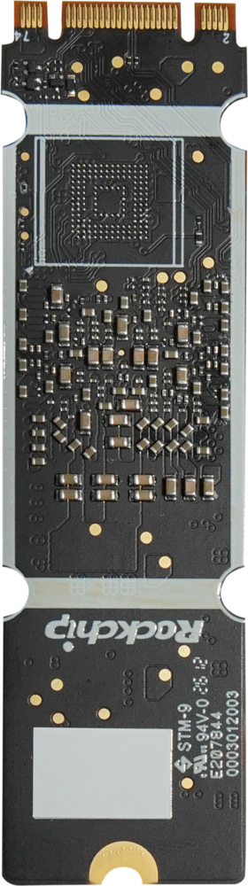
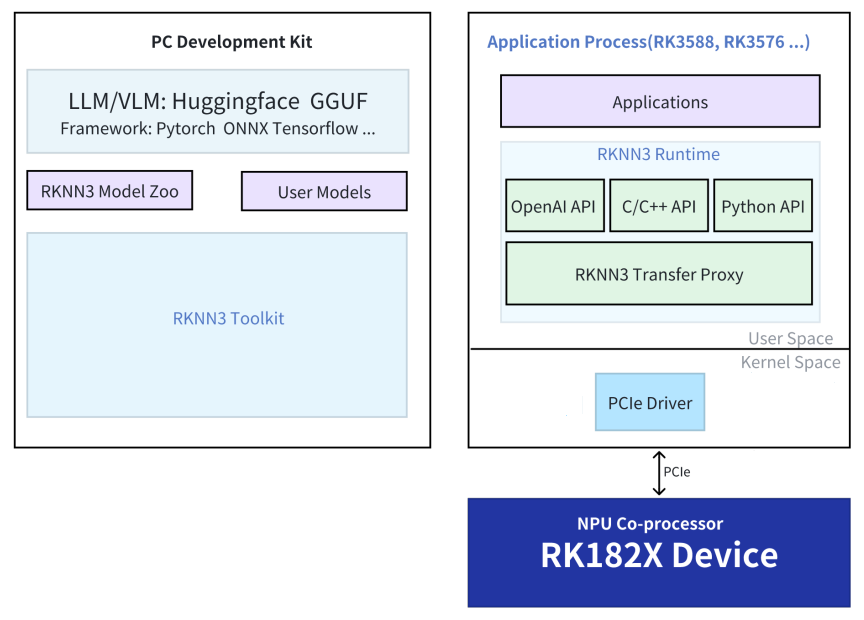

# RK1828 AI Computing Module

## 1. Product Introduction

### Overview

The RK1828 AI computing module (model: RM182XMC0) is built around the Rockchip RK1828 AI coprocessor. It delivers 20 TOPS of INT8 AI computing power with 5 GB of high-bandwidth 3D-stacked DRAM on chip, supporting on-device inference of 3B~7B LLM/VLM models. With an M.2 2280 (Key B-M) gold-finger form factor, the module connects to host devices such as RK3588 and RK3576 through the PCIe 2.1 high-speed interface. It is plug-and-play and flexibly expands the AI computing power of host devices.

| Front | Back |
| :---: | :---: |
|  |  |

### Specifications

| Item | Specification |
| --- | --- |
| Chip | RK1828 (AI coprocessor) |
| AI computing power | 20 TOPS (INT8) |
| Memory | 5 GB on-chip 3D-stacked DRAM |
| CPU | Triple-core RISC-V64 |
| Interface | PCIe 2.1 |
| Form factor | M.2 2280 (Key B-M) |
| Supported models | 3B~7B LLM/VLM models |

## 2. Usage

### Hardware Installation

Insert the RK1828 AI computing module into the M.2 slot of the host device and power on. The host connects to the coprocessor through the PCIe high-speed interface:

* RK3588/RK3576 SoC (Host): As the core of the system, responsible for task scheduling, resource allocation, and overall control.
* RK1820/RK1828 Coprocessor (Device): As an AI computing acceleration unit, focused on high-performance neural network inference tasks.
* PCIe (Communication Interface): Realizes low latency and high bandwidth data exchange between the main control and coprocessor.

### Compile the RK1820/RK1828 Installer

Please contact `sales@t-firefly.com` to get the **RK182X SDK** download link.

<font color=red>

**Notice:**
<br>
**1. The SDK uses cross-compilation, so use the SDK on an x86_64 PC. Do not download the SDK to the device**<br>
**2. Use Ubuntu 20.04 or Ubuntu 22.04 (real PC or docker) as the build environment. Other OS versions may cause build failures**<br>
**3. Do not place or decompress the SDK archive in a virtual machine shared folder or a non-English directory**<br>
**4. Use a regular user (not root) throughout the process of obtaining and compiling the SDK. Root privilege is not allowed or needed (except for apt installing software)**

</font>

<br>
For example, the SDK archive is `rk182x_linux_release_20260908_v1.X.X.tgz`. (The specific version is subject to the latest release name on the cloud drive.)

```
mkdir rk182x_sdk
cd rk182x_sdk
tar xf rk182x_linux_release_20260908_v1.X.X.tgz
.repo/repo/repo sync -l
```

#### Bundle Update
Subsequent updates after 1.1.0a will be released as bundles to reduce download time.
After downloading and decompressing the SDK base package above and completing the synchronization, place the bundle package in the SDK root directory:

```
rk182x_sdk/
├── .repo/
└── bundle_xx_to_xx.tgz
```

Decompress the corresponding bundle package:

```
tar xzf bundle_xx_to_xx.tgz
```

Run the bundle's internal script from the SDK root directory:
```
./bundle_xx_to_xx/bundle_update.sh
```

#### Config
Use `./build.sh config` to configure.

```
Select board type:
1) RK182X EVB1
2) RK182X SODIMM
3) RK182X SODIMM USB
4) RK182X M2
5) Cancel
#?
```

Select `4`


```
Select Security Boot Mode:
1) Disable Secure Boot
2) Enable Secure Boot
3) Cancel
#?
```

Select `1`
> This option is used to apply security encryption to the firmware. Incorrect operation may prevent the firmware from being upgraded later, so please choose carefully. For more information, refer to 1828SDK_Path/docs/Develop/Rockchip_RK1820_RK1828_User_Guide_SecureBoot_EN.pdf

#### Build
```
./build.sh
```

The generated software installation package is located at `output/firmware/rknn3_rk182x_m2_installer_arm64.tgz`

### Install the Software Package

You need to manually install the RK1820/RK1828 software package. Follow the steps below:
* Copy `rknn3_rk182x_m2_installer_arm64.tgz` to the host device
* Decompress: `tar xzf rknn3_rk182x_m2_installer_arm64.tgz`
* Install: `./install.sh`
    * After installation and rebooting, the RK3588 or RK3576 system will automatically download the RK182X firmware and start the background service upon startup.

### Build deb

In the SDK provided by Firefly, the deb package build scripts have been added under `1828sdk_path/tools/build_helper`. Run `/tools/build_helper/build-helper.sh sodimm m2` directly, and the corresponding deb packages will be generated in that directory, so that they can be installed directly with `dpkg -i xxx.deb`.
> The deb build provided natively by Rockchip installs the source code and requires a network environment, installing build tools and compiling the driver. Since the rkep driver has already been compiled into our firmware, the deb build script in the provided SDK has been adjusted to no longer install the driver source code or check for build tools.

### rknn-smi

rknn-smi (System Management Interface) is a tool for RK1820/RK1828 device information collection, function configuration, and log management.

* Software Version: `sudo rknn-smi -v`
* Hardware Version: `sudo rknn-smi info -l`
* Status: `sudo rknn-smi info -w`
* Performance: `sudo rknn-smi set -t work_mode -s 2`
* Power Consumption: This feature is not supported on hardware
    * `sudo rknn-smi info -t power`

Reference version information of `sudo rknn-smi -v` (V 1.1.0):

```
rknn-smi version              : 1.3.0
PCIe driver version           : 3.3.1
RC chips connect version      : 3.3.2
EP chips connect version      : 0.0.2
PCIe Device 0 firmware version: 1.1.0
rknn3 API version             : 1.1.0
```

How to use, see the RK182X SDK: `docs/Tools/Rockchip_User_Guide_RKNN-SMI_Tool_EN.pdf`

### RKNN3

The rknn directory of the RK182X SDK:
```
rknn/
├── rknn3-model-zoo
├── rknn3-runtime
├── rknn3-toolkit
└── rknn-gstreamer-plugins
```

**RKNN3 SDK Block Diagram**
<center>


</center>

#### RKNN3 Model Zoo
Provides deployment examples of classic models on the RK1820/RK1828 platform. For more details, refer to [GitHub](https://github.com/airockchip/rknn3-model-zoo).

#### RKNN3 Runtime
The RKNN3 C API is the C language interface of the RKNN3 Runtime. Developers use C/C++ to develop applications and deploy model inference through the RKNN3 C API.

#### RKNN3 Toolkit
RKNN3 Toolkit is a development kit that provides users with model transformation, inference, and performance evaluation on the PC platform.

**RKNN3 Toolkit** is incompatible with [RKNN-Toolkit](https://github.com/airockchip/rknn-toolkit) and [RKNN-Toolkit2](https://github.com/airockchip/rknn-toolkit2). For more details, refer to [GitHub](https://github.com/airockchip/rknn3-toolkit).

### FAQs

#### Probability "Failed to initialize rknnsmi"
Add an appropriate delay to `/lib/systemd/system/rknn3.service`:

```
[Unit]
Description=rknn3 runtime service
DefaultDependencies=no
After=local-fs.target

[Service]
Type=forking
ExecStartPre=/bin/sleep 3 # delay 3 seconds
ExecStart=/bin/rknn3_startup start
ExecStop=/bin/rknn3_startup stop

[Install]
WantedBy=sysinit.target
```

#### Currently Supported Models
For currently supported models and detailed information, refer to `rknn/rknn3-runtime/doc/EN/00_RKNN3_SDK_Release_Notes_V1.1.0.pdf` in the SDK.

#### rknn3 API Version shows NA
Install binutils; some rootfs may not have the strings command.

```sh
sudo apt update
sudo apt install binutils
```

## 3. More Resources

* RKNN3 Model Zoo: https://github.com/airockchip/rknn3-model-zoo
* RKNN3 Toolkit: https://github.com/airockchip/rknn3-toolkit