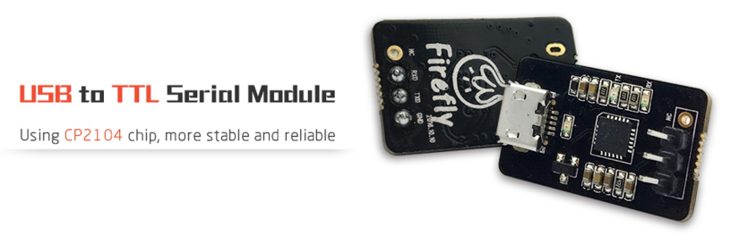
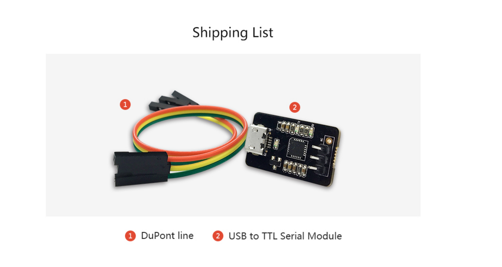

# 一、Introduction
## Product introduction

## Shipping list

## Detailed parameters

|| Parameter |
| ---- | ---- |
| Size | 25x15.5mm |
| Chip | CP2104 |
| LED | Power LED, TX LED, RX LED|
| USB Type | MicroUSB |
| Pin Header | 2.54mm 3PIN |