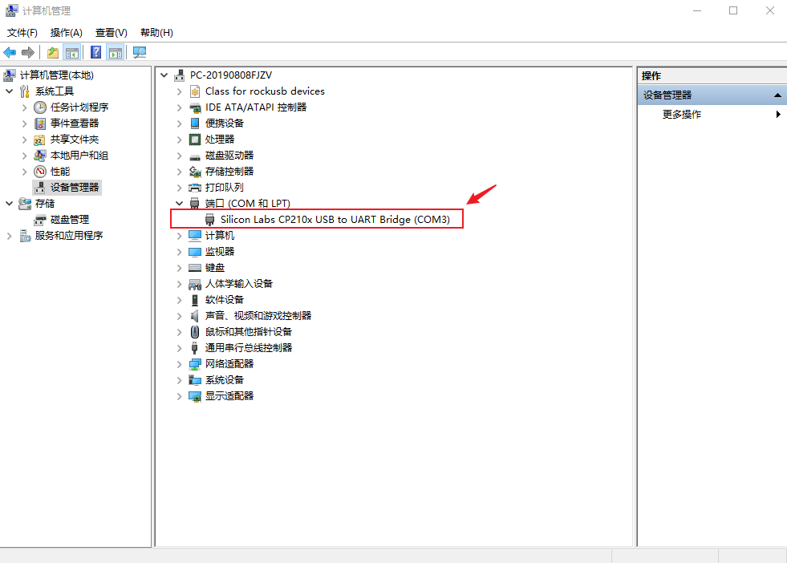

# Windows driver installation

## Install Driver

Our usb-to-ttl module is using CP2104, so download driver here:

* [CP210X](https://www.silabs.com/software-and-tools/usb-to-uart-bridge-vcp-drivers)

If you bought the module using the CH340 or PL2303 from elsewhere, you can download drivers here:

* [CH340](https://www.wch.cn/downloads/CH341SER_EXE.html)
* [PL2303](https://www.prolific.com.tw/en/portfolio-item/pl2303gl/)

After the adapter is inserted, the system will prompt for the discovery of new hardware and initialization, and then the corresponding COM port can be found in the device manager:

