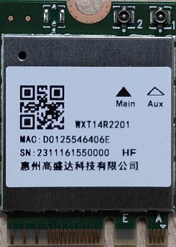

# Introduction
## Product introduction

### WXT14R2201
WXT14R2201 WIFI/BT module supports dual -frequency WIFI and Bluetooth 5.2. This module is based on
REALTEK RTL8852BE-CG chipset .The Realtek RTL8852BE-CG is a highly integrated single-chip that 
support 2-stream 802.11ax solutions with Multi-user MIMO(Multiple-Input, Multiple-Output) with Wireless 
LAN (WLAN) PCI Express network interface controller and USB mixed interface. It combines a WLAN 
MAC, a 2T2R capable WLAN baseband, and RF in a single chip. The module provides a complete 
solution in scenarios that require high-performance integrated wireless and Bluetooth. The Bluetooth part 
supports latest 5.2. 


<br>
<br>
<!--This module does not support voice calls and SMS, if you need support, please contact business <sales@t-firefly.com>。-->

<!--
## Shipping list
### PCIE interface

### USB interface

-->

## General Description

|Model| WXT14R2201 PCIe|
|----|----|
|Product description| IEEE 802.11ax/ac/a/b/g/n 2T2R <br> 2.4G + 5G WiFi and Bluetooth 5.2<br> |
|Software| Linux / Android<br>|
|Chipset| RTL8852BE-CG<br> |
|Interface| Wifi@PCIe<br> BT@USB<br> |
|Structure size| 22.0 mm × 30.0 mm × 2.3 mm<br> |
|Card type| M.2 Type 2230-S3-A-E<br> |
|Antenna| IPEX-G4<br> WIFI&BT→TX&RX(two ant)<br> |

## Feature
* Support 2.4GHz and 5GHz band channels. 
* 20MHz, 40MHz and 80MHz bandwidth transmission. 
* Compatible with IEEE 802.11a standard to provide wireless 54Mbps data rate. 
* Compatible with IEEE 802.11b standard to provide wireless 11Mbps data rate. 
* Compatible with IEEE 802.11g standard to provide wireless 54Mbps data rate. 
* Compatible with IEEE 802.11n standard to provide wireless 300Mbps data rate. 
* Compatible with IEEE 802.11ac standard to provide wireless 866.7Mbps data rate. 
* Compatible with IEEE 802.11ax standard to provide wireless 1201Mbps data rate.
* Bluetooth 5.2.
* Maximum reliability, throughput and connectivity with automatic data rate switching. 
* Complies with PCI Express base specification revision 1.1 for WLAN. 
* Complies with USB2.0 FS-mode for Bluetooth.
* HSF compliant. 
* WAPI(Wireless Authentication Privacy Infrastructure) certified. 

# 二、Usage

## Hardware connection
### Module connection
#### PCIE connection

<!--
| PX30 | [AIO-PX30-JD4](https://wiki.t-firefly.com/EG25/_images/EG25_AIO-PX30-JD4.png) |
| RK3128 | [AIO-3128C]() | 
| RK3288 | [AIO-3288C](https://wiki.t-firefly.com/EG25/_images/EG25_AIO-3288C.png), [AIO-3288J](https://wiki.t-firefly.com/EG25/_images/EG25_AIO-3288J.png) | 
| RK3399 | [AIO-3399C](https://wiki.t-firefly.com/EG25/_images/EG25_AIO-3399C.png), [AIO-3399JD4](https://wiki.t-firefly.com/EG25/_images/EG25_AIO-3399JD4.png), [AIO-3399J](_images/EG25_AIO-3399J.png), [Firefly-RK3399](https://wiki.t-firefly.com/EG25/_images/EG25_Firefly-RK3399.png) | 
| RK3399Pro | [AIO-3399Pro-JD4](), [AIO-3399ProC](https://wiki.t-firefly.com/EG25/_images/EG25_AIO-3399ProC.png) | 
-->

| CPU | Board | 
| ---- | ---- | 
| RK3588 | [ROC-RK3588-RT](https://wiki.t-firefly.com/WXT14R2201/_images/RTL8852BE_ROC-RK3588-RT.png)|


# 三、Firmware and Resource download
Related documents and firmware download, see the official website [Resource Download](https://en.t-firefly.com/doc/download/207.html)


# 四、Tutorial
## Flash firmware
<!--
| PX30 | [AIO-PX30-JD4](https://wiki.t-firefly.com/en/Core-PX30-JD4/programming_firmware.html) | |
| RK3128 | [Firefly-RK3128](https://wiki.t-firefly.com/en/Firefly-RK3128/Flash_Image.html), [AIO-3128C](https://wiki.t-firefly.com/en/AIO-3128C/Flash_Image.html)  |  |
| RK3288 | [Firefly-RK3288](https://wiki.t-firefly.com/en/Firefly-RK3288/upgrade_firmware.html), [AIO-3288J](https://wiki.t-firefly.com/en/AIO-3288J/upgrade_firmware.html),  [AIO-3288C](https://wiki.t-firefly.com/en/AIO-3288C/upgrade_firmware.html) | [Firefly-RK3288](https://wiki.t-firefly.com/en/Firefly-RK3288/upgrade_firmware_sd.html), [AIO-3288J](https://wiki.t-firefly.com/en/AIO-3288J/upgrade_firmware_sd.html), [AIO-3288C](https://wiki.t-firefly.com/en/AIO-3288C/upgrade_firmware_sd.html) |
|RK3308| [ROC-RK3308-CC](https://wiki.t-firefly.com/en/ROC-RK3308-CC/burning_firmware.html), [ROC-RK3308B-CC-PLUS](https://wiki.t-firefly.com/en/Core-3308Y/burning_firmware.html) ||
| RK3328 | [ROC-RK3328-CC](https://wiki.t-firefly.com/en/ROC-RK3328-CC/flash_emmc.html), [ROC-RK3328-PC](https://wiki.t-firefly.com/en/ROC-RK3328-PC/upgrade_firmware.html)  | [ROC-RK3328-CC](https://wiki.t-firefly.com/en/ROC-RK3328-CC/flash_sd.html) |
|RK3399|[Firefly-RK3399](https://wiki.t-firefly.com/en/Firefly-RK3399/02-upgrade_table.html), [ROC-RK3399-PC](https://wiki.t-firefly.com/en/ROC-RK3399-PC/03-upgrade_firmware.html) <br> [ROC-RK3399-PC-PLUS](https://wiki.t-firefly.com/en/ROC-RK3399-PC-PLUS/03-upgrade_firmware.html), [AIO-3399JD4](https://wiki.t-firefly.com/en/Core-3399-JD4/03-upgrade_firmware.html), [AIO-3399J](https://wiki.t-firefly.com/en/AIO-3399J/03-upgrade_firmware.html) <br> [AIO-3399C](https://wiki.t-firefly.com/en/AIO-3399C/03-upgrade_firmware.html) | [Firefly-RK3399](https://wiki.t-firefly.com/en/Firefly-RK3399/05-upgrade_firmware_sd.html), [ROC-RK3399-PC](https://wiki.t-firefly.com/en/ROC-RK3399-PC/05-upgrade_firmware_sd.html) <br> [ROC-RK3399-PC-PLUS](https://wiki.t-firefly.com/en/ROC-RK3399-PC-PLUS/05-upgrade_firmware_sd.html), [AIO-3399JD4](https://wiki.t-firefly.com/en/Core-3399-JD4/05-upgrade_firmware_sd.html), [AIO-3399J](https://wiki.t-firefly.com/en/AIO-3399J/05-upgrade_firmware_sd.html) <br> [AIO-3399C](https://wiki.t-firefly.com/en/AIO-3399C/05-upgrade_firmware_sd.html) | 
|RK3399Pro|[AIO-3399Pro-JD4](https://wiki.t-firefly.com/en/AIO-3399PRO-JD4/03-upgrade_firmware.html), [AIO-3399ProC](https://wiki.t-firefly.com/en/AIO-3399ProC/03-upgrade_firmware.html)| [AIO-3399Pro-JD4](https://wiki.t-firefly.com/en/AIO-3399PRO-JD4/05-upgrade_firmware_sd.html), [AIO-3399ProC](https://wiki.t-firefly.com/en/AIO-3399ProC/05-upgrade_firmware_sd.html) |
-->

| CPU | USB upgrade | SD upgrade |
| ---- | ---- | ---- |
|RK3588|[ROC-RK3588-RT](https://wiki.t-firefly.com/en/ROC-RK3588-RT/upgrade_firmware.html)|[ROC-RK3588-RT](https://wiki.t-firefly.com/en/ROC-RK3588-RT/upgrade_firmware_sd.html)|

## Compile the firmware

<!--
### PX30 platform
|  System  |  Board |
|  ----  | ----  |
| Android8.1 | [AIO-PX30-JD4](https://wiki.t-firefly.com/en/Core-PX30-JD4/Android_development.html#aio-px30-jd4-compiling-method) |
| Ubuntu | [AIO-PX30-JD4](https://wiki.t-firefly.com/en/Core-PX30-JD4/linux_compile.html) |
| Buildroot | [AIO-PX30-JD4](https://wiki.t-firefly.com/en/Core-PX30-JD4/buildroot_compile.html) |
-->

<!--
### RK3128 platform
|  System  |  Board | 
|  ----  | ----  | 
| Android5.1  | [Firefly-RK3128](https://wiki.t-firefly.com/en/Firefly-RK3128/Build_Android.html#hdmi), [AIO-3128C](https://wiki.t-firefly.com/en/AIO-3128C/Build_Android.html#hdmi) | 
-->

<!--
### RK3288 platform
|  System  |  Board | 
|  ----  | ----  | 
| Android5.1  | [Firefly-RK3288](https://wiki.t-firefly.com/en/Firefly-RK3288/compile_android_firmware.html#hdmi), [AIO-3288J](https://wiki.t-firefly.com/en/AIO-3288J/compile_android_firmware.html#hdmi), [AIO-3288C](https://wiki.t-firefly.com/en/AIO-3288C/compile_android_firmware.html#hdmi) | 
| Ubuntu | [Firefly-RK3288](https://wiki.t-firefly.com/en/Firefly-RK3288/linux_compile_gpt.html), [AIO-3288J](https://wiki.t-firefly.com/en/AIO-3288J/linux_compile_gpt.html), [AIO-3288C](https://wiki.t-firefly.com/en/AIO-3288C/linux_compile_gpt.html) | 
| Buildroot | [Firefly-RK3288](https://wiki.t-firefly.com/en/Firefly-RK3288/buildroot_compile.html), [AIO-3288J](https://wiki.t-firefly.com/en/AIO-3288J/buildroot_compile.html), [AIO-3288C](https://wiki.t-firefly.com/en/AIO-3288C/buildroot_compile.html) |
-->

<!--
### RK3308 platform
|  System   |  Board | 
|  ----  | ----  | 
| Buildroot | [ROC-RK3308-CC](https://wiki.t-firefly.com/en/ROC-RK3308-CC/buildroot_development.html), [ROC-RK3308B-CC-PLUS](https://wiki.t-firefly.com/en/Core-3308Y/sdkbuilding.html) |
-->

<!--
### RK3328 platform
|  System   |  Board | 
|  ----  | ----  | 
| Android7.1 | [ROC-RK3328-CC](https://wiki.t-firefly.com/en/ROC-RK3328-CC/android_compile_android7.html)|
|Android8.1 | [ROC-RK3328-CC](https://wiki.t-firefly.com/en/ROC-RK3328-CC/android_compile_android8.html) |
| Android10.0  | [ROC-RK3328-PC](https://wiki.t-firefly.com/en/ROC-RK3328-PC/android_compile_android10.html) | 
| Ubuntu | [ROC-RK3328-CC](https://wiki.t-firefly.com/en/ROC-RK3328-CC/linux_compile.html), [ROC-RK3328-PC](https://wiki.t-firefly.com/en/ROC-RK3328-PC/linux_compile.html) |
-->

<!--
### RK3399 platform
|  System   |  Board | 
|  ----  | ----  | 
| Android7.1 Industry | [Firefly-RK3399](https://wiki.t-firefly.com/en/Firefly-RK3399/compile_android7.1_industry_firmware.html#public-compile), [ROC-RK3399-PC](https://wiki.t-firefly.com/en/ROC-RK3399-PC/compile_android7.1_industry_firmware.html#public-compile), [ROC-RK3399-PC-PLUS](https://wiki.t-firefly.com/en/ROC-RK3399-PC-PLUS/compile_android7.1_industry_firmware.html#public-compile), [ROC-RK3399-PC-Pro](https://wiki.t-firefly.com/en/ROC-RK3399-PC-Pro/compile_android7.1_industry_firmware.html#public-compile), [AIO-3399JD4](https://wiki.t-firefly.com/en/Core-3399-JD4/compile_android7.1_industry_firmware.html#public-compile), [AIO-3399J](https://wiki.t-firefly.com/en/AIO-3399J/compile_android7.1_industry_firmware.html#public-compile), [AIO-3399C](https://wiki.t-firefly.com/AIO-3399C/compile_android7.1_industry_firmware.html#public-compile), [Face-RK3399](https://wiki.t-firefly.com/Face-RK3399/compile_android_firmware.html#wan-zheng-bian-yi-face-rk3399) | 
| Android10.0 | [ROC-RK3399-PC-PLUS](https://wiki.t-firefly.com/en/ROC-RK3399-PC-PLUS/compile_android10.0_firmware.html#public-compile), [ROC-RK3399-PC-Pro](https://wiki.t-firefly.com/en/ROC-RK3399-PC-Pro/compile_android10.0_firmware.html#public-compile),[AIO-3399J](https://wiki.t-firefly.com/en/AIO-3399J/compile_android10.0_firmware.html#public-compile), [AIO-3399C](https://wiki.t-firefly.com/AIO-3399C/compile_android10.0_firmware.html#public-compile) | 
| Ubuntu | [Firefly-RK3399](https://wiki.t-firefly.com/en/Firefly-RK3399/linux_compile_gpt.html), [ROC-RK3399-PC](https://wiki.t-firefly.com/en/ROC-RK3399-PC/linux_compile_gpt.html), [ROC-RK3399-PC-PLUS](https://wiki.t-firefly.com/en/ROC-RK3399-PC-PLUS/linux_compile_gpt.html), [AIO-3399JD4](https://wiki.t-firefly.com/en/Core-3399-JD4/linux_compile_gpt.html), [AIO-3399J](https://wiki.t-firefly.com/en/AIO-3399J/linux_compile_gpt.html), [AIO-3399C](https://wiki.t-firefly.com/AIO-3399C/linux_compile_gpt.html) | 
| Buildroot | [Firefly-RK3399](https://wiki.t-firefly.com/en/Firefly-RK3399/buildroot_compile.html), [ROC-RK3399-PC](https://wiki.t-firefly.com/en/ROC-RK3399-PC/buildroot_compile.html), [ROC-RK3399-PC-PLUS](https://wiki.t-firefly.com/en/ROC-RK3399-PC-PLUS/buildroot_compile.html), [AIO-3399JD4](https://wiki.t-firefly.com/en/Core-3399-JD4/buildroot_compile.html), [AIO-3399J](https://wiki.t-firefly.com/en/AIO-3399J/buildroot_compile.html), [AIO-3399C](https://wiki.t-firefly.com/AIO-3399C/buildroot_compile.html) | 
-->

<!--
### RK3399Pro platform
|  System  |  Board | 
|  ----  | ----  | 
| Android9.0 | [AIO-3399Pro-JD4](https://wiki.t-firefly.com/AIO-3399Pro-JD4/compile_android9.0_firmware.html#public-compile), [AIO-3399ProC](https://wiki.t-firefly.com/AIO-3399ProC/compile_android9.0_firmware.html#public-compile) | 
| Ubuntu | [AIO-3399Pro-JD4](https://wiki.t-firefly.com/AIO-3399PRO-JD4/linux_compile_gpt.html), [AIO-3399ProC](https://wiki.t-firefly.com/AIO-3399ProC/linux_compile_gpt.html) | 
-->

<!--
### RK3566 platform

|  System   |  Board | 
|  ----  | ----  | 
| Android11.0 | [AIO-3566JD4](https://wiki.t-firefly.com/Core-3566JD4/compile_android11.0_firmware.html#public-compile), [ROC-RK3566-PC](https://wiki.t-firefly.com/en/ROC-RK3566-PC/compile_android11.0_firmware.html#public-compile) | 
-->
<!--
| Ubuntu | [AIO-3566JD4](https://wiki.t-firefly.com/Core-3566JD4/linux_compile_gpt.html), [ROC-RK3566-PC](https://wiki.t-firefly.com/en/ROC-RK3566-PC/linux_compile_gpt.html) | 
| Buildroot | [AIO-3566JD4](https://wiki.t-firefly.com/Core-3566JD4/buildroot_compile.html), [ROC-RK3566-PC](https://wiki.t-firefly.com/en/ROC-RK3566-PC/buildroot_compile.html) |
-->
<!--
### RK3568 platform

|  System  |  Board | 
|  ----  | ----  | 
| Android11.0 | [AIO-3568J](https://wiki.t-firefly.com/Core-3568J/compile_android11.0_firmware.html#public-compile), [ROC-RK3568-PC](https://wiki.t-firefly.com/en/ROC-RK3568-PC/compile_android11.0_firmware.html#public-compile) , [ROC-RK3568-PC-SE](https://wiki.t-firefly.com/en/ROC-RK3568-PC-SE/compile_android11.0_firmware.html#public-compile)| 
-->
<!--
| Ubuntu | [AIO-3568J](https://wiki.t-firefly.com/Core-3568J/linux_compile_gpt.html), [ROC-RK3568-PC](https://wiki.t-firefly.com/en/ROC-RK3568-PC/linux_compile_gpt.html) | 
| Buildroot | [AIO-3568J](https://wiki.t-firefly.com/Core-3568J/buildroot_compile.html), [ROC-RK3568-PC](https://wiki.t-firefly.com/en/ROC-RK3568-PC/buildroot_compile.html) |
-->

### RK3588 platform

|  System   |  Board | 
|  ----  | ----  | 
| Android12.0 | [ROC-RK3588-RT](https://wiki.t-firefly.com/en/ROC-RK3588-RT/android_compile_android12.0_firmware.html)|
| Buildroot | [ROC-RK3588-RT](https://wiki.t-firefly.com/en/ROC-RK3588-RT/linux_compile_buildroot.html)|
| Ubuntu20.04 | [ROC-RK3588-RT](https://wiki.t-firefly.com/en/ROC-RK3588-RT/linux_compile_ubuntu.html)|
| Debian11 | [ROC-RK3588-RT](https://wiki.t-firefly.com/en/ROC-RK3588-RT/linux_compile_debian.html)|


<!--
### EC20 GNSS Function(optional)

EC20 module supports wireless network data communication, including GNSS and without GNSS:
* Suffix `SNNS`: not support GNSS
* Suffix `SGNS`: support GNSS

GNSS is supported by public firmware, but disabled by default

### Parameters
EC20 module supports GPS, GLONASS, GALILEO and BEIDOU, and is compatible with standard NMEA 0183 protocol. It can output NMEA information of 1Hz frequency through USB NMEA interface. The default output serial port is `/dev/ttyUSB1` and baud rate is ` 115200` bit/s.

### Antenna Requirements

||Parameter|
|---|---|
| Frequency range |1559MHz~1609MHz|
| Polarization |RHCP or Linear|
| VSWR |< 2(Typical) |
| Active antenna noise figure|< 1.5dB |
| Active antenna gain |> 0dB |
| LNA gain embedded in active antenna |< 17dB |


### How to enable GPS and modify serial port Configuration

##### Android Temporary modification method

* Enable ADB, and how to enable ADB, please refer to wiki tutorial ADB Use
* Set system readable and writable
    ```
    adb shell setprop persist.sys.root_access 3
    adb root && adb remount
    ```
* Modify Parameters

    * Enabled GPS：Modify the parameter `ro.factory.hasGPS` in `/vendor/build.prop` on the machine to `true` to enable GPS. It will take effect after soft restarting the machine.
    * Modify serial port configuration: change `SERIAL_DEVICE` and `SERIAL_BAUD_RATE` in /system/etc/u-blox.conf to `/dev/ttyusb1` and `115200` respectively. It takes effect after soft restarting the machine.

##### Android Code modification method

* Enabled GPS
    * Modify the `BOARD_HAS_GPS` in the SDK directory `device/rockchip/{CPU}/{PRODUCT}/{PRODUCT}.mk` to `true` to enable GPS function. Then, recompile the SDK and upgrad the firmware to take effect.

* Modify serial port configuration (serial port node or baud rate)
    * Set `SERIAL_DEVICE` in `device/rockchip/{CPU}/{PRODUCT}/GPS/u-blox.conf` to `/dev/ttyUSB1`. `SERIAL_BAUD_RATE` is changed to `115200`. Then, recompile the SDK and upgrad the firmware to take effect.
-->