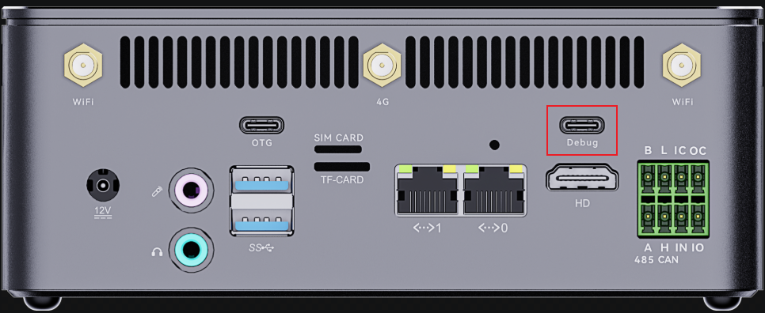
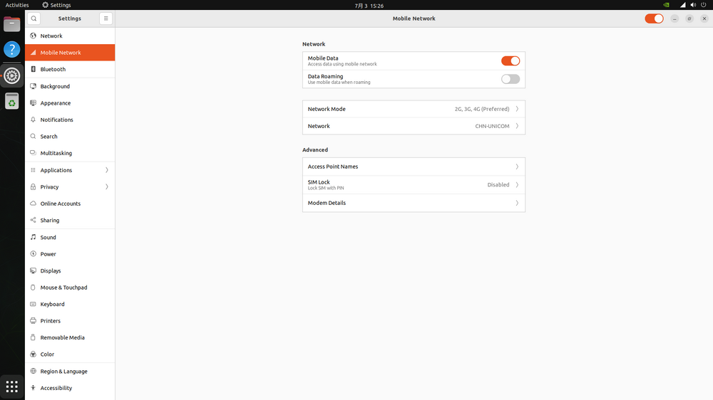

# Hardware Function Usage

## Login

There are two ways to login to AIBOX PRO, one is via Console (Debug serial), the other is via HDMI.

### Console Login
Type-C Connects to the Console port. The login account is `root`. By default, the `root password` is not set.<br>
<center>

</center>
Use the following serial port parameters:
* Baud rate: 115200
* Data bit: 8
* Stop bit: 1
* Parity check: None
* Flow control: None

### HDMI Login
When logging in via the HDMI, it automatically logs in as the user `firefly`, with the password also being `firefly`.

## Watchdog

#### Main Module
The device names for the external watchdogs is `/dev/wdt_core`. For example, using `/dev/wdt_core`, the procedure is as follows:
```shell
# Write to different fields to enable the watchdog and set the time.
# The numbers 0, 1, 2, and 3 represent 0.64s, 2.56s, 10.24s, and 40.96s, respectively.
# The letter 'e' indicates enabling the watchdog, while the letter 'd' indicates disabling it.

# Enable and set the timer for 10.24 seconds. You need to write to it once every 10.24 seconds. You can also write different numbers at any time to change the timing.
echo e >/dev/wdt_core //Enable
echo 2 >/dev/wdt_core //Set the timeout to 10.24 seconds.
```

#### Main Board
The device names for the external watchdogs is `/dev/wdt_base`. For example, using `/dev/wdt_base`, the procedure is as follows:
```shell
# Write to different fields to enable the watchdog and set the time.
# The numbers 0, 1, 2, and 3 represent 0.64s, 2.56s, 10.24s, and 40.96s, respectively.
# The letter 'e' indicates enabling the watchdog, while the letter 'd' indicates disabling it.

# Enable and set the timer for 10.24 seconds. You need to write to it once every 10.24 seconds. You can also write different numbers at any time to change the timing.
echo e >/dev/wdt_base //Enable
echo 2 >/dev/wdt_base //Set the timeout to 10.24 seconds.
```

## RTC

### Introduction

AIBOX PRO has an external RTC powered by a capacitor on the external motherboard, which ensures the RTC continues to run for a short period after power loss. In the kernel, it is represented as `rtc0`.
### Interface Usage

Linux provides three user-space interfaces for interacting with the RTC. The paths are:

*    SYSFS interface: /sys/class/rtc/rtc0/
*    PROCFS interface: /proc/driver/rtc
*    IOCTL interface: /dev/rtc0

Synchronize the current system time to the RTC.
```
hwclock -w
```

#### SYSFS interface
You can directly use `cat` and `echo` to operate the interfaces under /sys/class/rtc/rtc0/.

For example, to view the current RTC date and time:
```
# cat /sys/class/rtc/rtc0/date
2024-07-10
# cat /sys/class/rtc/rtc0/time
02:36:30

```

#### PROCFS interface

To print RTC-related information:
```
# cat /proc/driver/rtc
rtc_time        : 02:37:00
rtc_date        : 2024-07-10
alrm_time       : 00:00:00
alrm_date       : 1970-01-01
alarm_IRQ       : no
alrm_pending    : no
update IRQ enabled      : no
periodic IRQ enabled    : no
periodic IRQ frequency  : 1
max user IRQ frequency  : 64
24hr            : yes
```

#### IOCTL interface

You can use `ioctl` to control `/dev/rtc0`。

For detailed usage instructions, please refer to document `kernel-jammy-src/Documentation/admin-guide/rtc.rst` 。

## Bluetooth

AIBOX PRO supports wireless bluetooth, you can display the bluetooth device information through `hciconfig -a` command:

```shell
linaro@bm1684:~$ hciconfig -a
hci0:	Type: Primary  Bus: USB
	BD Address: 20:57:9E:BA:7C:EC  ACL MTU: 1021:8  SCO MTU: 255:16
	UP RUNNING 
	RX bytes:650 acl:0 sco:0 events:41 errors:0
	TX bytes:2170 acl:0 sco:0 commands:41 errors:0
	Features: 0xff 0xff 0xff 0xfa 0xdb 0xbd 0x7b 0x87
	Packet type: DM1 DM3 DM5 DH1 DH3 DH5 HV1 HV2 HV3 
	Link policy: RSWITCH HOLD SNIFF PARK 
	Link mode: SLAVE ACCEPT 
	Name: 'bm1684'
	Class: 0x000000
	Service Classes: Unspecified
	Device Class: Miscellaneous, 
	HCI Version: 4.2 (0x8)  Revision: 0xaba8
	LMP Version: 4.2 (0x8)  Subversion: 0xa0cd
	Manufacturer: Realtek Semiconductor Corporation (93)
```

Note that if the following error message is printed:

```shell
Can't open HCI socket.: Address family not supported by protocol
```

Then there may be a problem with the dependencies of the loadable modules. At this time, reload the dependencies and soft restart:

```shell
sudo -i
depmod -a
reboot
```

Check whether it is currently the master device or the slave device:

```shell
linaro@bm1684:~$ hciconfig hci0 lm
hci0:	Type: Primary  Bus: USB
	BD Address: 20:57:9E:BA:7C:EC  ACL MTU: 1021:8  SCO MTU: 255:16
	Link mode: SLAVE ACCEPT # slave device
```

Start the PulseAudio service as a media device:

```shell
linaro@bm1684:~$ pulseaudio --start --log-target=syslog
```

The steps to connect a Bluetooth device are as follows:

(1) Start the Bluetooth controller tool:

```shell
linaro@bm1684:~$ bluetoothctl
[NEW] Controller 20:57:9E:BA:7C:EC bm1684 [default]
```

(2) Power on the Bluetooth controller:

```shell
[bluetooth]# power on
Changing power on succeeded
```

(3) Set the bluetooth agent as default:

```shell
[bluetooth]# agent on
Agent registered
[bluetooth]# default-agent
Default agent request successful
```

(4) Open to be discovered by other Bluetooth devices:

```shell
[bluetooth]# discoverable on
Changing discoverable on succeeded
[CHG] Controller 20:57:9E:BA:7C:EC Discoverable: yes
```

(5) At this point, the AIBOX PRO Bluetooth device can be found on the smartphone, and the phone can be paired after clicking:

```shell
[NEW] Device A4:90:CE:DF:64:4F iQOO Neo6 SE
[CHG] Device A4:90:CE:DF:64:4F Modalias: bluetooth:v001Dp1200d1436
[CHG] Device A4:90:CE:DF:64:4F UUIDs: 00001105-0000-1000-8000-00805f9b34fb
[CHG] Device A4:90:CE:DF:64:4F UUIDs: 0000110a-0000-1000-8000-00805f9b34fb
[CHG] Device A4:90:CE:DF:64:4F UUIDs: 0000110c-0000-1000-8000-00805f9b34fb
[CHG] Device A4:90:CE:DF:64:4F UUIDs: 0000110e-0000-1000-8000-00805f9b34fb
[CHG] Device A4:90:CE:DF:64:4F UUIDs: 00001112-0000-1000-8000-00805f9b34fb
[CHG] Device A4:90:CE:DF:64:4F UUIDs: 00001115-0000-1000-8000-00805f9b34fb
[CHG] Device A4:90:CE:DF:64:4F UUIDs: 00001116-0000-1000-8000-00805f9b34fb
[CHG] Device A4:90:CE:DF:64:4F UUIDs: 0000111f-0000-1000-8000-00805f9b34fb
[CHG] Device A4:90:CE:DF:64:4F UUIDs: 0000112d-0000-1000-8000-00805f9b34fb
[CHG] Device A4:90:CE:DF:64:4F UUIDs: 0000112f-0000-1000-8000-00805f9b34fb
[CHG] Device A4:90:CE:DF:64:4F UUIDs: 00001132-0000-1000-8000-00805f9b34fb
[CHG] Device A4:90:CE:DF:64:4F UUIDs: 00001200-0000-1000-8000-00805f9b34fb
[CHG] Device A4:90:CE:DF:64:4F UUIDs: 00001800-0000-1000-8000-00805f9b34fb
[CHG] Device A4:90:CE:DF:64:4F UUIDs: 00001801-0000-1000-8000-00805f9b34fb
[CHG] Device A4:90:CE:DF:64:4F UUIDs: 2c042b0a-7f57-4c0a-afcf-1762af70257c
[CHG] Device A4:90:CE:DF:64:4F UUIDs: 8fa9c715-bd1f-596c-a1b0-13162b15c892
[CHG] Device A4:90:CE:DF:64:4F ServicesResolved: yes
[CHG] Device A4:90:CE:DF:64:4F Paired: yes
[CHG] Device A4:90:CE:DF:64:4F ServicesResolved: no
[CHG] Device A4:90:CE:DF:64:4F Connected: no
[CHG] Controller 20:57:9E:BA:7C:EC Discoverable: no
```

(6) Connect mobile device:

```shell
[bluetooth]# connect A4:90:CE:DF:64:4F
Attempting to connect to A4:90:CE:DF:64:4F
[CHG] Device A4:90:CE:DF:64:4F Connected: yes
Connection successful
[CHG] Device A4:90:CE:DF:64:4F ServicesResolved: yes
[iQOO Neo6 SE]# 
```

(7) Set the mobile device to trust:

```shell
[iQOO Neo6 SE]# trust A4:90:CE:DF:64:4F
[CHG] Device A4:90:CE:DF:64:4F Trusted: yes
Changing A4:90:CE:DF:64:4F trust succeeded
```

### Bluetooth Audio

Bluetooth audio is available using the bluez-alsa tool, a Bluetooth audio ALSA backend utility.

#### Install the bluez-alsa tool

AIBOX PRO does not have this tool installed by default, and users need to compile and install it by themselves. Here are the steps for version 1.3.0, as follows:

(1) Download the source package: [https://github.com/Arkq/bluez-alsa/releases/tag/v1.3.0](https://github.com/Arkq/bluez-alsa/releases/tag/v1.3.0)

(2) Installation dependencies:

```shell
sudo apt install -y libasound2-dev libbluetooth-dev libglib2.0-dev libsbc-dev libfdk-aac-dev pkgconf
```

(3) Extract:

```shell
tar xzvf bluez-alsa-1.3.0.tar.gz
cd bluez-alsa-1.3.0
```

(4) Compile and install:

```shell
autoreconf --install
mkdir build && cd build
../configure --enable-aac --enable-debug
make && make install
```

#### Audio Test

After the installation is complete, you can connect a Bluetooth headset or speaker to play music. First, configure Bluetooth as the master device mode:

```shell
sudo hciconfig hci0 lm master
```

Enable the bluez-alsa service, note that the PulseAudio service and bluez-alsa are mutually exclusive:

```shell
# Remove the PulseAudio process
killall pulseaudio
# Open the bluez-alsa service for connecting to bluetooth 
bluealsa -p a2dp-source -p hsp-ag &
```

To connect a Bluetooth headset:

```shell
[bluetooth]# connect 0C:AE:BD:9B:BB:5C
Attempting to connect to 0C:AE:BD:9B:BB:5C
[CHG] Device 0C:AE:BD:9B:BB:5C Connected: yes
Connection successful
[CHG] Device 0C:AE:BD:9B:BB:5C ServicesResolved: yes
[EDIFIER LolliPods 2022版]# 
```

In addition, open a login and execute the following command to play the audio:

```shell
aplay -D bluealsa:HCI=hci0,DEV=0C:AE:BD:9B:BB:5C,PROFILE=a2dp example.wav
```

For more information about bluez-alsa, please refer to the source code repository: [https://github.com/Arkq/bluez-alsa/tree/v1.3.0](https://github.com/Arkq/bluez-alsa/tree/v1.3.0)。


### Send and receive files

Bluetooth file sending and receiving can use the OBEX protocol, which encapsulates information data with an object model and transmits applications with a session protocol specification.

The Obex service is needed in Linux. Firstly, connect the AIBOX PRO to the Bluetooth device according to the previous steps, then start the Obex daemon, and set the receiving directory to `/home/linaro/`:

```shell
/usr/lib/bluetooth/obexd -r /home/linaro -a -d &
```

#### Use obex push service

First configure Bluetooth as master device mode:

```shell
sudo hciconfig hci0 lm master
```

Find the channel for the Obex Push service on your mobile phone:

```shell
linaro@bm1684:~$ sdptool search --bdaddr A4:90:CE:DF:64:4F OPUSH
Searching for OPUSH on A4:90:CE:DF:64:4F ...
Service Name: OBEX Object Push
Service RecHandle: 0x1000d
Service Class ID List:
  "OBEX Object Push" (0x1105)
Protocol Descriptor List:
  "L2CAP" (0x0100)
  "RFCOMM" (0x0003)
    Channel: 12
  "OBEX" (0x0008)
Profile Descriptor List:
  "OBEX Object Push" (0x1105)
    Version: 0x0102

Searching for OPUSH on A4:90:CE:DF:64:4F ...
Service Search failed: Invalid argument
```

You can see that the channel is 12, and then you can push the file to the phone:

```shell
linaro@bm1684:~$ obexftp --nopath --noconn --uuid none --bluetooth A4:90:CE:DF:64:4F --channel 12 --put sn.txt
Suppressing FBS.
Connecting..\done
Sending "sn.txt".../done
Disconnecting..-done
```

At this time, you can see the pop-up window whether to receive the file on the mobile phone.

#### Use obexctl interactive command line

The following demonstrates the steps for AIBOX PRO to receive files:

(1) Start the obex service on the device side (slave device):

```shell
root@firefly:~# systemctl --user start obex
```

(2) Enter the interactive command line:

```shell
root@firefly:~# obexctl 
[NEW] Client /org/bluez/obex 
```

(3) Connect AIBOX PRO (master device):

```shell
[obex]# connect 20:57:9E:BA:7C:EC
Attempting to connect to 20:57:9E:BA:7C:EC
...
[NEW] Session /org/bluez/obex/client/session2 [default]
[NEW] ObjectPush /org/bluez/obex/client/session2 
```

(4) Send files:

```shell
[20:57:9E:BA:7C:EC]# send /root/test.txt
Attempting to send /root/test.txt to /org/bluez/obex/client/session1
[NEW] Transfer /org/bluez/obex/client/session1/transfer1
Transfer /org/bluez/obex/client/session1/transfer1
        Status: queued
        Name: test.txt
        Size: 0
        Filename: /root/test.txt
        Session: /org/bluez/obex/client/session1
[CHG] Transfer /org/bluez/obex/client/session1/transfer1 Status: complete
```

(5) Check the `test.txt` file in the `/home/linaro/` directory of AIBOX PRO:

```shell
linaro@bm1684:~$ ls -l test.txt
-rw------- 1 linaro linaro 0 Nov 25 15:49 test.txt
```

## WIFI

AIBOX PRO supports wireless WIFI, and the network card name in the system defaults to `wlan0`:

```shell
root@bm1684:~# ifconfig wlan0
wlan0: flags=4099<UP,BROADCAST,MULTICAST> mtu 1500
         ether 20:57:9e:ba:02:fc txqueuelen 1000 (Ethernet)
         RX packets 0 bytes 0 (0.0 B)
         RX errors 0 dropped 0 overruns 0 frame 0
         TX packets 0 bytes 0 (0.0 B)
         TX errors 0 dropped 0 overruns 0 carrier 0 collisions 0
```

### WIFI connection

(1) Enable WIFI:

```shell
nmcli radio wifi on
```

(2) Check whether WIFI is enabled successfully:

```shell
# Print out enabled to indicate success
nmcli radio wifi
```

(3) View WIFI access point:

```shell
nmcli dev wifi list
```

(4) Connect to WIFI access point:

```shell
sudo nmcli device wifi connect zouxftest1 password 12345678 name test
```
Where `zouxftest1` is the name of the WIFI access point, and `12345678` is the password.

The connection success log is as follows:

```shell
Device 'wlan0' successfully activated with 'fd6c634b-f517-4ae9-a8e9-292a9c19d25c'.
```

Note that if you want to disable WIFI status:

```shell
nmcli radio wifi off
```

### WIFI hotspot

Use the `nmcli` command to create a wireless AP hotspot:

```shell
sudo nmcli device wifi hotspot ifname wlan0 con-name my-hostapt ssid zouxftest7 band bg password 12345678 channel 5
```

described as follows:
- `con-name`: The name of the connection, defined here as `my-hostapt`
- `ssid`: the name of the created AP hotspot, defined here as `zouxftest7`
- `band`: WIFI protocol standard, choose `bg` here
- `password`: the password of the created AP hotspot, defined here as `12345678`
- `channel`: the pass through of the created AP hotspot, defined as `5` here

After creating a wireless AP hotspot, if you want to turn on/off the WIFI hotspot:

```shell
sudo nmcli connection up [down] my-hostapt
```

## RS485

AIBOX PRO has one RS485 interface. If the CPU is RK3588, the device name is `/dev/ttyS6`; if the CPU is RK3576, the device name is `/dev/ttyS3`. It supports half-duplex communication, and the default baud rate is `9600`. This interface uses a Phoenix terminal block, so a compatible terminal connector is required. Once connected, it can be debugged using standard serial port methods.

## Cellular Network

AIBOX PRO supports 4G LTE. In system settings, there are multiple network options. You can enable mobile data here:

<center>


</center>

Check the network interface via command line:

```shell
$ ifconfig wwan0
wwan0: flags=4305<UP,POINTOPOINT,RUNNING,NOARP,MULTICAST>  mtu 1500
        inet 10.176.252.100  netmask 255.255.255.248  destination 10.176.252.100
        unspec 00-00-00-00-00-00-00-00-00-00-00-00-00-00-00-00  txqueuelen 1000  (UNSPEC)
        RX packets 4  bytes 405 (405.0 B)
        RX errors 0  dropped 0  overruns 0  frame 0
        TX packets 8  bytes 439 (439.0 B)
        TX errors 0  dropped 0 overruns 0  carrier 0  collisions 0

```

## CAN Usage

### CAN Introduction

CAN (Controller Area Network) is a serial communication network that supports distributed and real-time control. For more information, refer to the [CAN Application Report](https://www.ti.com/lit/an/sloa101b/sloa101b.pdf).

### Hardware Connection

The CAN [interface location of the AIBOX PRO development board is shown here](interface_definition.md).

Since there is only one CAN interface, the first device created in the kernel is `can0` by default.

### CAN Communication Test

Use `candump` and `cansend` to send and receive messages. These tools are included in the SDK and can also be downloaded from [GitHub](https://github.com/linux-can/can-utils).

```
# Bring down can0 on both ends
ip link set can0 down
# Set the bitrate to 250Kbps on both ends
ip link set can0 type can bitrate 250000
# Bring up can0 on both ends
ip link set can0 up
# Run candump on the receiving end
candump can0
# Run cansend on the sending end
cansend can0 123#1122334455667788
```

### FAQS

#### Messages are delayed or not received

Check whether the CAN_H and CAN_L bus wires are loose or connected in reverse.
