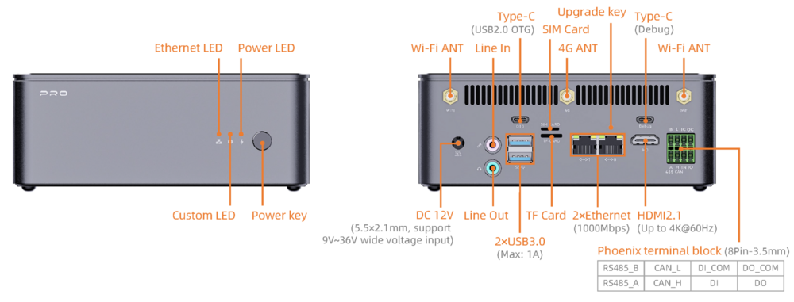

# Interface Introduction

AIBOX-PRO has rich interfaces, mainly including:
- 12V Power Interface (5.5*2.1mm)
- Power Button
- MaskRom Button
- Gigabit Ethernet x 2
- USB 3.0 x 2
- Line out & Line in
- HDMI
- TF Card Slot
- SIM Card Slot
- Type-C (OTG/Flash)
- Type-C (Debug)
- RS485
- CAN
- DI/DO Optocoupler Isolation
- Power Indicator
- Wi-Fi Antenna x 2 (requires the corresponding Wi-Fi module)
- 4G Antenna (requires the corresponding 4G/5G module)

It also provides one internal PCIe expansion slot and one SATA interface.

PS: The interfaces listed above are supported by RK3588. If the RK3576 core board is used, Wi-Fi, the PCIe expansion slot, and the SATA module are not available due to hardware limitations.

