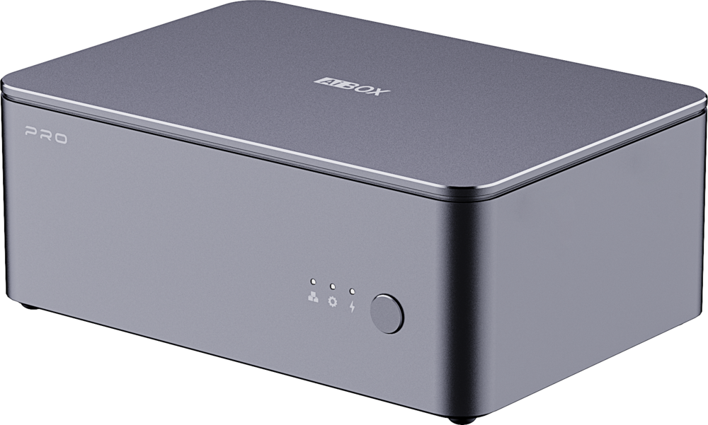
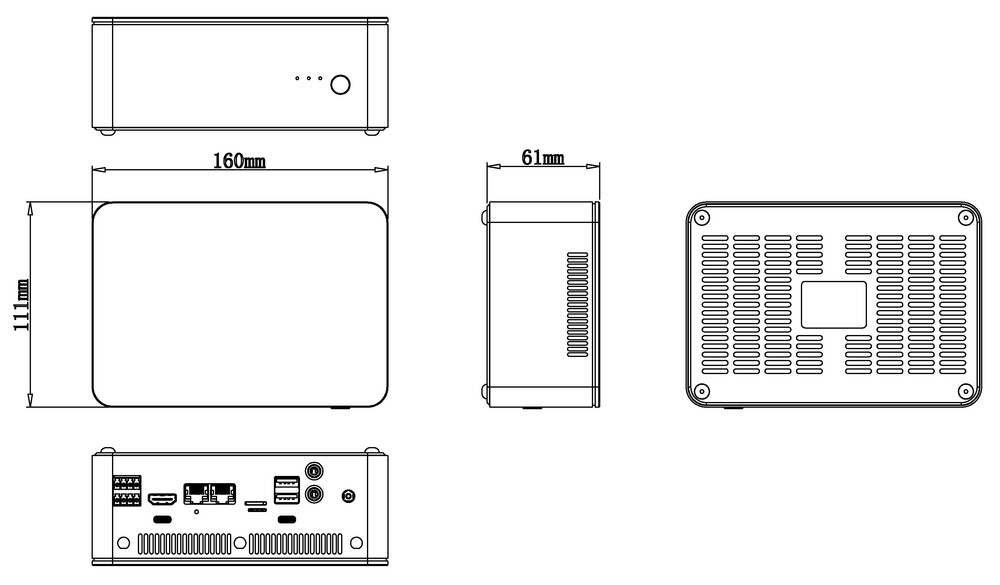

# Introduction

[Specification](https://download.t-firefly.com/Spec/Computers/AIBOX%20PRO_Specification_EN.pdf) | [Purchase](https://www.t-firefly.com/products/aibox-pro-edge-computing-computer) | [Downloads](https://community.t-firefly.com/en/doc/download/414)

**AIBOX PRO** features a dual-core module design with dual-core heterogeneous architecture. The two core modules work independently for multi-task parallel processing. The main controller Core-3588JD4 integrates an ARM Mali-G610 MP4 quad-core GPU with a built-in AI accelerator NPU, delivering 6 TOPS of computing power and supporting mainstream deep learning frameworks. The co-processor RK1828 supports deployment of large models such as Qwen3-8B and Qwen2.5-VL-7B, enabling multi-channel video recognition, object detection and tracking, visual development, and more. One box meets all your personalized AI deployment needs.

## Interface Description

**AIBOX PRO** provides rich interfaces, mainly including:
- 12V Power Interface (5.5*2.1mm)
- Power Button
- MaskRom Button
- Gigabit Ethernet x 2
- USB 3.0 x 2
- Line out & Line in
- HDMI
- TF Card Slot
- SIM Card Slot
- Type-C (OTG/Flash)
- Type-C (Debug)
- RS485
- CAN
- DI/DO Optocoupler Isolation
- Power Indicator
- Wi-Fi Antenna x 2 (requires the corresponding Wi-Fi module)
- 4G Antenna (requires the corresponding 4G/5G module)

It also provides one internal PCIe expansion slot and one SATA interface.

PS: The interfaces listed above are supported by RK3588. If the RK3576 core board is used, Wi-Fi, the PCIe expansion slot, and the SATA module are not available due to hardware limitations.

## Structure and Dimensions

## Resources and Support

* [Technical Support Forum](https://forum.t-firefly.com/): a communication platform with more than 100,000 enterprise customers and users

### Contact

* Email: sales@t-firefly.com
* Mobile: (+86) 186 8811 7175
* Tel: 0760-89881218
* National Service Hotline: 4001-511-533
* Address: Room 2101, Hongyu Building, No. 57 Zhongshan 4th Road, East District, Zhongshan City, Guangdong Province