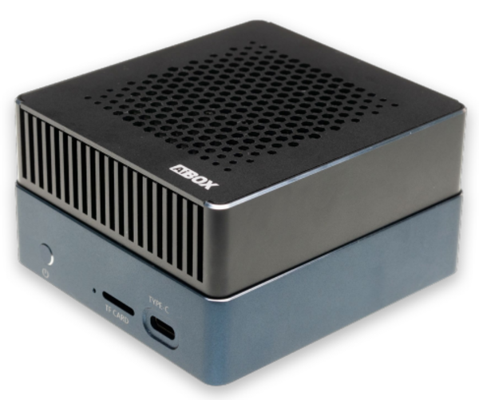
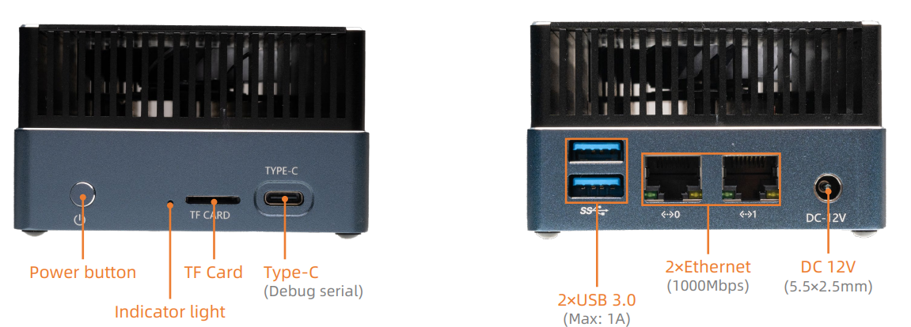
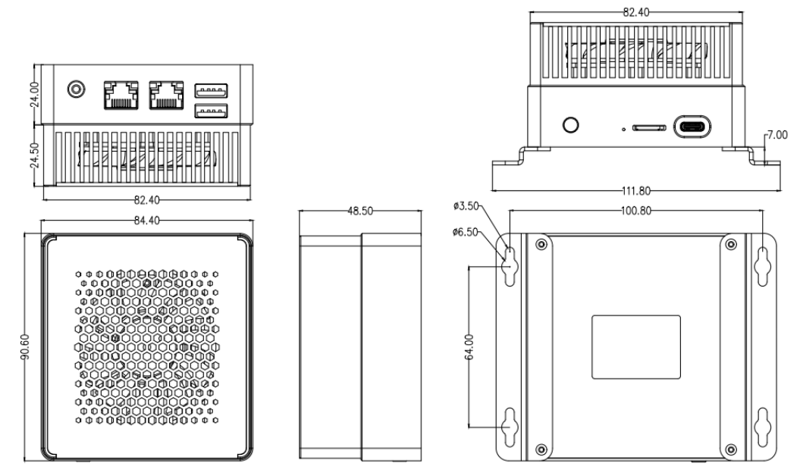

# Introduction

[Specification](https://download.t-firefly.com/Spec/Computers/AIBOX-1684X_AIBOX-1684_Specification_EN.pdf) | [Purchase](https://www.t-firefly.com/products/aibox-1684x-ai-box-up-to-32-tops-of-computing-power) | [Downloads](https://community.t-firefly.com/en/doc/download/248)

The AIBOX-1684X is a high-computing-power AI box equipped with the SOPHON AI computing processor BM1684X. It supports peak computing power of 32 TOPS (INT8), 16 TFLOPS (FP16/BF16), and 2 TFLOPS (FP32) high-precision computing. It is compatible with mainstream programming frameworks, offers a comprehensive toolchain, high ease of use, and minimal algorithm migration costs. It is suitable for various AI computing scenarios such as visual computing, edge computing, and general-purpose computing services.

## Interface Description

**AIBOX-1684X** provides rich interfaces, mainly including:

- 12V Power interface (5.5*2.5mm)
- Power button
- 1000Mbps Ethernet x 2
- USB 3.0 x 2
- TF card slot
- Type C (Debug serial)

## 结构尺寸

## Resources and Support

* [Core board Core-1684XJD4 Wiki](https://wiki.t-firefly.com/en/Core-1684XJD4/): including debug serial port, system firmware and other development materials
* [Technical Support Forum](https://forum.t-firefly.com/): a communication platform with more than 100,000 enterprise customers and users

### Contact

* Email: sales@t-firefly.com
* Mobile: (+86) 186 8811 7175
* Tel: 0760-89881218
* National Service Hotline: 4001-511-533
* Address: Room 2101, Hongyu Building, No. 57 Zhongshan 4th Road, East District, Zhongshan City, Guangdong Province