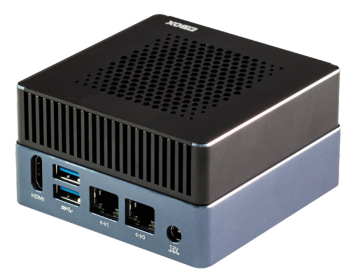
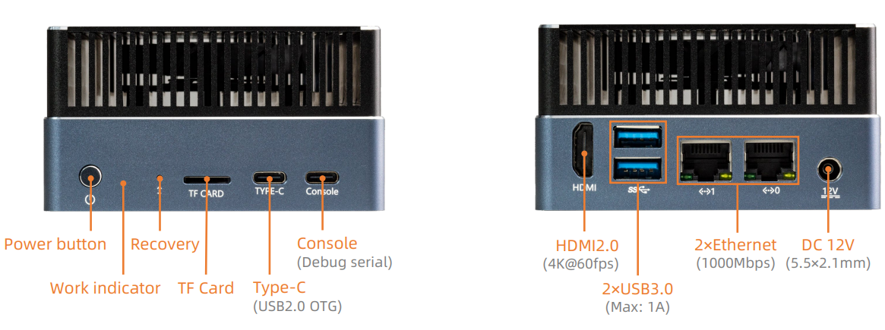

# Introduction

[Specification](https://download.t-firefly.com/Spec/Computers/AIBOX-1688_AIBOX-186_Specification_EN.pdf) | [Purchase](https://www.t-firefly.com/products/aibox-186-artificial-intelligence-box-6t-large-model-privatization-deployment-deep-learning-computing-cv186ah) | [Downloads](https://community.t-firefly.com/en/doc/download/278)

**AIBOX-186** is equipped with the Sophgo computing chip CV186AH, a highly integrated visual computing chip designed for AI inference, computer vision, and other applications. It efficiently adapts to various AI algorithms, enabling applications such as image classification, object detection, instance segmentation, semantic segmentation, text recognition, and speech recognition, and supports local private deployment of large language models, meeting the needs of edge computing and AI inference box scenarios.

## Interface Description

**AIBOX-186** provides rich interfaces, mainly including:

**Front**：
- Power Button
- Work LED (RGB LED, default green in Linux OS)
- Recovery Button (pushed with needle, function undefined)
- TF Card Slot (support high-speed card)
- TYPE-C USB 2.0 OTG
- TYPE-C Serial Port (for system debugging)

**Back**：
- HDMI 2.0 (up to 4K@60fps)
- 2*USB 3.0 (upper slot defaults to support USB 3.0 only, no USB 2.0)
- 2*1000Mbps Ethernet (0: DHCP, 1: Static IP address 192.168.150.1/24)
- 12V Power Interface（5.5*2.5mm）

## Resources and Support

* [Core board Core-186JD4 documentation](https://wiki.t-firefly.com/en/Core-186JD4/): including SDK compilation tutorials and function development materials
* [Technical Forum](https://forum.t-firefly.com/): A communication platform with more than 100,000 enterprise customers and users

### Contact

* Email: sales@t-firefly.com
* Mobile: (+86) 186 8811 7175
* Landline: 0760-89881218
* National Service Hotline: 4001-511-533
* Address: Room 2101, Hongyu Building, No. 57 Zhongshan 4th Road, East District, Zhongshan City, Guangdong Province