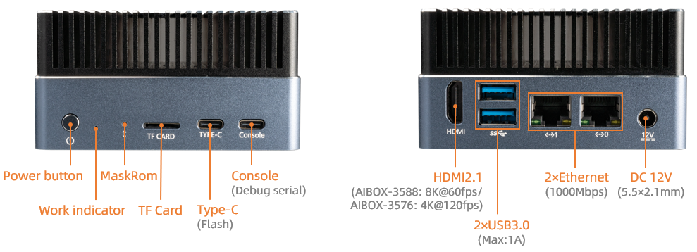

# Hardware Interface Introduction

AIBOX-3576 has rich interfaces, mainly including:
- 12V Power interface（5.5*2.5mm）
- Power button
- MaskRom button
- 1000Mbps Ethernet x 2
- USB 3.0 x 2
- HDMI
- TF card slot
- Console (Debug serial)
- Type-C（Upgrade）
- Work indicator

