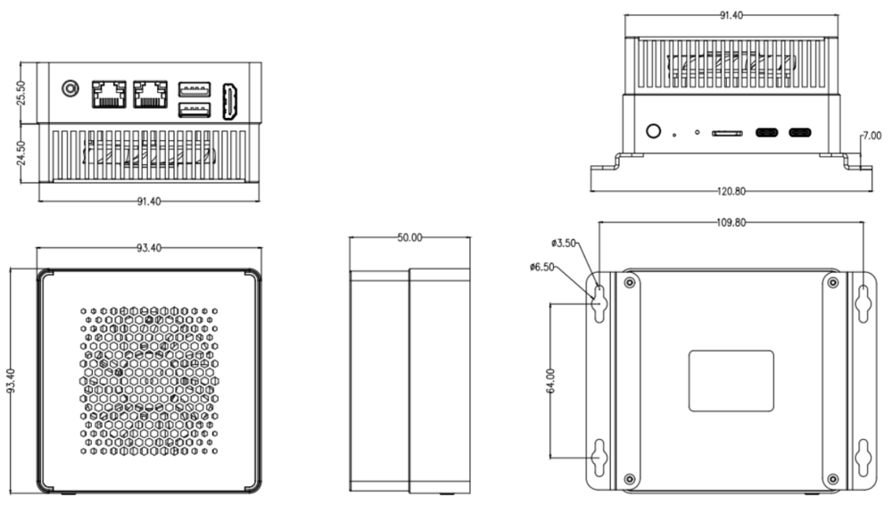

# Introduction

[Specification](https://download.t-firefly.com/Spec/Computers/AIBOX-3576_AIBOX-3588_AIBOX-3588S_Specification_EN.pdf) | [Purchase](https://www.t-firefly.com/products/aibox-3588-artificial-intelligence-box-6t-large-model-privatization-deployment-edge-computing-ruixin-micro-rk3588) | [Downloads](https://community.t-firefly.com/en/doc/download/273)

**AIBOX-3588** is equipped with the Rockchip octa-core 64-bit processor RK3588. It adopts an advanced process technology with high performance and low power consumption, has a built-in ARM Mali-G610 MP4 quad-core GPU, and integrates a 6 TOPS NPU. It supports the private deployment of ultra-large-parameter models under the Transformer architecture, supports traditional network architectures such as CNN, RNN, and LSTM, supports multiple deep learning frameworks, supports custom operator development, and supports Docker container management technology. One box can meet personalized AI deployment.

## Interface Description

**AIBOX-3588** provides rich interfaces, mainly including:
- 12V power interface (5.5*2.5mm)
- Power button
- MaskRom button
- Gigabit Ethernet x 2
- USB 3.0 x 2
- HDMI
- TF card slot
- Console (Debug Serial)
- Type-C (for flashing)
- Power indicator LED

## Structure and Dimensions

## Resources and Support

* [Technical Support Forum](https://forum.t-firefly.com/): a communication platform with more than 100,000 enterprise customers and users

### Contact

* Email: sales@t-firefly.com
* Mobile: (+86) 186 8811 7175
* Tel: 0760-89881218
* National Service Hotline: 4001-511-533
* Address: Room 2101, Hongyu Building, No. 57 Zhongshan 4th Road, East District, Zhongshan City, Guangdong Province