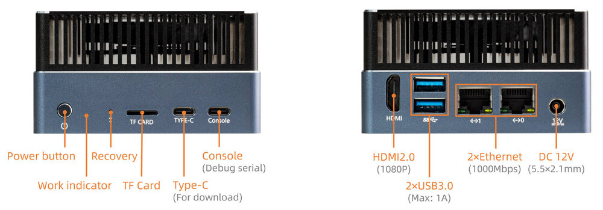
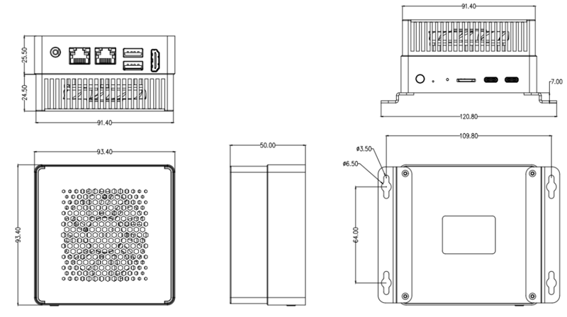

# Introduction

[Specification](https://download.t-firefly.com/Spec/Computers/AIBOX-8550_Specification_EN.pdf) | [Purchase](https://www.t-firefly.com/products/aibox-8550-qcs8550-embedded-mini-pc) | [Downloads](https://community.t-firefly.com/en/doc/download/356)

AIBOX-8550 features the Qualcomm hexa-core (1+2+3) QCS8550 AI processor with an integrated 48 TOPS NPU, supporting mainstream AI models and deep learning frameworks. The built-in Adreno 740 GPU enables ray tracing and 8K video codec. Housed in an industrial-grade all-metal casing for efficient heat dissipation, it ensures 24/7 stable operation to meet rigorous industrial demands. It is widely used in intelligent surveillance, AI education, computing power services, edge computing, private deployment of large models, data security and privacy protection, etc.

## Interface Description

**AIBOX-8550** provides rich interfaces, mainly including:

* DC Power Port
* 2 x USB3.0
* 1 x Type-C (For firmware download)
* 1 x Console (For Debug)
* 2 x 1000M Ethernet RJ45
* 1 x HDMI 2.0
* 1 x TF Card slot
* Power Key

## Structure and Dimension

## 结构尺寸

## Resources and Support

* [[Forum]](https://forum.t-firefly.com/): Tech communication platform for over 100K company and individual customers.

### Contact

* Email: sales@t-firefly.com
* Mobile: (+86) 186 8811 7175
* Landline: 0760-89881218
* Service Hotline: 4001-511-533
* Address: Room 2101, Hongyu Building, No. 57 Zhongshan 4th Road, East District, Zhongshan City, Guangdong Province