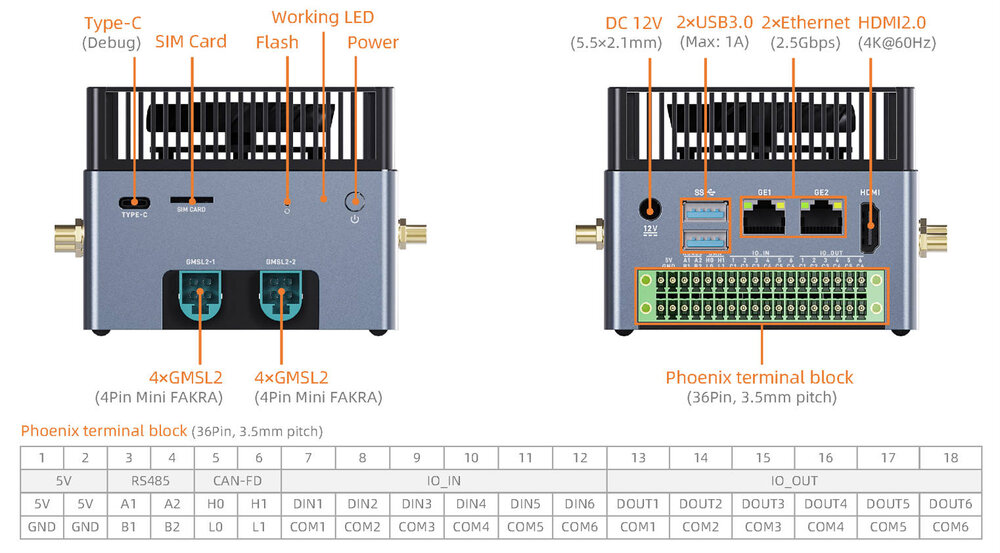
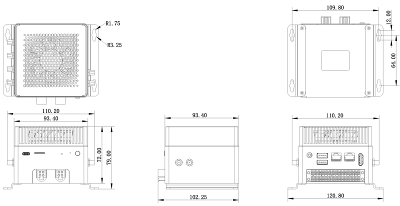

# Introduction

[Specification](https://download.t-firefly.com/Spec/Computers/AIBOX-9075_Specification_EN.pdf) | [Purchase](https://www.t-firefly.com/products/aibox-9075-industrial-edge-computer) | [Downloads](https://community.t-firefly.com/en/doc/download/407)

AIBOX-9075 is equipped with the Qualcomm IQ-9075 processor, delivering a peak computing power of 200 TOPS and a 13B large model inference performance of 12 TPS, supporting private deployment of edge-side large models. The octa-core CPU runs at up to 2.36GHz, suitable for high-load edge AI and multi-task concurrency. It has a built-in security subsystem and four real-time cores. Based on the Qualcomm Linux software stack, it supports Ubuntu/Yocto systems and mainstream AI inference frameworks. With industrial wide-temperature design and standard GMSL2, CAN-FD, RS485 and optocoupler isolated IO, it is suitable for edge computing, industrial control, intelligent surveillance and robotics scenarios.

## Interface Description

**AIBOX-9075** provides rich interfaces, mainly including:

* DC Power Port
* 2 x USB3.0
* 1 x Type-C (For debug console)
* 2 x 2.5G Ethernet RJ45
* 1 x HDMI 2.0
* 1 x SIM Card Slot
* 2 x GMSL2 4Pin Mini FAKRA
* 2 x RS485
* 2 x CAN-FD
* 6 x IO in
* 6 x IO out
* Download Key
* Power Key

## Structure and Dimension

## 结构尺寸

## Resources and Support

* [[Forum]](https://forum.t-firefly.com/): Tech communication platform for over 100K company and individual customers.

### Contact

* Email: sales@t-firefly.com
* Mobile: (+86) 186 8811 7175
* Landline: 0760-89881218
* Service Hotline: 4001-511-533
* Address: Room 2101, Hongyu Building, No. 57 Zhongshan 4th Road, East District, Zhongshan City, Guangdong Province