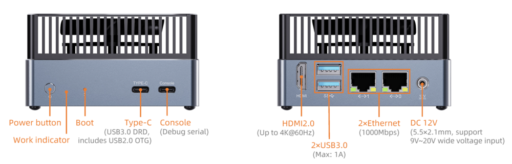

# Introduction

[Specification](https://download.t-firefly.com/Spec/Computers/AIBOX-K3_Specification_EN.pdf) | [Purchase](https://www.t-firefly.com/products/aibox-k3-risc-v-edge-mini-pc) | [Downloads](https://community.t-firefly.com/en/doc/download/376)

**AIBOX-K3** Powered by SpacemiT Key Stone K3 chip with RISC-V homogeneous fusion architecture. Integrates a self-developed 8-core general-purpose big core X100 and an 8-core parallel AI core A100, delivering 130K DMIPS of general-purpose computing power and 60 TOPS of AI computing power. It can run large models with up to 30 billion parameters and supports rapid deployment of all types of AI algorithms and models. K3 natively supports Linux 7.0 mainline kernel and RISC-V hardware virtualization, features M/S/U three-level privilege architecture.

## Interface Description

**AIBOX-K3** provides rich interfaces, mainly including:
- 12V power connector (5.5*2.5mm)
- Power button
- Boot button
- Gigabit Ethernet x 2
- USB 3.0 x 2
- PCIe SSD slot (bottom of the machine) x 1
- HDMI 2.0
- Console (debugging serial port)
- Type-C USB 3.0
- Power indicator light

## Structure and Dimensions

## Resources and Support

* [Chip Product Documentation](https://spacemit.com/community/document/info?lang=en&nodepath=hardware/key_stone/k3/k3_docs): including Product Introduction, Datasheet and User Manual
* [Technical Support Forum](https://forum.t-firefly.com/): a communication platform with more than 100,000 enterprise customers and users

### Contact

* Email: sales@t-firefly.com
* Mobile: (+86) 186 8811 7175
* Tel: 0760-89881218
* National Service Hotline: 4001-511-533
* Address: Room 2101, Hongyu Building, No. 57 Zhongshan 4th Road, East District, Zhongshan City, Guangdong Province