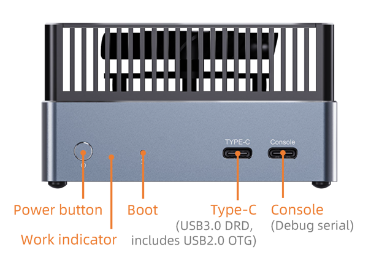
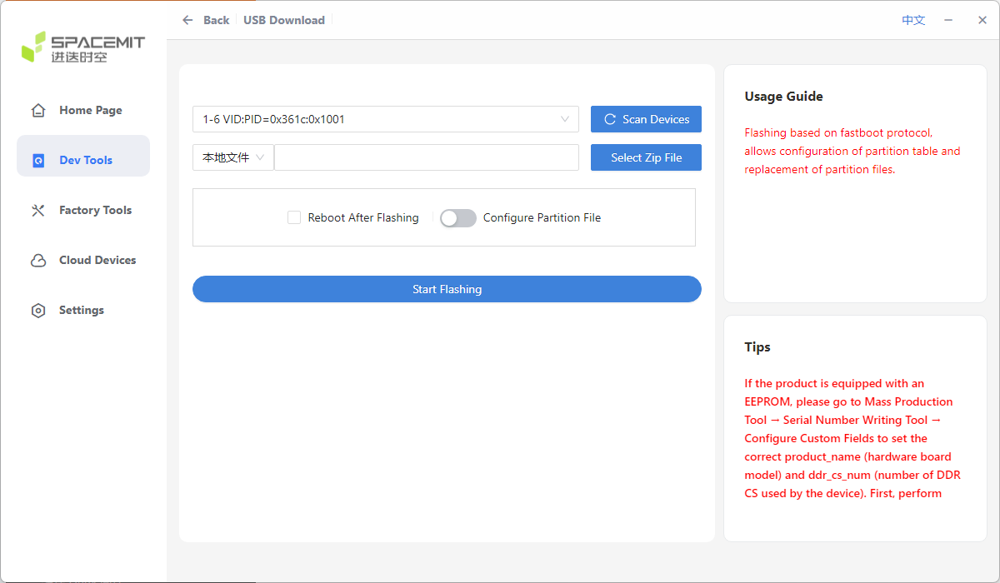

# Hardware Flashing Mode

***For an introduction to boot modes, please refer to the chapter [《Firmware Upgrade Introduction》](upgrade_bootmode_spacemit.md)***

## Introduction

Hardware flashing mode is the last line of defense against bricking your device.

**Please read carefully and operate with caution!**

The operation steps are as follows:

1. Connect the PC to the Type-C USB 3.0 port on the board using a Type-C cable. Be careful not to connect it to the USB serial port.
2. Press and hold the boot button, then connect the 12V power supply.
3. The device will then enter hardware programming mode.
4. Click "Scan Device" in the programming tool to identify the device.

