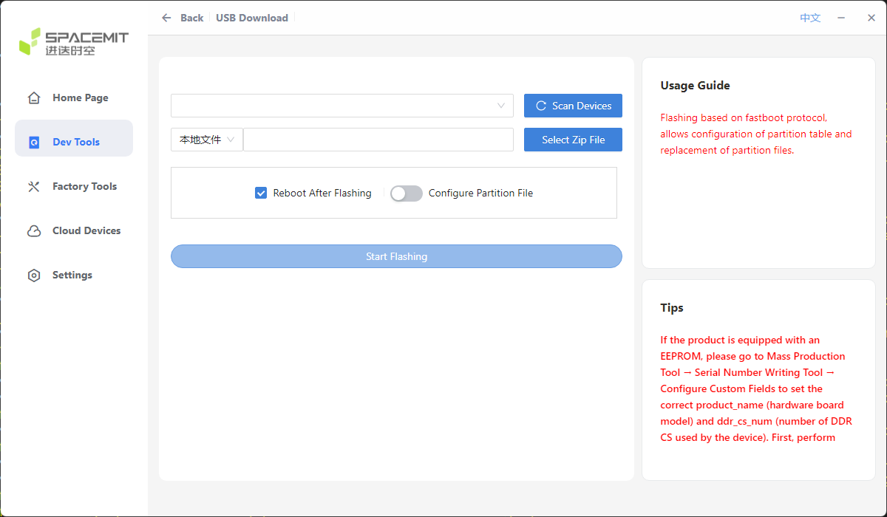
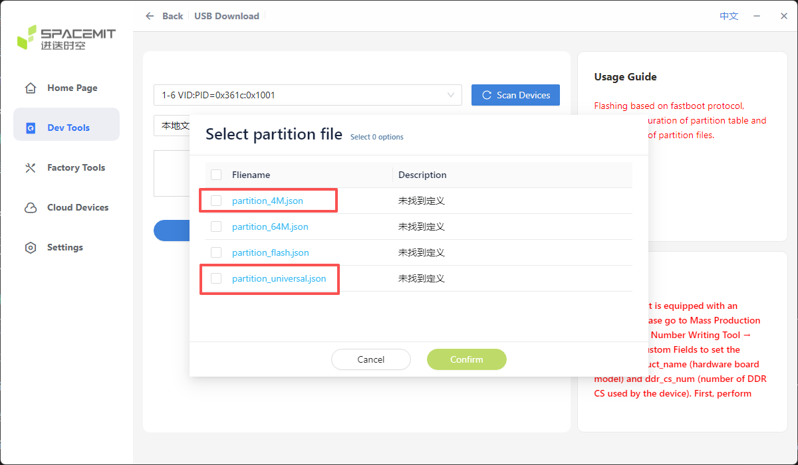

# FAQ

## Q: What flashing methods does the K3 support?

**A:** The AIBOX-K3 supports two flashing methods:

* **USB cable flashing**: burn the firmware from the host to the board's storage via a Type-C cable. Both unified firmware and partition images are supported. The board needs to enter flashing mode first, then flash with the titanflasher tool. See [Upgrading Firmware Using a USB Cable](upgrade_firmware.md).
* **MaskRom (hardware flashing mode) flashing**: the last line of defense when the board cannot enter Loader mode; enter it by pressing the boot button while powering on. See [Hardware Flashing Mode](upgrade_boot_mode_spacemit.md).

Please read the [Flashing Tool User Manual](https://spacemit.com/community/document/info?lang=en&nodepath=tools/user_guide/flasher_user_guide.md) carefully before flashing.

The titanflasher flashing tool interface:

## Q: How to enter flashing mode (Loader)?

**A:** Entering Loader mode via software requires operating the uboot terminal (the adb tool cannot be used), as follows:

1. Connect the board to the host with a Type-C cable, and connect the serial debugging terminal.
2. Run `reboot` in the serial debugging terminal to restart the board.
3. When the board reboots to the uboot stage, press and hold the `s` key to enter the uboot debugging terminal, then delete the extra `s` characters from the input.
4. Run `fastboot 0` in the uboot debugging terminal to enter flashing mode.
5. On the PC, in titanflasher, click: Dev Tools --> USB Download --> Scan Devices --> Select the flashing file --> Start Flashing.

> Note: at this point the titanflasher tool will flash part of the necessary firmware to the board, but not all of it. You need to press Enter again in the board's uboot terminal to continue the subsequent firmware flashing.

If the board cannot enter Loader mode, you can force entry into the hardware flashing mode; see "What are common errors?" below.

## Q: Is partition flashing supported?

**A:** Yes. Besides flashing the unified firmware, titanflasher also supports flashing partition images by configuring a partition file. Steps:

Dev Tools --> USB Download --> Scan Devices --> Local File --> Select the flashing file --> Reboot After Flashing --> Configure Partition File --> Start Flashing.

When configuring the partition file, you need to select the partition file:

1. `partition_4M.json`: updates the Nor Flash on the core board.
2. `partition_universal.json`: updates the UFS partition image on the core board.

## Q: What to do if flashing fails?

**A:** If an error occurs during flashing, it is usually caused by a poorly connected USB cable, a low-quality cable, or insufficient driving capability of the computer's USB port. Troubleshoot as follows:

1. Replace the Type-C cable with one in good condition.
2. Try another USB port on the computer, rescan the device and retry.
3. If it still fails, try forcing entry into the hardware flashing mode and flash again (see "What are common errors?" below).

## Q: What are common errors?

**A:**

* **Cannot enter Loader mode**: you can force entry into the hardware flashing mode: connect the PC to the board's Type-C USB 3.0 port with a Type-C cable (be careful not to connect it to the USB serial port by mistake), press and hold the boot button and then power on; the device will enter the hardware flashing mode. Then click "Scan Devices" in the flashing tool to identify the device. See [Hardware Flashing Mode](upgrade_boot_mode_spacemit.md).

* **Device not recognized by the flashing tool**: make sure the Type-C cable is well connected and not plugged into the wrong port (it should be the Type-C USB 3.0 port). Replace the USB cable or the computer's USB port if necessary, and click "Scan Devices" again.
* **Nor Flash related**: `partition_4M.json` updates the Nor Flash on the core board. Before flashing, check whether a Nor Flash chip is soldered on the core board, to avoid selecting the wrong partition file.

