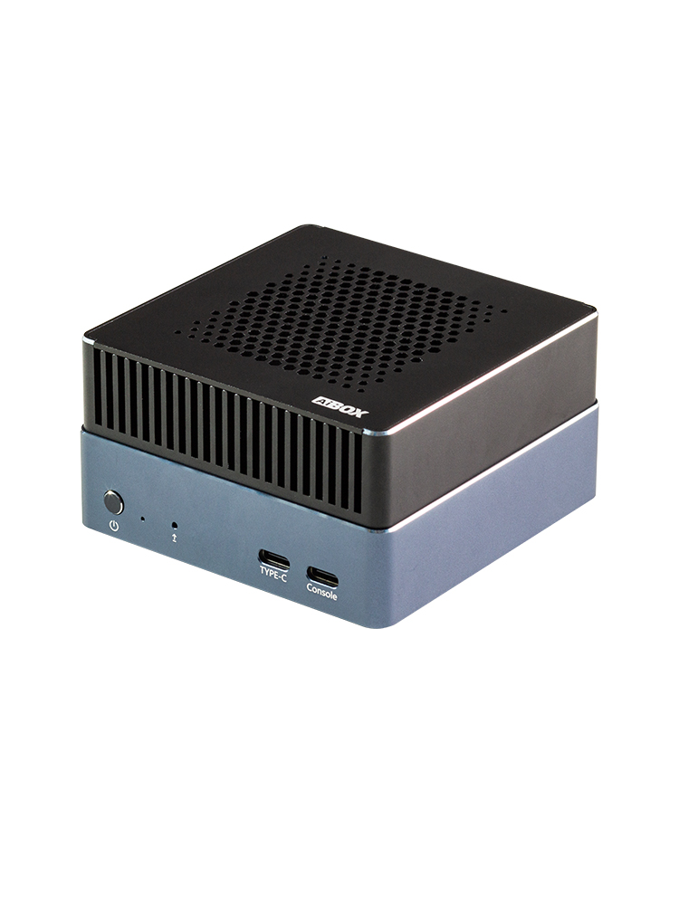

# Introduction
AIBOX-Orin NX is equipped with the Nvidia Jetson Orin NX module, is available in 16GB Memory, up to 100 TOPS. It can run AI models, including Transformer and ROS robot models. It can realize larger and more complex deep neural networks, such as using TENSORFLOW, OPENCV, JETPACK, KERASMXNET, PY-TORCH, etc., to achieve object recognition, object detection and tracking, speech recognition, and other visual development functions, meeting the needs of higher AI artificial intelligence application scenarios. 

