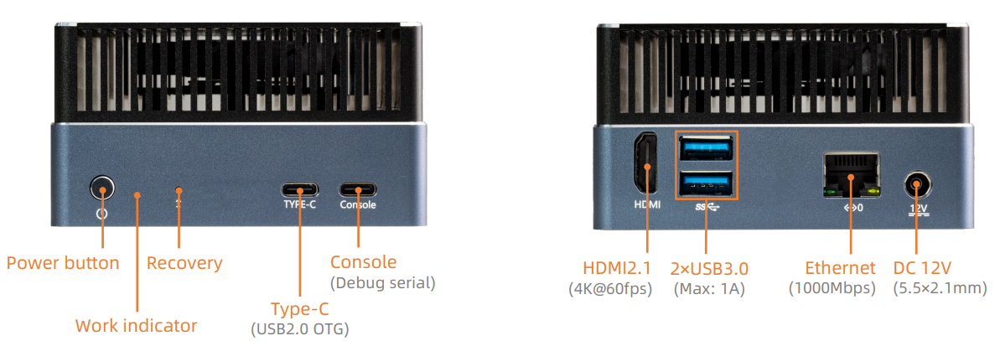

# Introduction

[Specification](https://download.t-firefly.com/Spec/Computers/AIBOX-OrinNano_AIBOX-OrinNX_Specification_EN.pdf) | [Purchase](https://www.t-firefly.com/products/aibox-orinnx-157tops-ai-big-model-of-edge-computing-jetson-module-nvidia) | [Downloads](https://community.t-firefly.com/en/doc/download/263)

| OS Name      | SDK Version | Kernel Version | Support Status | Maintenance Status |
| :--------: | :-------: | :-------: | :-------: | :-------: |
| Ubuntu 22.04 | Jetson Linux 36.4.3 (JetPack 6.2) | 5.15 | √ | Main Maintenance  |

AIBOX-Orin NX is equipped with the Nvidia Jetson Orin NX module, is available in 16GB Memory, up to 157 TOPS. It can run AI models, including Transformer and ROS robot models. It can realize larger and more complex deep neural networks, such as using TENSORFLOW, OPENCV, JETPACK, KERASMXNET, PY-TORCH, etc., to achieve object recognition, object detection and tracking, speech recognition, and other visual development functions, meeting the needs of higher AI artificial intelligence application scenarios.

## Interface Description

**AIBOX-Orin NX** provides rich interfaces, mainly including:
- 12V DC Power (5.5*2.5mm)
- Power Key
- Recovery Key (Put the device into Force Recovery Mode, to flash images)
- 1000Mbps Ethernet x 1
- USB 3.0 x 2
- HDMI
- NVME M.2 (PCIE3.0 x 1)
- Console (Debug Serial)
- Type-C (USB2.0 OTG)
- Power Led

## 结构尺寸

## Resources and Support

* [SDK Developer Guide (r36.3)](https://docs.nvidia.com/jetson/archives/r36.3/DeveloperGuide/index.html)
* [Jetson Benchmarks](https://github.com/NVIDIA-AI-IOT/jetson_benchmarks)
* [Jetson Download Center](https://developer.nvidia.com/embedded/downloads)
* [Jetson Archived Documentation](https://docs.nvidia.com/jetson/archives/)
* [Technical Support Forum](https://forum.t-firefly.com/): a communication platform with more than 100,000 enterprise customers and users

### Contact

* Email: sales@t-firefly.com
* Mobile: (+86) 186 8811 7175
* Tel: 0760-89881218
* National Service Hotline: 4001-511-533
* Address: Room 2101, Hongyu Building, No. 57 Zhongshan 4th Road, East District, Zhongshan City, Guangdong Province