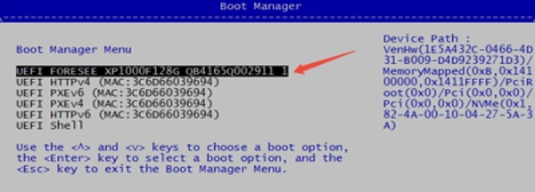

# FAQ

## Q: How to confirm the NVMe SSD is functioning properly?

a. Power on the device.
b. Press the `ESC` key to enter the UEFI Menu (a USB keyboard is required).
c. Select `Boot Manager` to enter the boot manager.
d. If the NVMe SSD is listed, the NVMe SSD is working properly.

eg:

<center>


</center>

## Q: What preparations are needed before upgrading the firmware?

**A:** Please prepare a PC running Ubuntu 22.04. The PC needs to support the NFS service, and commands such as `sshpass` may be required during the upgrade process; if they are missing, please install them yourself. Also prepare a Type-C cable to connect the OTG port of the device to the PC.

The firmware package can be obtained from the Firefly [Download Page](https://community.t-firefly.com/en/download/236).

## Q: How to put the device into Recovery mode?

**A:** Follow these steps:

* Power off the AIBOX-OrinNano first
* Connect the OTG port of the AIBOX-OrinNano to the PC using a Type-C cable
* Press and hold the Recovery key of the AIBOX-OrinNano
* Power on the AIBOX-OrinNano
* Release the Recovery key of the AIBOX-OrinNano

## Q: How to confirm that the device has entered Recovery mode?

**A:** Run the `lsusb` command on the PC. If you see the message `Bus <bbb> Device <ddd>: ID 0955: <nnnn> Nvidia Corp.`, the device has entered Recovery mode. Where:

* `<bbb>` is any three-digit number
* `<ddd>` is any three-digit number
* `<nnnn>` is a four-digit number corresponding to the core module:

## Q: After following the steps, why can't I see the Nvidia device in `lsusb`?

**A:** Please check the following items in order:

* Confirm that the operation sequence is correct: power off first, connect the Type-C cable, press and hold the Recovery key, then power on, and finally release the Recovery key
* Replace the Type-C cable (some cables only support charging and cannot transfer data) or try another USB port on the PC
* Make sure the Type-C cable is connected to the **OTG** port of the device, not the Debug port

## Q: How to flash the firmware? How to tell whether the upgrade succeeded?

**A:** After downloading and decompressing the firmware package, enter the firmware package directory and run the flashing command:


If everything goes well, the terminal will show `Flash is successful` and similar messages after the upgrade:

```
Flash is successful
Reboot device
Cleaning up...
```

The full log is saved in the `Linux_for_Tegra/initrdlog/` directory inside the firmware package. For detailed flashing steps, please refer to [Upgrade Firmware](upgrade_firmware.md).

## Q: What should I do if the flashing fails or an error occurs during the process?

**A:** You can try the following methods:

* Enter Recovery mode again as described above and run the flashing command again
* Replace the Type-C cable or use another USB port on the PC to rule out poor cable contact
* Make sure the device is powered normally, and do not power off the device during the upgrade
* If it fails repeatedly, check the logs under `Linux_for_Tegra/initrdlog/` in the firmware package to locate the problem

## Q: What is the relation between firmware versions and JetPack?

**A:** Firmware packages are released by JetPack version (for example, R36.4 corresponds to JetPack 6.2, and R38.4 corresponds to JetPack 7.1). The flashing scripts and commands may differ between versions. Please pay attention to the JetPack/L4T version of the firmware package when downloading, and follow the version-specific instructions on the [Upgrade Firmware](upgrade_firmware.md) page.