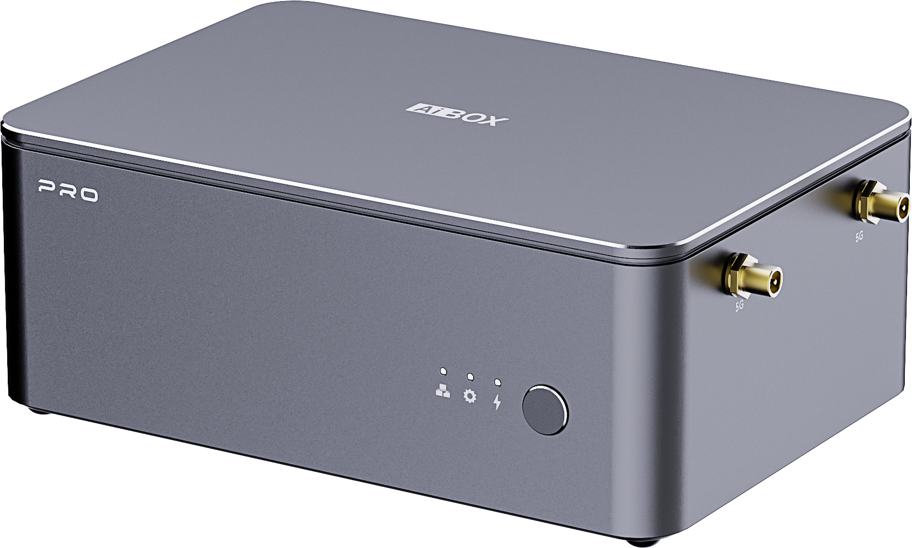
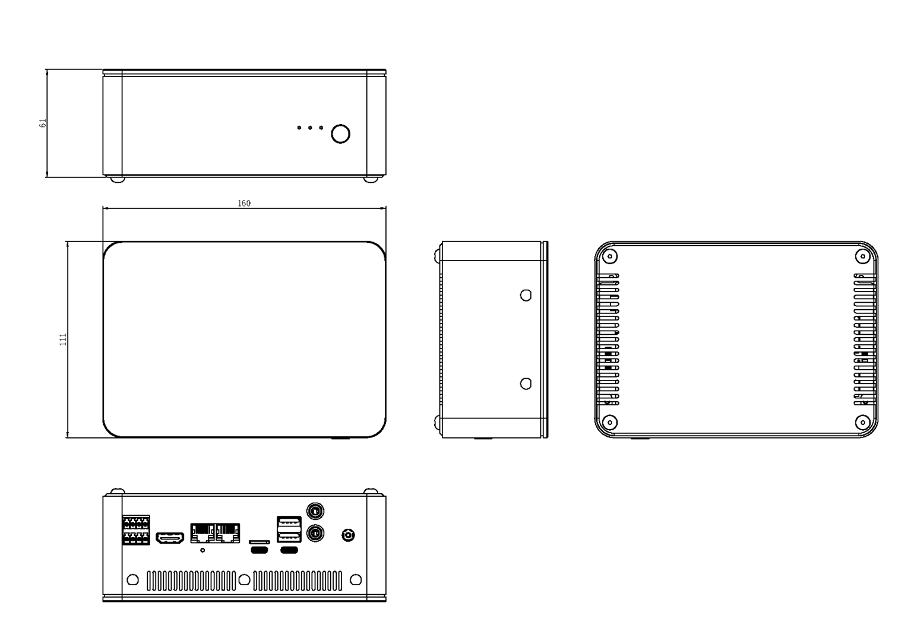

# Introduction
**AIBOX-PRO-3588** features a dual-core module design with dual-core heterogeneous architecture. The two core modules work independently for multi-task parallel processing. The main controller Core-3588JD4 integrates an ARM Mali-G610 MP4 quad-core GPU with a built-in AI accelerator NPU, delivering 6 TOPS of computing power and supporting mainstream deep learning frameworks. The co-processor RK1828 supports deployment of large models such as Qwen3-8B and Qwen2.5-VL-7B, enabling multi-channel video recognition, object detection and tracking, visual development, and more. One box meets all your personalized AI deployment needs.

Please refer to the [Specification](https://download.t-firefly.com/Spec/Computers/AIBOX%20PRO_Specification_EN.pdf) for more details.

## Dimensions
