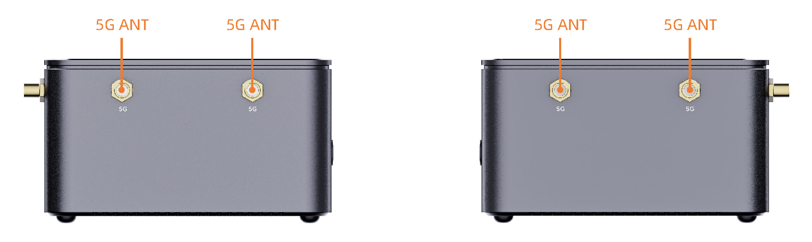

# Interface Introduction

AIBOX-PRO has rich interfaces, mainly including:
- 12V Power Interface (5.5*2.1mm)
- Power Button
- MaskRom Button
- Gigabit Ethernet x 2
- USB 3.0 x 2
- Line out & Line in
- HDMI
- TF Card Slot
- SIM Card Slot
- Type-C (OTG/Flash)
- Type-C (Debug)
- RS485
- CAN
- DI/DO Optocoupler Isolation
- Power Indicator
- Wi-Fi Module/Bluetooth Module (only one can be used at a time)
- Wi-Fi Antenna x 2
- 4G Antenna
- 5G Antenna x 4

Note:
The following interfaces are unavailable on the RK3576 core board: Wi-Fi, Bluetooth (shared with Wi-Fi), SATA, and expansion PCIe.

