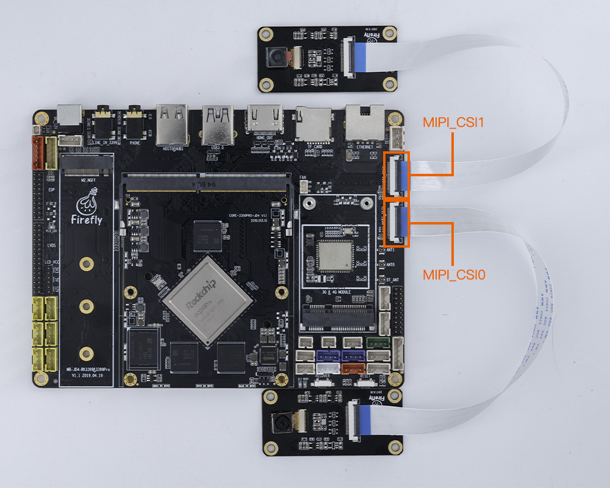
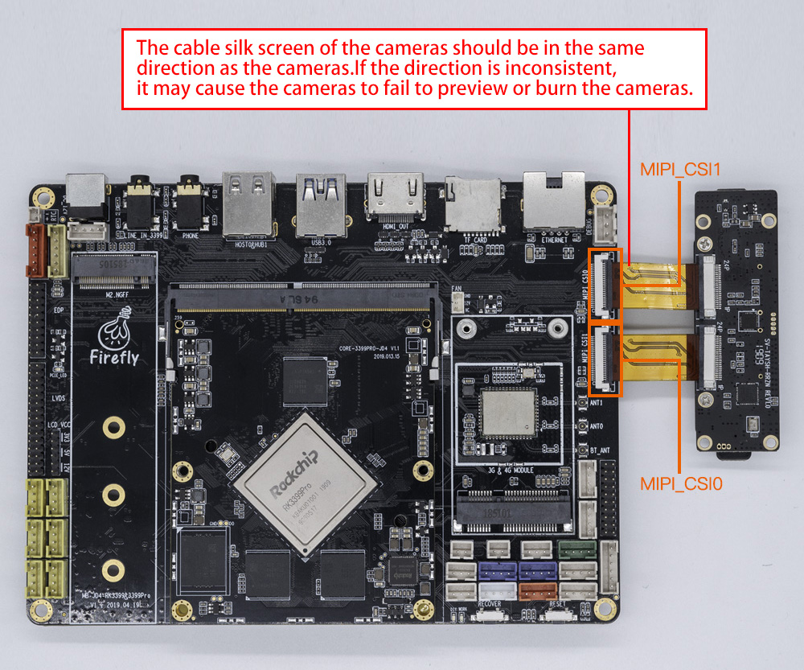

# Camera Module

## [OV13850 Camera Moudle](https://www.firefly.store/products)<font color=#ff0000>(Out of production)</font> <br />

### Product Parameter

* Brand：Omnivision
* Model：CMK-OV13850
* Interface：MIPI
* Pixels：1320W


### Firmware follow

CMK-OV13850 camera module is supported by default in public firmware.


### Datasheet

[DataSheet and schematic of OV13850 Camera Module](http://download.t-firefly.com/product/RK3288/Docs/Peripherals/OV13850%20datasheet/Sensor_OV13850-G04A_OmniVision_SpecificationV1.pdf).

### Picture


### Connection Method



### Renderings


## [CAM-8MS1M Monocular camera](https://www.firefly.store/products/cam-8ms1m-camera-module)

### Product Parameter
* **Brand**：SV
* **ISP**：XC7160
* **Sensor**: SC8238
* **Interface**: MIPI
* **Pixels**: 800W(Currently only supports up to 1080P, 4K is still being adapted)

### Reference firmware
Public Fimware support CAM-8MS1M camera module by default. If it doesn't work, please update the latest firmware.
[Android 9.0 Download link](https://en.t-firefly.com/doc/download/61.html#other_257)


### Physical map


### Connection method


### Real pictures


## SV-TAYSH-TQ Camera module

### Product parameters

* Model：XC7022(RGB)/XC6130(IR)

* Interface ：MIPI

* Pixel ：200W

### Patch
kernel/arch/arm64/boot/dts/rockchip/rk3399pro-firefly-aiojd4.dtsi
```
        xc7160b: xc7160b@1b {
+                status = "disabled";
                reset-gpios = <&gpio1 RK_PC4 GPIO_ACTIVE_HIGH>;
        };
        xc7160f: xc7160f@1b {
+                status = "disabled";
                reset-gpios = <&gpio1 RK_PC4 GPIO_ACTIVE_HIGH>;
        };

        XC7022b: XC7022b@1b{
+                status = "okay";
                reset-gpios = <&gpio0 RK_PB5 GPIO_ACTIVE_HIGH>;
        };

        XC6130b: XC6130b@23{
+                status = "okay";
                reset-gpios = <&gpio0 RK_PB5 GPIO_ACTIVE_HIGH>;
        };

```
Modify the above patch and [complie kernel](https://wiki.t-firefly.com/en/AIO-3399Pro-JD4/compile_android9.0_firmware.html#manually-compile-aio-3399pro-jd4-android-9-0), then reboot after upgrading boot.img.
### Physical map


### Connection method



### Real pictures


