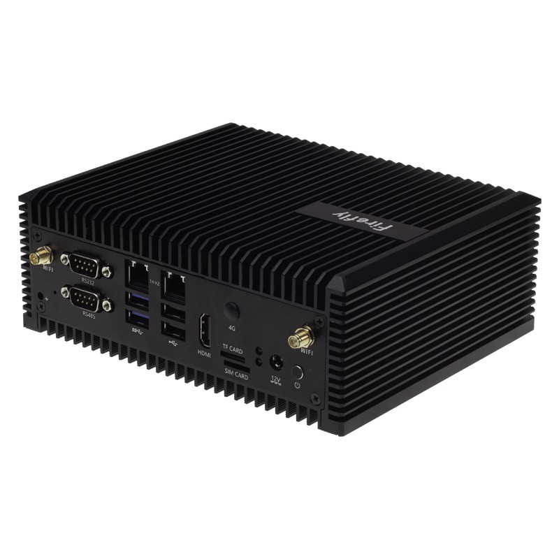

# Introduction

EC-A1684JD4 FD utilizes the SOPHON AI computing processor BM1684 and can be configured with 12GB of RAM. With an industrial-grade all-metal casing, aluminum alloy heat conduction, efficient heat dissipation, fanless design, and zero noise, it ensures stable operation and meets the demands of industrial applications. It boasts an INT8 computing power of up to 17.6TOPS, supports mainstream programming frameworks, features a comprehensive toolchain for easy usability, and comes with low algorithm migration costs. It is suitable for a wide range of AI computing scenarios, including visual computing, edge computing, general computing services, intelligent transportation, unmanned supermarkets, drones, and more.

