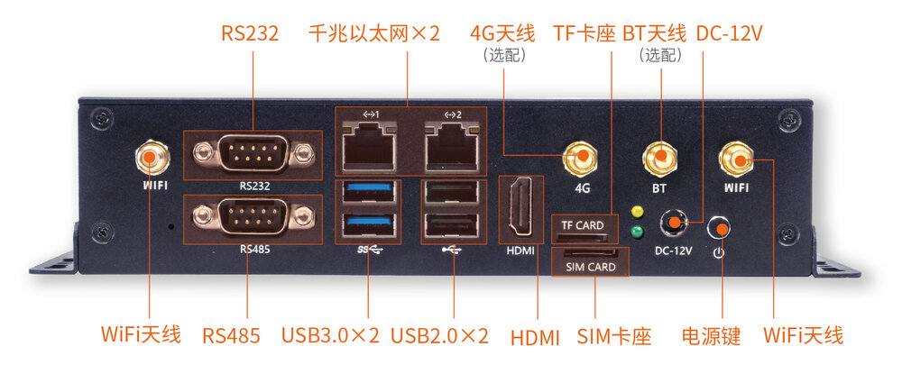
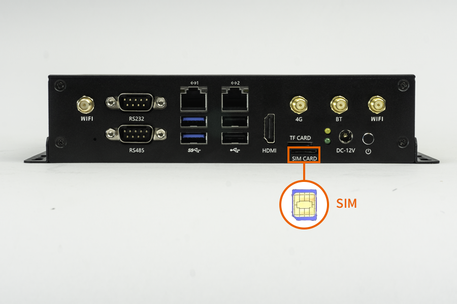

# Interface definition

EC-A1684JD4 has rich interfaces, mainly including:
- 12V Power interface
- Power button
- RS232
- RS485
- 1000Mbps Ethernet x 2
- USB 3.0 x 2
- USB 2.0 x 2
- HDMI
- TF card slot
- SIM card slot
- BT antenna
- WIFI antenna x 2
- 4G antenna

## Antenna Connection

## SIM Card Insertion

## Serial Port Pinout

