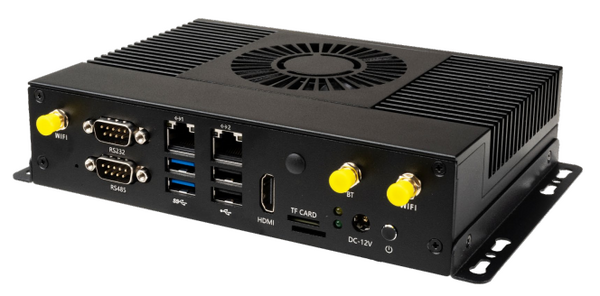
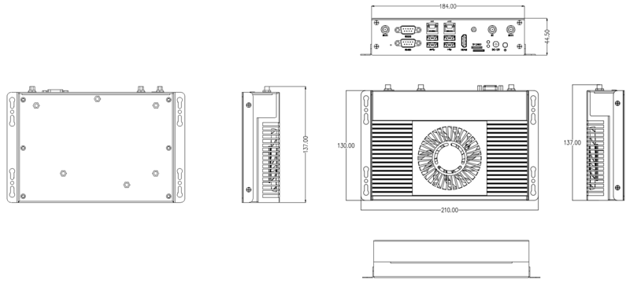

# Introduction

[Specification](https://download.t-firefly.com/Spec/Computers/EC-A1684JD4_Specification_EN.pdf) | [Purchase](https://www.t-firefly.com/products/ec-a1684jd4-8-core-high-computing-power-ai-computer) | [Downloads](https://community.t-firefly.com/en/doc/download/177)

The EC-A1684JD4 utilizes the SOPHON AI computing processor BM1684, with the option for 12GB of RAM. It boasts an INT8 computing power of up to 17.6TOPS, supports mainstream programming frameworks, features a comprehensive toolchain for easy usability, and comes with low algorithm migration costs. It is well-suited for a variety of AI computing scenarios, including visual computing, edge computing, general computing services, intelligent transportation, unmanned supermarkets, drones, and more.

## Interface Description

**EC-A1684JD4** provides rich interfaces, mainly including:

- 12V Power interface (5.5*2.5mm)
- Power button
- RS232
- RS485
- 1000Mbps Ethernet x 2
- USB 3.0 x 2
- USB 2.0 x 2
- HDMI
- TF card slot
- SIM card slot
- BT antenna
- WIFI antenna x 2
- 4G antenna

As shown in the figure below:

## 结构尺寸

## Resources and Support

* [Core board Core-1684JD4 Wiki](https://wiki.t-firefly.com/en/Core-1684JD4/): including debug serial port, system firmware and other development materials
* [Technical Support Forum](https://forum.t-firefly.com/): a communication platform with more than 100,000 enterprise customers and users

### Contact

* Email: sales@t-firefly.com
* Mobile: (+86) 186 8811 7175
* Tel: 0760-89881218
* National Service Hotline: 4001-511-533
* Address: Room 2101, Hongyu Building, No. 57 Zhongshan 4th Road, East District, Zhongshan City, Guangdong Province