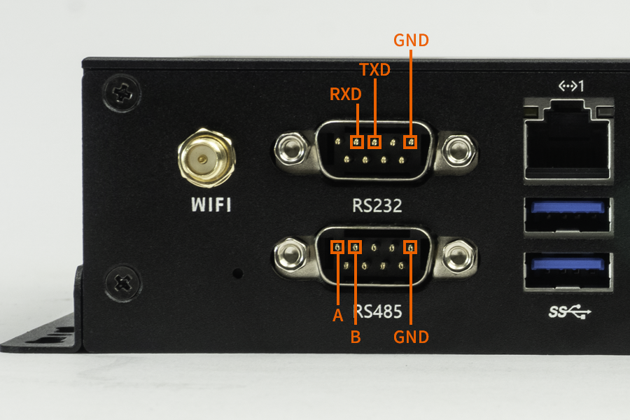
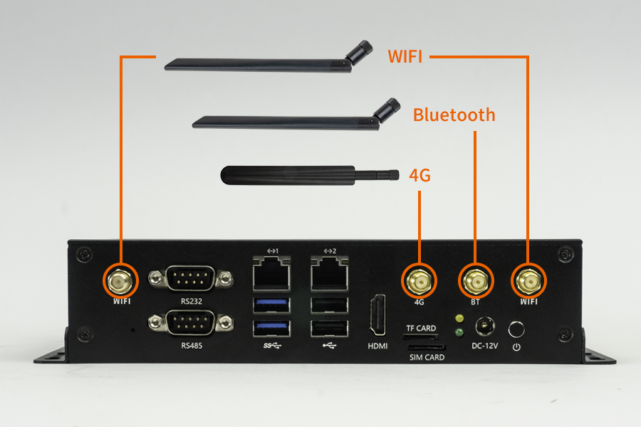

# Hardware Function Usage
## Debug Serial Port

The EC-A1684XJD4 requires an external RS232 serial cable to connect to the debug serial port for debugging.
The AIO-1684XJD4 can be connected to a PC via an RS232-to-USB adapter for serial port debugging. Both the login account and password are `linaro`.

The serial port parameters are:

* Baud rate: 115200
* Data bits: 8
* Stop bit: 1
* Parity: none
* Flow Control: None

### Using serial port debugging on Windows

On Windows, putty or SecureCRT is generally used. We recommend using the free version of MobaXterm. It is a powerful terminal software, and the usage of other serial software is similar.

Go here to [download MobaXterm](https://mobaxterm.mobatek.net/):

1. Select `session` as `Serial`.
2. Modify `Serial port` to the COM port found in Device Manager.
3. Set `Speed (bsp)` to `115200`.
4. Click the `OK` button.

<center>


</center>
<center>


</center>

### Serial debugging on Linux

There are several options available on Linux: minicom, picocom, kermit. Due to space constraints, the use of minicom is introduced below.

Install minicom:

```
sudo apt-get install minicom
```

After connecting the serial cable, see what the serial device file is. The following example is `/dev/ttyUSB0`:

```
$ ls /dev/ttyUSB*
/dev/ttyUSB0
```

Run:

```
$ sudo minicom
Welcome to minicom 2.7
OPTIONS: I18n
Compiled on Jan  1 2014, 17:13:19.
Port /dev/ttyUSB0, 15:57:00
Press CTRL-A Z for help on special keys
```

The above prompt `CTRL-A Z` is the escape key. Press `Ctrl-a` and then `z` to bring up the menu:

```
   +-------------------------------------------------------------------+
                         Minicom Command Summary                      |
  |                                                                    |
  |              Commands can be called by CTRL-A <key>                |
  |                                                                    |
  |               Main Functions                  Other Functions      |
  |                                                                    |
  | Dialing directory..D  run script (Go)....G | Clear Screen.......C  |
  | Send files.........S  Receive files......R | cOnfigure Minicom..O  |
  | comm Parameters....P  Add linefeed.......A | Suspend minicom....J  |
  | Capture on/off.....L  Hangup.............H | eXit and reset.....X  |
  | send break.........F  initialize Modem...M | Quit with no reset.Q  |
  | Terminal settings..T  run Kermit.........K | Cursor key mode....I  |
  | lineWrap on/off....W  local Echo on/off..E | Help screen........Z  |
  | Paste file.........Y  Timestamp toggle...N | scroll Back........B  |
  | Add Carriage Ret...U                                               |
  |                                                                    |
  |             Select function or press Enter for none.               |
  +--------------------------------------------------------------------+
```

Press `O` according to the prompt to enter the setting interface:

```
           +-----[configuration]------+
           | Filenames and paths      |
           | File transfer protocols  |
           | Serial port setup        |
           | Modem and dialing        |
           | Screen and keyboard      |
           | Save setup as dfl        |
           | Save setup as..          |
           | Exit                     |
           +--------------------------+
```

Move the cursor to `Serial port setup`, press enter to enter the serial port setup interface, then enter the letters indicated above, select the corresponding option, and set as follows:

```
   +-----------------------------------------------------------------------+
   | A -    Serial Device      : /dev/ttyUSB0                              |
   | B - Lockfile Location     : /var/lock                                 |
   | C -   Callin Program      :                                           |
   | D -  Callout Program      :                                           |
   | E -    Bps/Par/Bits       : 115200 8N1                                |
   | F - Hardware Flow Control : No                                        |
   | G - Software Flow Control : No                                        |
   |                                                                       |
   |    Change which setting?                                              |
   +-----------------------------------------------------------------------+
```

**Note:** `Hardware Flow Control` and `Software Flow Control` must be set to No, otherwise it may result in failure to input.

After the setup is complete, go back to the previous menu and select `Save setup as dfl` to save it as the default configuration, which will be used by default in the future.

### Debugging using DEBUG port

If you want to develop U-Boot or the kernel, you need to use the DEBUG port for debugging. The operation is the same as that of RS232 debugging, but you need to pay attention to the adapter and its driver.

#### Selecting an adapter

There are many USB-to-serial adapters on the online store, which are divided into the following types according to the chip:

| Serial port | Maximum baud rate | Recommended or not | Evaluation | Purchase link |
| :--------: | :-------: |:-------: | :-------: | :-------: |
| [CP2104](https://www.firefly.store/products/usb-to-uart-module-cp2104) | 2Mbps | Recommended | Support high baud rate communication, good stability and durability | [Click to buy](https://www.firefly.store/products/usb-to-uart-module-cp2104) |
| CH340 | 2Mbps | Not recommended | In actual use, it is found that the actual baud rate of many CH340s on the market cannot reach 1.5 Mbps | |
| PL2303 | 1.2Mbps | Not recommended | The maximum baud rate cannot reach 1.5Mbps | |

Generally speaking, adapters using CH340 chips have relatively stable performance and are more expensive.

**Note:** The default baud rate for the EC-A1684XJD4 is 115200.

#### Hardware connection

The USB to serial adapter has four pins:

* 3.3V power supply (NC), no connection required
* GND, the ground wire of the serial port, connects to the GND pin of the serial port of the development board
* TXD, the output line of the serial port, connects to the TX pin of the serial port of the development board
* RXD, the input line of the serial port, connects to the RX pin of the serial port of the development board

**Note:** If you encounter the problem that TX and RX cannot input and output when using other serial adapters, you can try to reverse the connection of TX and RX.

#### Install driver

Windows requires the adapter driver to be installed (Linux does not). Download the driver and install it:

* [CH340](https://www.wch.cn/downloads/CH341SER_EXE.html)
* [PL2303](https://www.prolific.com.tw/en/portfolio-item/pl2303gl/)
* [CP210X](https://www.silabs.com/software-and-tools/usb-to-uart-bridge-vcp-drivers)

After inserting the adapter, the system will prompt to discover new hardware and initialize it, and then you can find the corresponding COM port in the Device Manager:

<center>


</center>

## UART

The Pinout of the on-board serial port of EC-A1684XJD4 is shown below:

<center>


</center>

The on-board serial port is the debug serial port (RS232 level), corresponding to the device node `/dev/ttyS1` with a default baud rate of `115200`.

### Serial Loopback Test

After shorting the TXD and RXD pins of the serial port, run the following commands on the device:

```shell
stty -F /dev/ttyS1 115200
cat /dev/ttyS1 &
echo "firefly test" > /dev/ttyS1
```

If the terminal outputs `firefly test`, the serial transceiving works normally.


## Login and Network Configuration

### Login

The EC-A1684XJD4 supports two login methods: debug serial port login and Ethernet SSH login. Both the login account and password are `linaro`.

* Debug serial port (RS232) login: see "Debug Serial Port" above for usage.
* Ethernet SSH login: The EC-A1684XJD4 has two Ethernet interfaces. By default, network port 0 (near the serial port) is set with a dynamic IP, while network port 1 (near the HDMI port) is set with the static IP `192.168.150.1`, subnet mask `255.255.255.0`. You can set the PC to `192.168.150.2/24` for the initial login. The IP of network port 0 is assigned by the router, and the IP address information is generally unknown in advance, so it is best to select network port 1 for the first login.

After the network port light flashes normally, open the terminal and use `ssh` to log in. The port number is `22`, and the username and password are also `linaro`:

```shell
ssh linaro@192.168.150.1
```

If the login fails, you can try to use the PC to `ping` the IP address of network port 1 of the EC-A1684XJD4. Note that the PC needs to add an IP address in the same network segment, because the IP address of the PC is not necessarily in the same network segment.

The following is how to add a same-network-segment IP on the PC (using administrator mode):

- Windows 10

  ```
  netsh int ipv4 add address "Ethernet" 192.168.150.101 255.255.255.0
  ```
  Where `"Ethernet"` refers to the network interface, `192.168.150.101` is the IP address, and `255.255.255.0` is the subnet mask.

- Linux

  ```shell
  ifconfig enp4s0:1 192.168.150.89
  ```
  Where `enp4s0` is the name of the network card driver of the PC, which can be viewed by executing the `ifconfig` command.

### Network IP configuration

#### Ubuntu System Configuration

In Ubuntu 20.04, the `eth0` interface is set to obtain an IP address dynamically (DHCP), while `eth1` is configured with a fixed IP address of `192.168.150.1`.

The configuration for `eth1` can be found in the `/etc/netplan/01-netcfg.yaml` file. You can modify this file to adjust the network settings for your Ubuntu system.

```shell
linaro@bm1684:~$ cat /etc/netplan/01-netcfg.yaml  | more
network:
        version: 2
        renderer: networkd
        ethernets:
                eth1:
                        dhcp4: no
                        addresses: [192.168.150.1/24]
                        optional: yes
```

If the user deletes this file, then `eth1` will revert to acquiring an IP address through DHCP, similar to `eth0`. If the user wants to assign a fixed IP address to `eth0` as well, they only need to add an `eth0` node (similar to `eth1`) in the `/etc/netplan/01-netcfg.yaml` file, and then restart for the changes to take effect.

## RS232 / RS485

The EC-A1684XJD4 provides one RS232 interface and one RS485 interface:

* RS485: the device name is `/dev/ttyS2`, supports full duplex, and the default baud rate is `9600`.
* RS232: the device name is `/dev/ttyS1`, supports full duplex, and the default baud rate is `115200`. Note that RS232 is used for login by default. To use it as a general communication serial port, the serial login service must be disabled first:

  ```shell
  sudo systemctl disable --now serial-getty@ttyS1.service
  ```

### RS485 transceiving test

(1) Connect the hardware: Connect the A, B, and GND pins of the RS485 to the A, B, and GND pins of the PC serial port adapter (USB to 485 serial port module) respectively.

(2) Open the PC serial port terminal. Open kermit in the terminal and set the baud rate:

```shell
$ sudo kermit
C-Kermit> set line /dev/ttyUSB0
C-Kermit> set speed 9600
C-Kermit> set flow-control none
C-Kermit> connect
```

Among them, `/dev/ttyUSB0` is the device file of the USB-to-serial adapter, which depends on the actual recognition of the PC.

(3) Send data: The device file for RS485 is `/dev/ttyS2`. Run the following commands on the device:

```shell
sudo -s
stty -F /dev/ttyS2 9600 -echo
echo firefly RS485 test... > /dev/ttyS2
```

The serial port terminal in the PC can receive the string "firefly RS485 test...".

(4) Receive data: First run the following command on the device:

```shell
sudo -s
cat /dev/ttyS2
```

Then enter the string "Firefly RS485 test..." on the serial terminal of the PC, and you can see the same string on the device side.

The test method of RS232 is similar to the steps of RS485; you only need to pay attention to the device name (`/dev/ttyS1`) and the baud rate (`115200`).

## Display Interface

The EC-A1684XJD4 provides 1 HDMI display output interface. The EC-A1684XJD4 does not have a graphics card chip, and the HDMI output part of the main control does not use the standard framebuffer driver. When it is shipped from the factory, there is no display when HDMI is connected.

If the user wants to test the HDMI display, he can connect to the HDMI interface, and then execute the `test-hdmi` script:

```shell
linaro@bm1684:~$ sudo -i
root@bm1684:~# test-hdmi
found (1024, 768) @ 60 fps
entry [0] = (1024, 768) added
found (1024, 768) @ 60 fps
found (1024, 768) @ 60 fps
found (1024, 768) @ 60 fps
found (1024, 768) @ 60 fps
found (1024, 768) @ 60 fps
found (1024, 768) @ 60 fps
found (1024, 768) @ 60 fps
found (1920, 1080) detailed timing desc
entry [1] = (1920, 1080) added
found (1920, 1080) detailed timing desc
found (1920, 1080) detailed timing desc
found (1920, 1080) detailed timing desc
```

## USB Interfaces

The EC-A1684XJD4 provides 2 USB 3.0 interfaces and 2 USB 2.0 interfaces. After inserting a USB flash drive, the storage device will be recognized as a node similar to `/dev/sdb1`. The system does not support auto-mounting, so you need to mount it manually with the `mount` command.

Insert the USB drive, and use `dmesg` to know the `sd` device corresponding to the USB drive:

```shell
[15460.953423] [5]  sdb: sdb1
```

Mount the USB drive:

```shell
# create mount directory
mkdir disk
# mount
sudo mount /dev/sdb1 disk
# View the files in the USB drive
ls disk
```

After completing data writing, please use `sync` or `umount` in time, and please use the `sudo poweroff` command when shutting down to avoid violent power-off, so as to avoid data loss.

## TF Card

The EC-A1684XJD4 provides 1 TF card slot, which can be used to mount a TF card for storage expansion, as well as to upgrade the firmware via a TF card.

The TF card mounting is similar to the USB drive. Use `dmesg` to know the `mmcblk` device corresponding to the TF card:

```shell
[16220.776440] [4]  mmcblk1: p1
```

Mount the TF card:

```shell
# create mount directory
mkdir media
# mount
sudo mount /dev/mmcblk1p1 media
# View the files in the TF card
ls media
```

For firmware upgrade via TF card, see [Firmware Upgrade](fw_upgrade.md).

## SIM Card

The SIM card slot of the EC-A1684XJD4 is used together with a 4G module to provide mobile network connectivity. **The 4G module is optional**, and the SIM card function is available only after the module has been installed inside the chassis. The SIM card insertion direction is shown in the figure below. Please power off the device before inserting or removing the SIM card.

<center>


</center>

## Antenna Connection

The antenna connection of EC-A1684XJD4 is shown below:

<center>


</center>


## Fan

The EC-A1684XJD4 fans work in 4 levels:

| Main control current temperature | Fan working level |
|:----------:|:----------:|
| ≥ 33℃ | 1 |
| ≥ 45℃ | 2 |
| ≥ 55℃ | 3 |
| ≥ 60℃ | 4 |

The higher the working level of the fan, the faster the speed. If the current temperature of the main controller is lower than 33℃, the fan is turned off by default.

Users can view the current working temperature of the main controller by executing the following command:

```shell
cat /sys/class/thermal/thermal_zone1/temp
```

For example, the following is 45.5℃:

```shell
linaro@bm1684:~$ cat /sys/class/thermal/thermal_zone1/temp
45500
```

In addition, the user can also manually turn on the fan (write 0-4, 0 is off, 4 is the maximum level):

```
sudo -i
echo 4 > /sys/class/thermal/cooling_device0/cur_state
```

## Device ID

### View Device ID

If you need to check the device ID, you can read the serial number of the core board. After reading successfully, it will return a string in json format:

```shell
linaro@bm1684:~$ cat /sys/bus/i2c/devices/1-0017/information
{
	"model": "SA5",
	"chip": "BM1684X",
	"mcu": "STM32",
	"product sn": "HQDZKETBWY2100012",
	"board type": "0x01",
	"mcu version": "0x38",
	"pcb version": "0x12",
	"reset count": 0
}
```

### Update Device ID

The device ID update is generally used to update the product SN number, which is stored in the EEPROM of the MCU.

The user needs to modify it in the following ways:

(1) First you need to unlock the MCU EEPROM:

```shell
sudo -i
echo 0 > /sys/devices/platform/5001c000.i2c/i2c-1/1-0017/lock
```

(2) Write the SN number:

```shell
echo "HQATEVBAIAIAI0001" > sn.txt
dd if=sn.txt of=/sys/bus/nvmem/devices/1-006a0/nvmem count=17 bs=1
```

(3) Finally, re-lock the MCU EEPROM to avoid accidental rewriting:

```shell
echo 1 > /sys/devices/platform/5001c000.i2c/i2c-1/1-0017/lock
```
