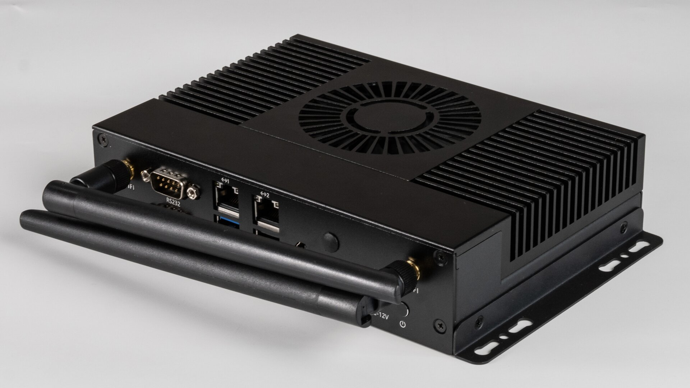

# Introduction
EC-A1684XJD4 utilizes the SOPHON AI computing processor BM1684X, with configurations of 16GB of large memory and 128GB eMMC storage. It supports peak computing power of 32 TOPS (INT8), 16 TFLOPS (FP16/BF16), and 2 TFLOPS (FP32) high-precision computing. The board supports 32-channel H.265/H.264 1080p@25fps video decoding. It is compatible with mainstream programming frameworks, offers a comprehensive toolchain, high ease of use, and minimal algorithm migration costs. It is suitable for various AI computing scenarios such as visual computing, edge computing, general-purpose computing services, intelligent transportation, unmanned supermarkets, drones, and more.
