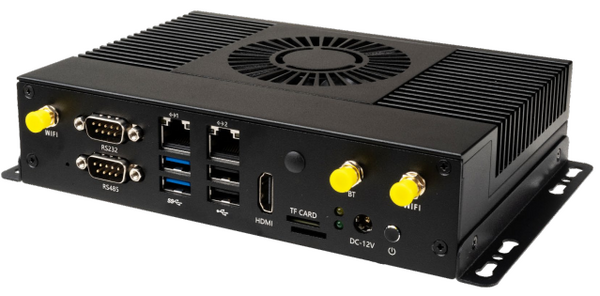
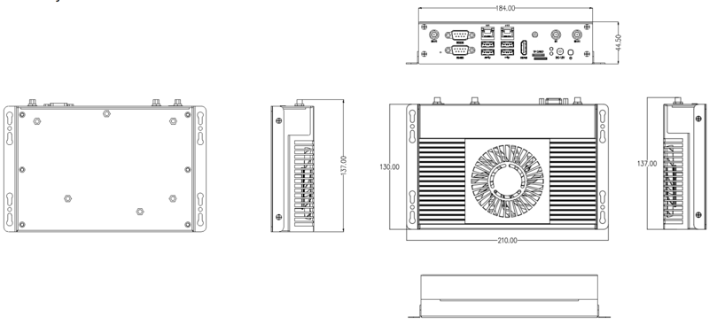

# Introduction

[Specification](（同中文版）) | [Purchase](https://www.t-firefly.com/products/ec-a1684xjd4-32t-high-computing-power-ai-embedded-computer) | [Downloads](https://community.t-firefly.com/en/doc/download/225)

The EC-A1684XJD4 utilizes the SOPHON AI computing processor BM1684X, with configurations of 16GB of large memory and 128GB eMMC storage. It supports peak computing power of 32 TOPS (INT8), 16 TFLOPS (FP16/BF16), and 2 TFLOPS (FP32) high-precision computing. The board supports 32-channel H.265/H.264 1080p@25fps video decoding. It is compatible with mainstream programming frameworks, offers a comprehensive toolchain, high ease of use, and minimal algorithm migration costs. It is suitable for various AI computing scenarios such as visual computing, edge computing, general-purpose computing services, intelligent transportation, unmanned supermarkets, drones, and more.

## Interface Description

**EC-A1684XJD4** provides rich interfaces, mainly including:

- 12V Power interface (5.5*2.5mm)
- Power button
- RS232
- RS485
- 1000Mbps Ethernet x 2
- USB 3.0 x 2
- USB 2.0 x 2
- HDMI
- TF card slot
- SIM card slot
- BT antenna
- WIFI antenna x 2
- 4G antenna

As shown in the figure below:

## 结构尺寸

## Resources and Support

* [Core board Core-1684XJD4 Wiki](https://wiki.t-firefly.com/en/Core-1684XJD4/): including debug serial port, system firmware and other development materials
* [Technical Support Forum](https://forum.t-firefly.com/): a communication platform with more than 100,000 enterprise customers and users

### Contact

* Email: sales@t-firefly.com
* Mobile: (+86) 186 8811 7175
* Tel: 0760-89881218
* National Service Hotline: 4001-511-533
* Address: Room 2101, Hongyu Building, No. 57 Zhongshan 4th Road, East District, Zhongshan City, Guangdong Province