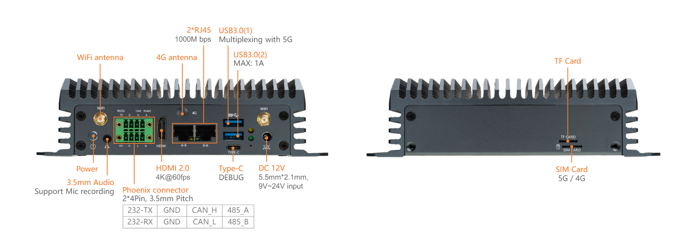
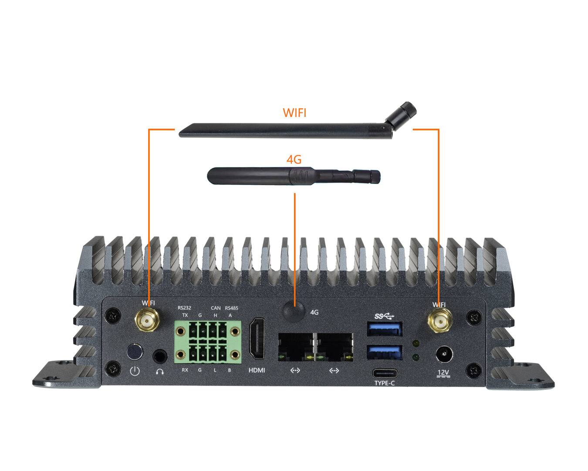
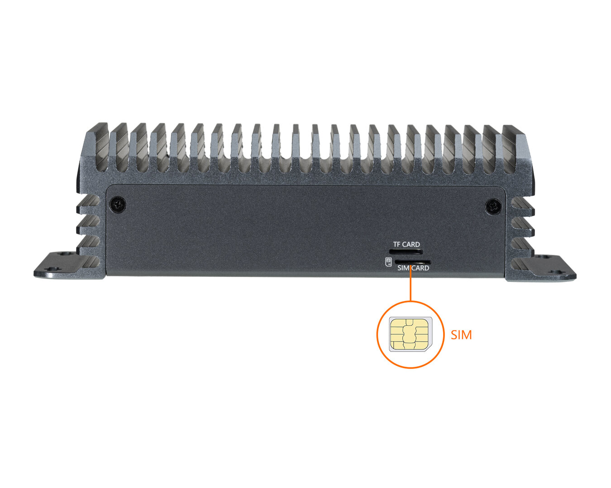

# Interface Introduction

EC-A1688JD4 has a rich set of interfaces, including:
- 12V power interface (5.5*2.5mm)
- POWER button
- RS232
- RS485
- CAN
- Gigabit Ethernet x 2
- USB 3.0 x 2
- HDMI
- TF card slot
- SIM card slot
- BT antenna
- WIFI antennas x 2
- 4G antenna
- Headphone
- NVME interface (PCIE3.0 x 1)
- Type-C (USB2.0, but defaults to debug serial port)
- Power indicator light

