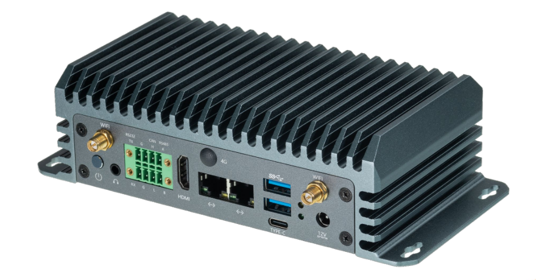

# Introduction
EC-A1688JD4 uses the computing chip BM1688, which is a highly integrated visual computing chip designed for AI inference, computer vision, and other applications. It can be integrated into various types of products such as intelligent computing servers, edge computing boxes, industrial computers, professional smart network cameras, and AIoT devices. It efficiently adapts to all AI algorithms on the market, enabling applications such as image classification, object detection, instance segmentation, semantic segmentation, behavior analysis, text recognition, natural language processing, speech recognition, speech synthesis, and search recommendation, empowering various industries with AI. Additionally, it integrates image processing hardware: supporting HDR wide dynamic range, 3D noise reduction, 3A, dehazing, and various image enhancement and computer vision algorithms such as fisheye unwrapping, image stitching, and binocular fusion, providing customers with professional-grade video image quality and hardware image algorithm acceleration. It features an industrial-grade all-metal shell, aluminum alloy heat dissipation, efficient cooling, a fanless design, and zero noise. 

