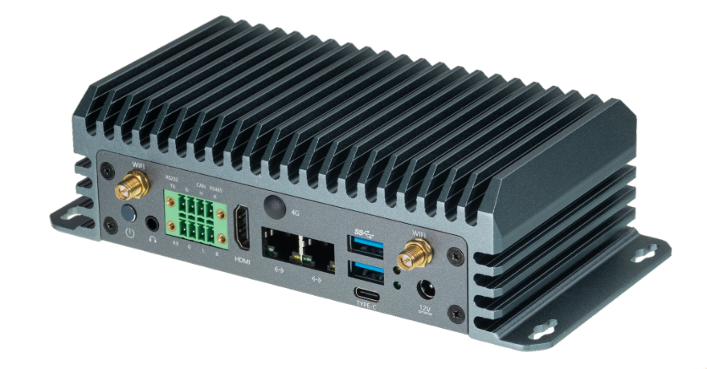
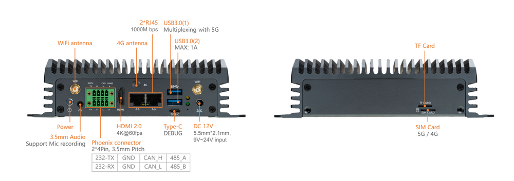

# Introduction

[Specification](https://download.t-firefly.com/Spec/Computers/EC-A1688JD4_EC-A186JD4_Specification_EN.pdf) | [Purchase](https://www.t-firefly.com/products/ec-a186jd4-industrial-ai-pc) | [Downloads](https://community.t-firefly.com/en/doc/download/390)

EC-A186JD4 uses the computing chip CV186AH, which is a highly integrated visual computing chip designed for AI inference, computer vision, and other applications. It can be integrated into various types of products such as intelligent computing servers, edge computing boxes, industrial computers, professional smart network cameras, and AIoT devices. It efficiently adapts to all AI algorithms on the market, enabling applications such as image classification, object detection, instance segmentation, semantic segmentation, behavior analysis, text recognition, natural language processing, speech recognition, speech synthesis, and search recommendation, empowering various industries with AI. Additionally, it integrates image processing hardware: supporting HDR wide dynamic range, 3D noise reduction, 3A, dehazing, and various image enhancement and computer vision algorithms such as fisheye unwrapping, image stitching, and binocular fusion, providing customers with professional-grade video image quality and hardware image algorithm acceleration. It features an industrial-grade all-metal shell, aluminum alloy heat dissipation, efficient cooling, a fanless design, and zero noise.

## Interface Description

**EC-A186JD4** provides rich interfaces, mainly including:
- 12V Power Interface（5.5*2.5mm）
- POWER Button
- RS232
- RS485
- CAN
- Gigabit Ethernet x 2
- USB 3.0 x 2
- HDMI
- TF Card Slot
- SIM Card Slot
- BT Antenna
- WIFI Antenna x 2
- 4G Antenna
- Headphone Jack
- NVME Interface (PCIE3.0 x 1)
- Type-C (USB 2.0, used as debug serial port by default)
- Power LED

The antenna connection is shown below:
The SIM card installation is shown below:
## Resources and Support

* [Core board Core-186JD4 documentation](https://wiki.t-firefly.com/en/Core-186JD4/): including SDK compilation tutorials and function development materials
* [Technical Forum](https://forum.t-firefly.com/): A communication platform with more than 100,000 enterprise customers and users

### Contact

* Email: sales@t-firefly.com
* Mobile: (+86) 186 8811 7175
* Landline: 0760-89881218
* National Service Hotline: 4001-511-533
* Address: Room 2101, Hongyu Building, No. 57 Zhongshan 4th Road, East District, Zhongshan City, Guangdong Province