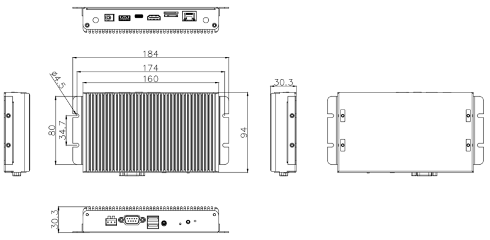

# Introduction

[Specification](https://download.t-firefly.com/Spec/Computers/EC-A3399C_Specification_EN.pdf) | [Purchase](https://www.t-firefly.com/products/ec-a3399cai-six-core-ai-embedded-computer) | [Downloads](https://community.t-firefly.com/en/doc/download/63)

EC-A3399C is a six-core mini embedded computer based on the high-performance, open-source AIO-3399C platform. It is powered by the 64-bit Rockchip RK3399 processor, which combines two Cortex-A72 cores with four Cortex-A53 cores and runs at up to 2.0 GHz. The computer features an industrial aluminum-alloy enclosure, a fanless cooling system, stable long-term operation, and a rich set of expansion interfaces.

EC-A3399C supports hardware decoding of H.265/HEVC and VP9, H.264 encoding, 4K HDR, and hardware decoding at up to 4K. It supports HDMI 2.0, DisplayPort 1.2, and other display outputs, with mirrored or extended dual-display configurations. Typical applications include gaming equipment, digital signage, vending machines, and robotics.

## Interface Description

**EC-A3399C** provides rich interfaces, mainly including:

* 1 x DC 12V power interface (DC 5.5 x 2.1mm)
* 1 x RJ45 (Gigabit Ethernet)
* 1 x HDMI 2.0 (up to 4K@60Hz output)
* 1 x DisplayPort 1.2 (up to 4K@60Hz output)
* 1 x Type-C (OTG, can be used for firmware flashing)
* 1 x USB3.0
* 2 x USB2.0 (dual-stacked USB recepts on the front panel)
* 1 x RS232 (DB9)
* 1 x RS485 (terminal block)
* 1 x TF Card
* 1 x Micro SIM card slot (used with a Mini PCIe 3G/4G module, module optional)
* 1 x 3.5mm Phone jack
* 2 x WiFi/Bluetooth antennas (ANT)
* 1 x IR receiver
* 1 x Power button, 1 x Recovery button
* 2 on-board TTL UARTs (available after opening the enclosure)

The interface layout is shown in the figure below:

## Structure and Dimensions

The dimension of the computer is 160 x 94 x 26 mm, with an AL6063 aluminum-alloy enclosure.

## Resources and Support

* [[Wiki]](../../Motherboard/AIO-3399C/index.md): Contains Android, Ubuntu, driver development, and firmware build documentation (refer to the AIO-3399C Wiki)
* [[Technical Forum]](https://forum.t-firefly.com/): A communication platform with more than 100,000 enterprise customers and users

### Contact

* Email: sales@t-firefly.com
* Mobile: (+86) 186 8811 7175
* Landline: 0760-89881218
* National Service Hotline: 4001-511-533
* Address: Room 2101, Hongyu Building, No. 57 Zhongshan 4th Road, East District, Zhongshan City, Guangdong Province
 