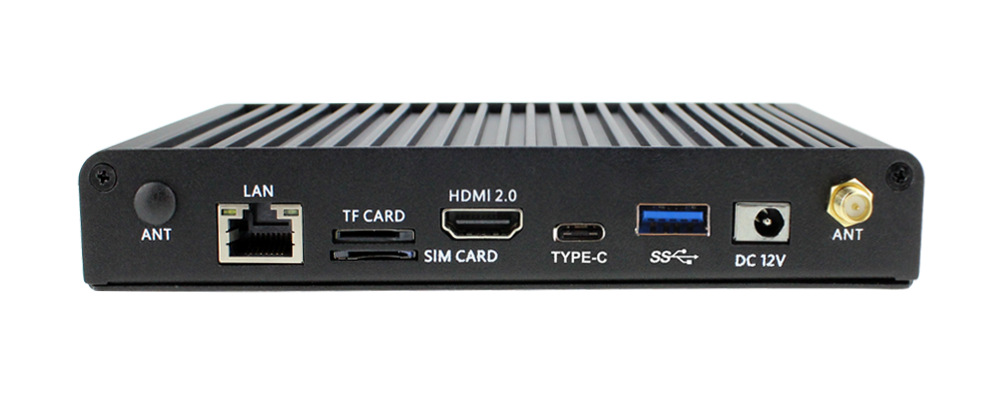
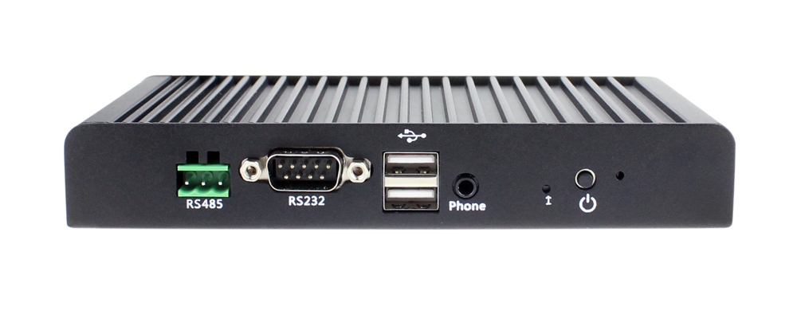

# Product Introduction

EC-A3399C is a six-core mini embedded computer based on the high-performance, open-source AIO-3399C platform. It is powered by the 64-bit Rockchip RK3399 processor, which combines two Cortex-A72 cores with four Cortex-A53 cores and runs at up to 2.0 GHz. The computer features an industrial aluminum-alloy enclosure, a fanless cooling system, stable long-term operation, and a rich set of expansion interfaces.

EC-A3399C supports hardware decoding of H.265/HEVC and VP9, H.264 encoding, 4K HDR, and hardware decoding at up to 4K. It supports dual LVDS, eDP, HDMI, DP 1.2, and other display outputs, with mirrored or extended dual-display configurations. Typical applications include gaming equipment, digital signage, vending machines, and robotics.

# Product Specifications

# Product Resources

* [Development documentation](../../Motherboard/AIO-3399C/index.md)  
  See the AIO-3399C Wiki for Android, Ubuntu, driver development, and firmware build documentation.
* [Technical forum](http://bbs.t-firefly.com/forum.php?mod=forumdisplay&fid=100)

# Contact Information

For professional technical support or more detailed product information, please contact our sales team.

* Email: sales@t-firefly.com
* Mobile: (+86) 186 8811 7175
* Landline: 0760-89881218
* National Service Hotline: 4001-511-533
* Address: Room 2101, Hongyu Building, No. 57 Zhongshan 4th Road, East District, Zhongshan City, Guangdong Province
 