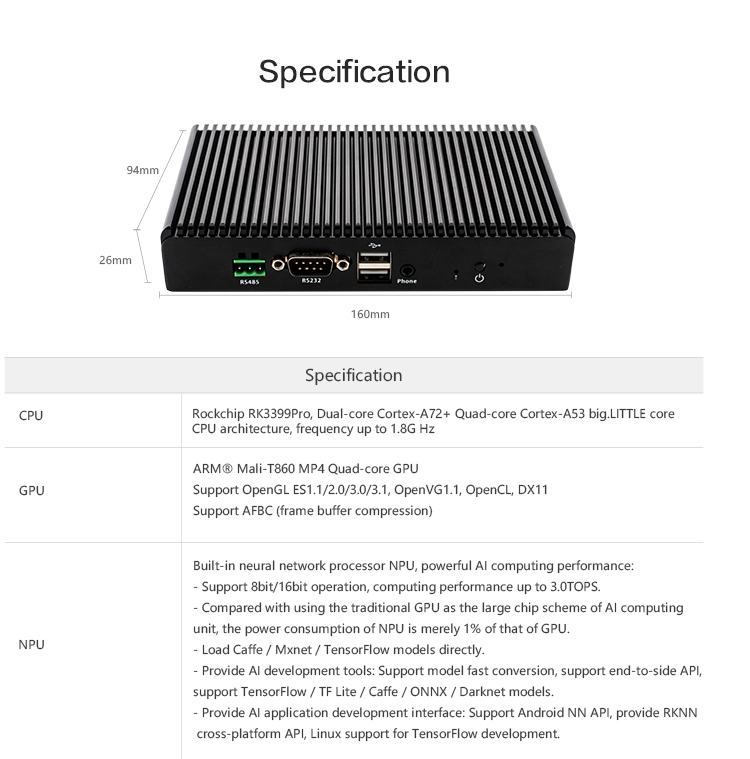
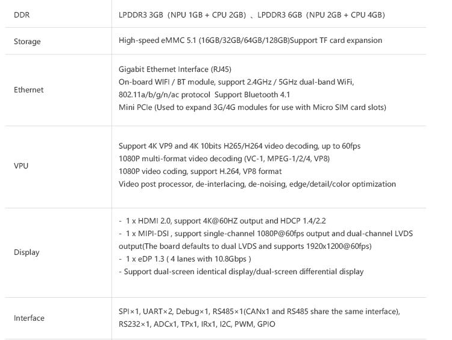
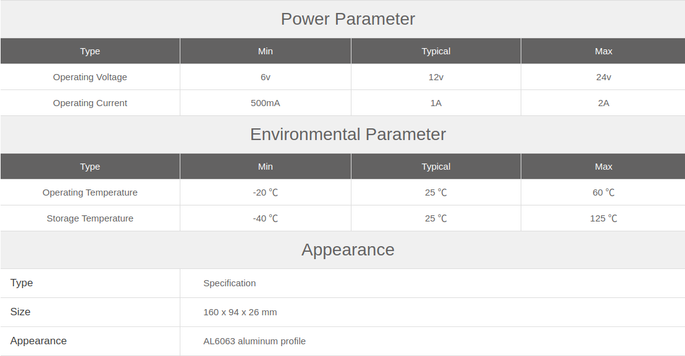

## Product introduction

EC-A3399ProC six-core 64-bit AI embedded host, based on AIO-3399ProC artificial intelligence open source, equipped with an industrial-grade metal casing, efficient heat dissipation, support for multiple operating systems, stable operation, super AI computing performance and rich expansion interfaces, The CPU integrates AI neural network processor NPU, supports 8bit/16bit computing and has a performance of up to 3.0TOPS, and provides Rock-X SDK AI visual recognition API component library, which can quickly realize machine vision recognition. Support TensorFlow/Caffe/Mxnet general model, support Android NN API, RKNN cross-platform API, TensorFlow development interface, and provide AI development tools such as model conversion and end-to-side conversion API. It has powerful hardware encoding and decoding capabilities, supporting 4K VP9, 4K 10bit H265/H264 and 1080P multi-format (VC-1, MPEG-1/2/4, VP8) video decoding. Abundant extension interfaces meet the different actual needs of customers, and the integrated overall design greatly shortens the customer development time cycle, which is basically a low-threshold and high-efficiency product development tool.

# Specifications

# Other Specifications

# Resources

* [Manual](../../Mainboards/AIO-3399ProC/index.md) Includes firmware building, system usage, interface usage, and other tutorials (see the AIO-3399ProC Wiki)
* [Download Page](http://en.t-firefly.com/doc/download/69.html) Includes firmware, root filesystems, and tool download links.
* [Forum](https://bbs.t-firefly.com/forum.php?mod=forumdisplay&fid=100) Technical communication platform for over 100K corporate and individual users.

## Product technical support
The EC-A3399ProC host can meet the needs of customers in different aspects in a variety of scenarios. The super AI computing performance and rich expansion interfaces can be directly applied to: AI driving monitoring (face recognition, driving behavior recognition, smoking detection, Phone detection, distracted driving), industrial control mainframe, AI server, unmanned retail shelf, facial payment equipment, facial recognition equipment, smart vending cabinet, smart education and other industry products. The above application scenarios have been widely used by customers, and the quality and performance have a very good reputation in the industry. The professional technical team solves various problems in hardware design and software functions for customers. For professional technical support and more detailed information, please contact the business.

### Technical case
* [Multi-channel codec example]
* [Double screen variant example]
* [Firefly Android API Demo]

### Contact information
* Email: sales@t-firefly.com
* Mobile: (+86) 186 8811 7175
* Landline: 0760-89881218
* National Service Hotline: 4001-511-533
* Address: Room 2101, Hongyu Building, No. 57 Zhongshan 4th Road, East District, Zhongshan City, Guangdong Province
 