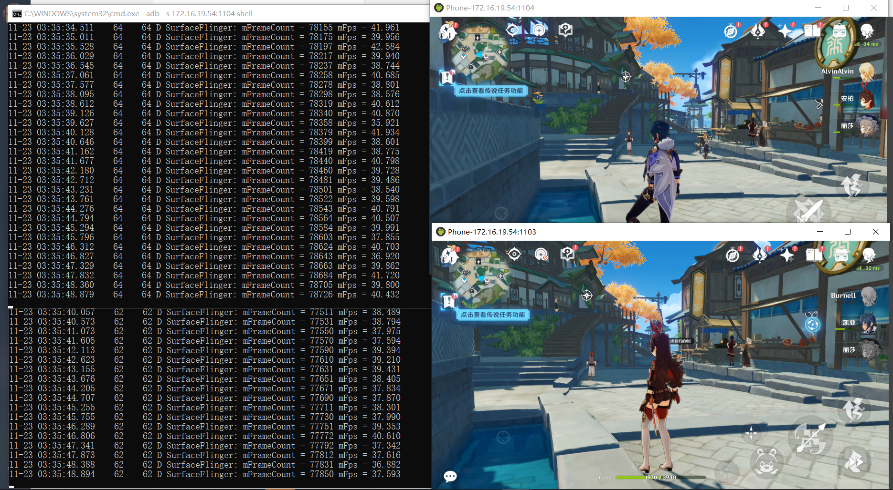

## Android in Container

AIC (Android in Container) means runing Android inside a container on Linux. RK3588 Linux can use docker to run Android and support running multiple Androids at the same time.

Cluster-Server with AIC can increase the amount of Androids, really helpful in cloud-mobile and cloud-gaming.

Here are some firmwares for testing: [Download](https://drive.google.com/drive/folders/1JvVj2VTJFpsZORyuEbG8oFtXP1ELOOJq?usp=sharing)

### Usage

Notice:

1. The host OS is Ubuntu Minimal without desktop, so using debug serial, ssh, adb shell etc. to interact.
2. Interaction with Android is through network adb and screen mirroring application like scrcpy, not by mouse/keyboard.
3. Operation AIC requires the following knowledge: basic Linux commands, docker commands, adb commands.

#### Create Containers

Copy the "container" dir to the /userdata/ of host device (RK3588), use the script "aic.sh" inside to deploy:

Please connect the device to the Internet, and init env at first use:
```bash
cd /userdata/container
./aic.sh -i
```

After init, copy android container firmware to /userdata/container/ (There's already a firmware in it)

Run "./aic.sh -r <android_container_firmware.tgz> <container amount to create>" to deploy.
```bash
# For example:
./aic.sh -r rk3588_docker-android12-userdebug-super.img-20231128.1932.tgz 3
```

Default use docker0 network and port mapping:
```bash
<host ip>:1100 --> <container 0>:5555
<host ip>:1101 --> <container 1>:5555
......
```

For more please read aic.sh

#### Connect to Containers

In the same local network, use any PC with adb to connect.
```bash
adb connect <host ip>:<port>

# After connection
# Start scrcpy
scrcpy -s <host ip>:<port>
```

We skipped the tutorial of installing adb and scrcpy, please google it if you need.

#### Manage Containers

Use common docker commands to manage containers.
```bash
# Check all containers
root@firefly:~# docker ps -a
CONTAINER ID   IMAGE            COMMAND                  CREATED      STATUS                    PORTS     NAMES
cad5a331dea9   rk3588:firefly   "/init androidboot.h…"   6 days ago   Exited (137) 6 days ago             android_1
37f60c3b6b80   rk3588:firefly   "/init androidboot.h…"   6 days ago   Up 13 seconds                       android_0

# Start/Stop containers
docker start/stop <NAMES>

# Connect to Android shell(run exit to return)
docker exec -it <NAMES> sh

# Delete containers
docker rm <NAMES>
```

### Performance

Run this cmd as root to enable performance mode to get better experience:
```bash
# It is normal to get an "Invalid argument", ignore it
root@firefly:~# echo performance | tee $(find /sys/devices -name *governor)
performance
tee: /sys/devices/system/cpu/cpuidle/current_governor: Invalid argument
```

Enter Android terminal or use adb shell to run this cmd can print the game fps:
```bash
# Notice: This cmd prints fps only when the game is running
setprop debug.sf.fps 1;logcat -s SurfaceFlinger
```

One RK3588 using AIC running two Genshin Impact with highest graphic setting at the same time can reach 35+ fps:
