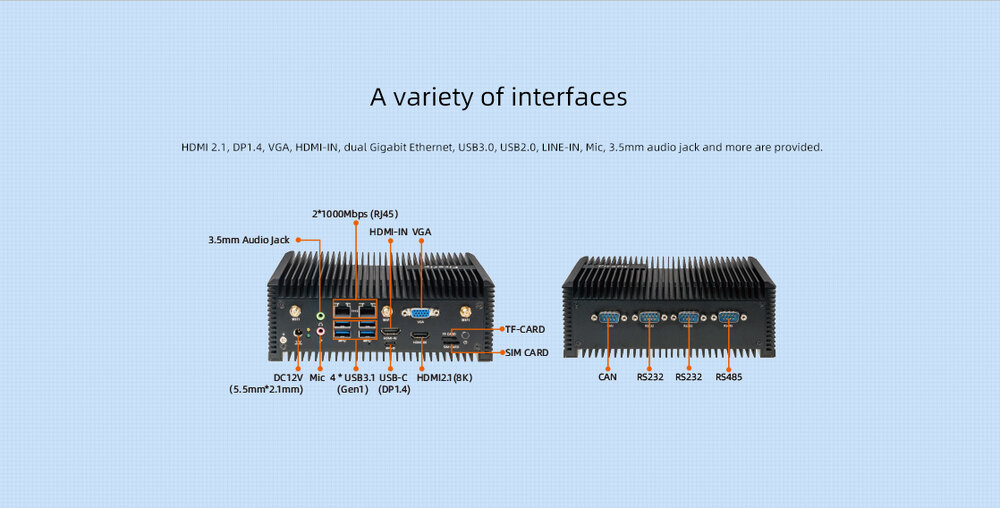

## Product introduction

EC-A3588JQ Octa-Core 8K AI Industrial Computer Powered by RK3588J octa-core 64-bit processor, the computer
supports up to 32GB of RAM and 8K video encoding and decoding.
It features a wide range of interface options, including Gigabit
Ethernet, WiFi6 , 5G/4G expansion and multiple video input and
output, as well as M.2 SATA/PCIe SSD. Multiple operating systems
are also supported. With industrial-grade SoC and precision
components, it delivers long and stable operation at a temperature
between -40°C and 85°C , satisfying the industrial-grade needs.

 